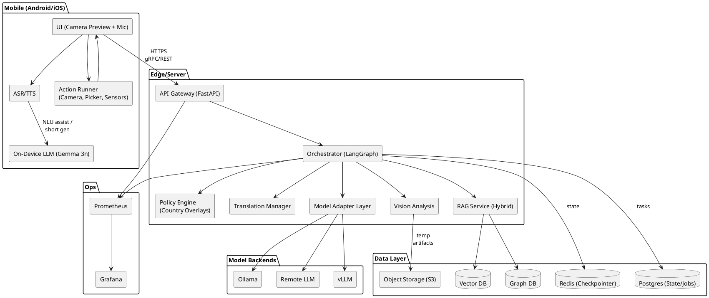
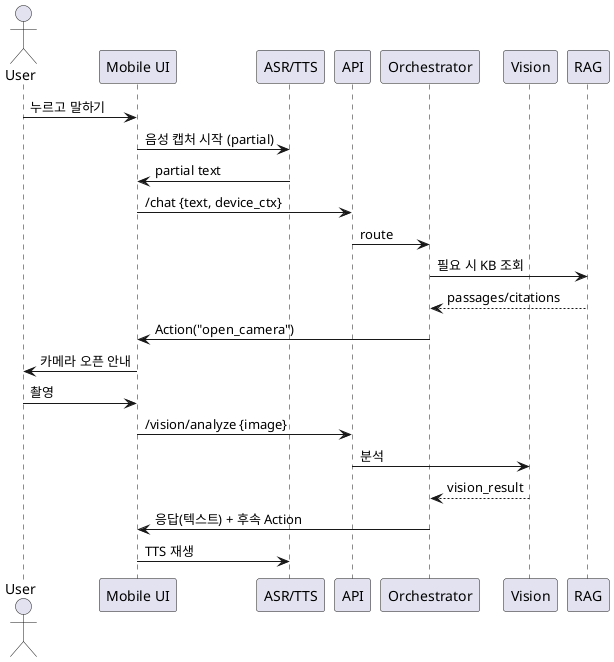
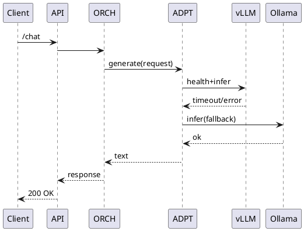
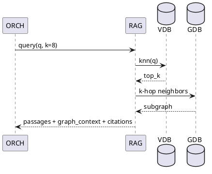

# Onboarding Agent — 요구사항 & 아키텍처 (v2025-08-15)

> 음성 중심 + 카메라 프리뷰 인터랙션을 제공하는 **온디바이스 우선** 하이브리드 AI 에이전트. 디바이스에서 가능한 일은 로컬로 처리하고, 복잡한 계획/검색/지식 조회는 서버의 LangGraph 오케스트레이터로 위임. 모델 교체가 쉬운 **Model Adapter Layer**, 국가별 **정책 오버레이**, **다국어 지원**, **GraphRAG 기반 KB**를 핵심 축으로 설계.

---

## 1) 목표 & 스코프

* **주요 목적**: 카메라 프리뷰 화면에서 자연스러운 음성 대화로 업무/가이드/셋업을 수행하는 온디바이스 우선 에이전트.
* **핵심 가치**: 낮은 지연시간(로컬 처리), 개인정보 보호, 네트워크 불안정 시 **오프라인 모드** 유지, 모델/벤더 **독립성**.
* **타깃 플랫폼**: Android, iOS (각각 SpeechRecognizer / Speech framework + TTS), 서버는 FastAPI + LangGraph 기반.
* **주요 도메인 예**: IoT/가전 등록/설정 가이드, 고객 지원(FAQ/RAG), 사진 기반 확인/인증, 여행·예약형 태스크 오케스트레이션 등.

---

## 2) 대표 사용자 시나리오 (요약)

1. 사용자가 **말하기 버튼**을 누르고 기기에 요청 → 디바이스에서 **ASR(STT)** → 로컬 NLU 룰/소형 LLM으로 1차 분류.
2. "사진 첨부" 등 특정 키워드/의도가 감지되면 **카메라 앱 오픈**, 촬영 후 로컬 전처리(리사이즈·압축·익명화) → 서버 분석 필요 시 전송.
3. 서버 **LangGraph 오케스트레이터**가 정책 검사 → 계획 수립 → 도구 호출(vision/RAG/검색/업로드 등) → 응답 작성.
4. 결과는 다국어 번역 → **TTS**로 음성 출력, 필요 시 UI 오버레이(체크리스트/버튼)로 후속 액션 유도.
5. 네트워크 오류 시, 온디바이스 백오프·큐잉 → 회복 시 자동 재전송.

---

## 3) 기능 요구사항 (Functional)

* **온디바이스 처리**

  * Gemma 3n 등 소형 LLM으로 짧은 답변/룰 보강 NLU/후처리.
  * 디바이스 STT/TTS, 카메라 프리뷰, 이미지 전처리(축소/모자이크/텍스트 추출 등).
  * 기기 리소스 연동: 위치, 센서, 파일, 네트워크 상태.
* **서버 처리 (오케스트레이션)**

  * LangGraph 기반 **상태 기계**로 단계적 계획/도구 실행.
  * **Model Adapter Layer**: vLLM ↔ Ollama ↔ Remote LLM 교체/혼합 라우팅.
  * **GraphRAG**: 문서/FAQ 인제스트 → 임베딩/그래프 생성 → 하이브리드 검색.
  * **번역 매니저**: 다국어 입·출력 정규화.
  * **정책/가드레일**: 국가별 규정·금칙어·동의 플로우 오버레이.
* **지식 베이스(KB)**

  * 버전 관리되는 문서 세트, 파이프라인(크롤/ETL → 청크 → 임베딩 → 그래프).
  * 소스 메타데이터(버전, 날짜, 출처)와 신뢰 신호 관리.
* **클라이언트 액션 루프**

  * 서버가 요구한 **행동(Action)**(카메라 열기, 옵션 선택 등)을 앱이 실행 → 결과를 다시 서버로 회신.
* **관측/운영**

  * 트레이스/로그/지표(Prometheus/Grafana), 헬스체크, 자동 페일오버.

---

## 4) 비기능 요구사항 (Non‑Functional)

* **지연시간 목표**: 로컬 반응(버튼→피드백) < 100ms, ASR partial < 300ms, TTS 시작 < 700ms, 서버 왕복 < 1.5s (p95).
* **가용성**: 서버 측 이중화(멀티 모델 백엔드), 네트워크 단절 시 필수 기능 로컬 유지.
* **보안/프라이버시**: 전송/저장 암호화, 최소 수집, PII 마스킹, 리텐션 정책.
* **휴대성**: 모델/DB/클라우드 벤더 종속 최소화, IaC/Helm으로 재현 가능.

---

## 5) 전체 아키텍처 개요 (Component)




---

## 6) 컴포넌트 상세 설계

### 6.1 Mobile App

* **UI**: 카메라 프리뷰 상단에 음성 입력 버튼, 결과 오버레이(텍스트/아이콘/체크리스트)
* **ASR/TTS**: iOS Speech / Android SpeechRecognizer + 네이티브 TTS. 스트리밍 partial 결과 제공.
* **On-Device LLM**: gemma-3n(quant)로 NLU 룰 보강, 짧은 응답, 후처리.
* **Action Runner**: 카메라/파일/위치/권한 처리. 서버 지시에 따라 단계별 UX 진행.
* **오프라인 모드**: 요청 큐/재전송, 로컬 캐시.

### 6.2 API Gateway (FastAPI)

* 엔드포인트(예시):

  * `POST /chat` : 멀티모달 요청(텍스트, 오디오, 이미지 메타) 수신
  * `POST /actions/result` : 클라이언트 액션 결과 수신
  * `POST /vision/analyze` : 이미지/비디오 프레임 분석
  * `POST /speech/stt` , `POST /speech/tts`
  * `GET /healthz`, `GET /readyz`
* 인증: OAuth2/JWT, 디바이스 바인딩.

### 6.3 Orchestrator (LangGraph)

* **Checkpointer**: Redis/Postgres. 세션/스텝 레벨 상태 공유.
* **노드**(예): Input → PolicyGuard → DetectIntent → Plan → ToolSelect → Execute → Aggregate → Draft → Validate → Translate → Respond
* **에러 처리**: 재시도/보정 프롬프트/대안 경로.

### 6.4 Model Adapter Layer

* **라우팅 규칙**(YAML): 모델 가중치, 토큰 한도, 비용, 지연, 헬스 점수, 국가 규제 태그.
* **백엔드**: vLLM(서빙 성능), Ollama(호환/로컬), Remote LLM(선택적).
* **헬스체크 & 오토 페일오버**: 회로차단기, 지연/오류율 기반 스위칭.

### 6.5 RAG / KB (GraphRAG 하이브리드)

* 파이프라인: 추출(크롤/업로드) → 클린/스플릿 → 임베딩 → **그래프 생성(개체·관계)** → 인덱싱(Vector+Graph).
* 검색: **Dense + Sparse + Graph-hop** 혼합 랭킹.
* 메타: 출처/버전/유효기간 관리, 회답 시 근거 반환.

### 6.6 Policy Engine

* 국가별 금칙/민감 카테고리, 연령/동의 플로우, 로깅 레벨.
* 정책 위반 시 대안 제시, 감사 로깅, 경보(Webhook) 훅(향후 확장).

### 6.7 Translation Manager

* 다국어 입출력 정규화(ko/en/ja/…); 사용자 선호 언어 유지.
* 시스템/도구 응답의 용어 일관성 보장(용어집/스타일 가이드).

### 6.8 Vision Analysis

* 라이트웨이트 모델(텍스트 검출, QR/바코드, 기기 식별), 서버/온디바이스 선택적.
* 민감 영역 마스킹(얼굴/주소) 옵션.

---

## 7) 상태 & 데이터 설계

* **ConversationState**(요약):

```json
{
  "session_id": "uuid",
  "user_profile": {"locale":"ko-KR","consents":{...}},
  "policy_context": {"country":"KR","age_gate":true},
  "turn": {"input": {"text":...,"audio_ref":...,"image_refs":[...]},
            "intent": {"label":..., "score":...},
            "plan": [...],
            "tools_used": [...],
            "kb_hits": [...],
            "draft": ..., "final": ...},
  "history_head": "vector_cache_key",
  "metrics": {"latency_ms":...,"backend":"vllm"}
}
```

* **Checkpointer**: 그래프 스텝 단위로 직렬화, 재시도/재개 지원.

---

## 8) 배포 토폴로지 & DevOps

* **개발/로컬**: docker-compose (API, ORCH, VDB, GDB, REDIS, PG, Grafana, Prometheus, Ollama/vLLM 선택).
* **스테이징/운영**: Kubernetes + Helm 차트 (HorizontalPodAutoscaler, PodDisruptionBudget, Secret/ConfigMap, Ingress, ServiceMonitor).
* **CI/CD**: GitHub Actions → 포매팅/테스트 → 컨테이너 빌드 → 헬름 패키징/서명 → 환경별 릴리스.
* **관측/알림**: RED/USE, 지연/오류율/용량 대시보드, 경보 룰.

---

## 9) API 설계(요약)

* `POST /chat`
  **Req**: `{ text|audio|image_refs, device_ctx, locale }`
  **Res**: `{ messages[], actions[], tts_url?, citations[] }`
* `POST /actions/result`
  **Req**: `{ action_id, payload, attachments[] }` → **Res**: `{ status }`
* `POST /vision/analyze`
  **Req**: `{ image|video_frame, tasks:[ocr,detect,qr] }` → **Res**: `{ results }`

---

## 10) LangGraph 오케스트레이션 (개략)

```python
state = {
  "input": {},
  "intent": None,
  "plan": [],
  "kb_hits": [],
  "response": None,
}

# 노드들: Input -> Guard -> Intent -> Plan -> ToolExec -> Synthesize -> Translate -> Respond
```

* **Intent**: 로컬 규칙(정규식/키워드/슬롯) + 소형 LLM + 서버 분류기(모호할 때).
* **Plan/ToolExec**: Vision / RAG / 서드파티 API / Client Action 지시.
* **Synthesize**: 모델 어댑터로 라우팅, 근거 인용.

---

## 11) GraphRAG 파이프라인 (요약)

1. **수집**: 파일/크롤/웹훅 → S3 임시 보관
2. **정제/분할**: 규칙 기반/문서 유형별 파서
3. **임베딩**: 멀티링구얼 모델(e.g., e5-multilingual)
4. **그래프화**: 개체/관계 추출, 문서-개체 링크
5. **인덱싱**: VectorDB + GraphDB 동시 업데이트
6. **검색**: hybrid(knn + bm25 + k-hop)
7. **평가**: 회수율/정확도/근거 품질 자동 점검

---

## 12) 실패/복구 시나리오

* **모델 서버 장애**: Adapter가 vLLM→Ollama로 페일오버, 회로차단기 열림.
* **네트워크 단절**: 요청 로컬 큐/재시도, 핵심 기능(ASR/TTS/간단 응답) 로컬 유지.
* **비정상 입력**: 정책 엔진이 차단 후 대안 메시지/가이드 제공.

---

## 13) 보안/프라이버시

* 전송(TLS)/저장(디스크 암호화), 최소 수집, PII 마스킹(얼굴/주소/연락처), 옵트인 기반 텔레메트리.
* 감사 로깅 + 관리 콘솔 접근 통제, 키/시크릿 로테이션.

---

## 14) 테스트 전략

* 단위/통합/시나리오 E2E(음성·카메라 포함), 지연/부하 테스트, 안전성/레드팀 시나리오, 다국어 회귀 테스트.

---

## 15) 운영 대시보드(예)

* **모델 라우팅 현황**(vLLM vs Ollama 비중, 오류율), **RAG 히트율**, **p95 지연**, **정책 차단 건수**, **액션 루프 성공률**.

---

## 16) 시퀀스 다이어그램

### 16.1 음성+카메라 액션 루프



### 16.2 모델 페일오버(vLLM→Ollama)



### 16.3 GraphRAG 조회



---

## 17) 모델 라우터 설정(YAML 스니펫)

```yaml
models:
  - name: vllm_qwen72b
    provider: vllm
    max_tokens: 4096
    cost_weight: 0.7
    latency_weight: 0.2
    quality_weight: 0.1
    health_endpoint: http://vllm:8000/health
  - name: ollama_llama3_8b
    provider: ollama
    max_tokens: 2048
    cost_weight: 0.4
    latency_weight: 0.4
    quality_weight: 0.2
    health_endpoint: http://ollama:11434/health
routing:
  rules:
    - if: "country == 'KR' and task == 'faq'"
      prefer: [ollama_llama3_8b, vllm_qwen72b]
    - if: "latency_p95 > 1500 or error_rate > 5%"
      action: failover
```

---

## 18) 로드맵/To‑Do (요약)

* ReactFlow 기반 **시나리오 GUI** ↔ YAML DSL 상호 변환 안정화
* 온디바이스 STT/TTS 스트리밍 품질 튜닝(바람소리/잔향 억제)
* Vision 경량 모델 온디바이스 이전 옵션 검증(Core ML / NNAPI)
* GraphRAG 품질 평가 파이프라인/대시보드 연동
* 정책/안전 대안응답 템플릿 정교화

---

**참고**: 이 문서는 향후 세부 구현(코드/헬름/CI 파이프라인)과 함께 버전 태그를 증가시키며 관리합니다.
