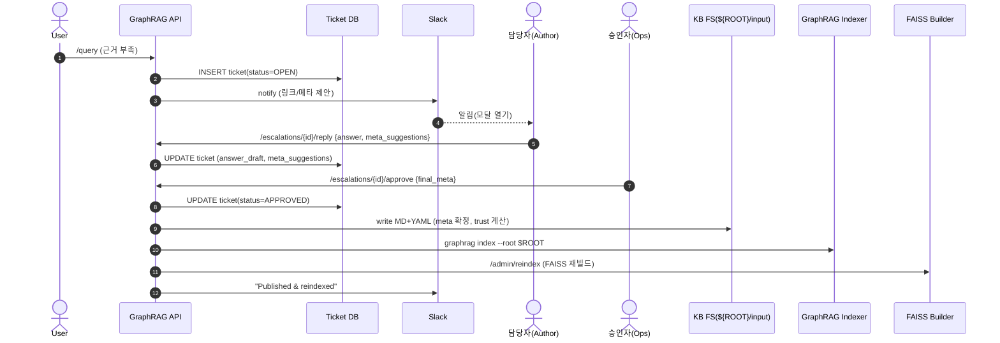
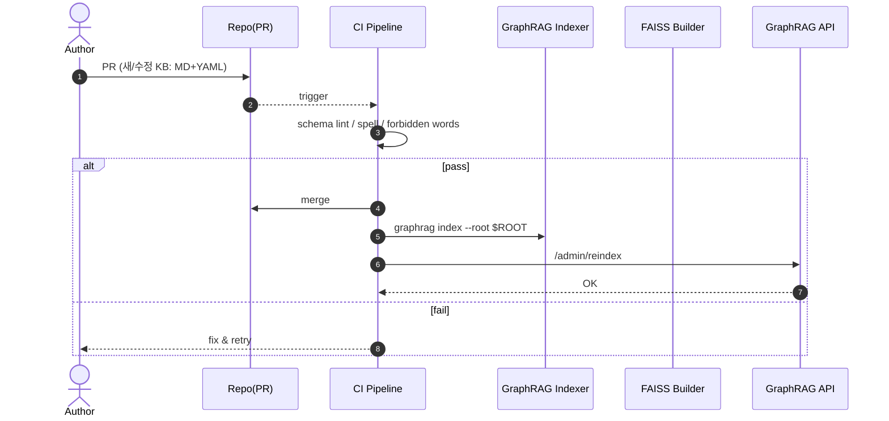
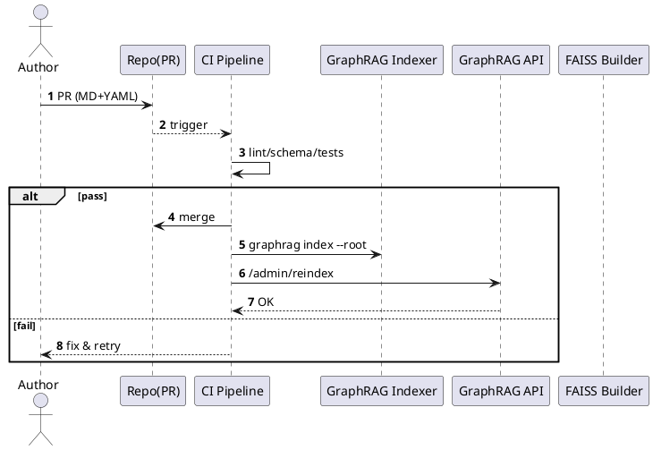
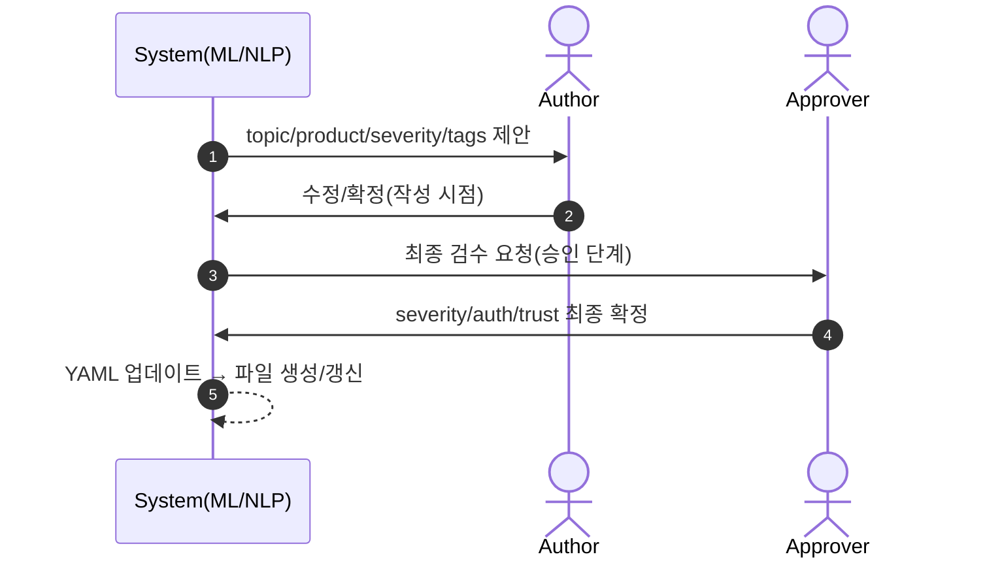
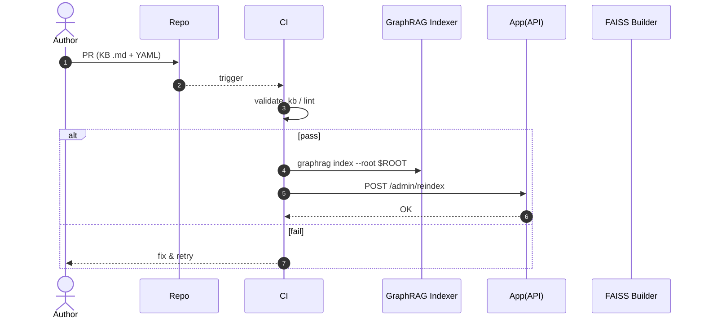
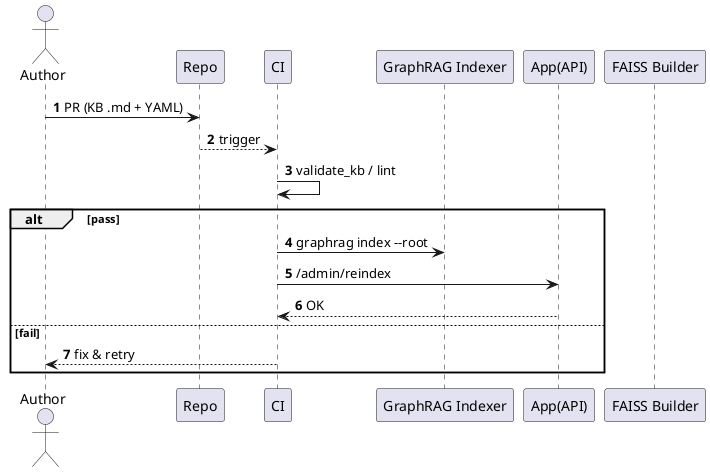
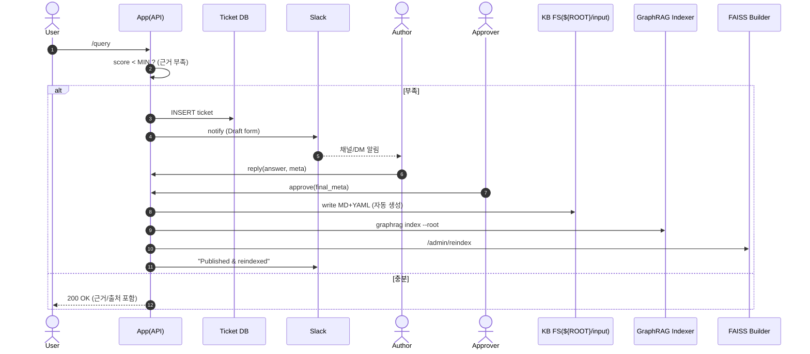
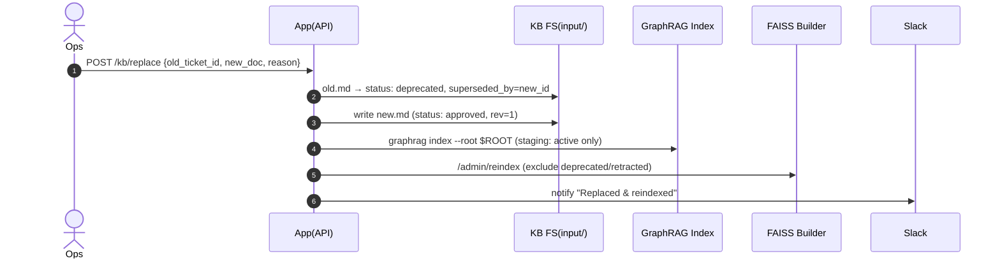
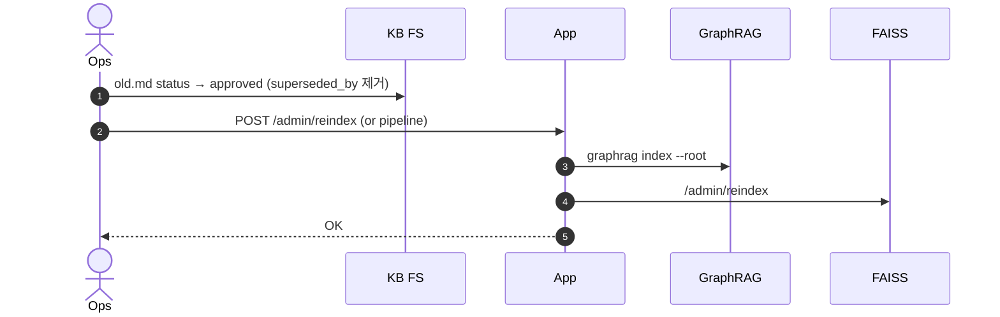

아래에 **요약 → 전체 운영 흐름(개발/운영 단계 분리) → 메타데이터 책임과 시점 → 예시 YAML/자동기입 규칙 → 시퀀스 다이어그램(메르메이드 & PlantUML)** 순서로 정리했어요.

---

## 요약

* **KB(지식베이스) 문서**는 담당자(도메인 SME/운영/지원)가 작성·승인하여 저장되는 **Markdown(+YAML 메타)** 파일입니다.
* **만드는 방법은 두 가지**

  1. **능동(개발/운영):** 담당자가 직접 작성(레포 커밋/관리 콘솔) → 리뷰/머지 → 인덱싱
  2. **수동→자동(운영·에스컬레이션 루트):** 사용자 질문에 근거 부족 ⇒ **티켓 생성** ⇒ 담당자 **슬랙에서 답변** ⇒ **운영 승인** 시 **파일 자동 생성**(YAML 메타 포함) → 인덱싱
* **메타데이터(tag/trust 등)의 채우는 주체/시점**

  * `topic/product/severity`: **담당자 제안** + **시스템 자동 추천**, 최종은 **승인자(Ops)** 확정
  * `tags`: 시스템이 **키워드/명사구 추출 & 제로샷 분류**로 제안 → 담당자가 **수정/확정**
  * `trust(0~1)`: **정책 기반 자동 산정**(역할/검수/신뢰 이력/신선도) + **승인자가 보정**
  * `answered_by/answered_at/ticket_id/rev`: **시스템 자동**
* **흐름**

  * 개발 단계: 스키마/파이프라인 구축 → 샘플 KB 작성 → 인덱싱/질의 테스트
  * 운영 단계: 에스컬레이션 워크플로(슬랙)로 **지식 포착 → 승인 → 자동 반영** + 정기 재인덱싱/관측/품질관리

---

# 1) 전체 운영 흐름(개발 단계 vs 운영 단계)

### A) 개발 단계(Dev)

1. **스키마 정의**: YAML 메타 키 확정(`topic/product/severity/tags/auth/trust/status/...`)
2. **샘플 KB 작성**: 담당자가 Markdown 작성(레포 PR)
3. **CI 품질체크**: 스키마 검증/링터/금지어 체크
4. **인덱싱**: `graphrag index` → 산출물(entities/docs/communities)
5. **FAISS 재빌드**: `/admin/reindex` → 질의 스모크 테스트
6. **대시보드·알림** 연동(옵션): `/metrics`, 슬랙

### B) 운영 단계(Ops)

1. **사용자 질의** `/query`
2. **하이브리드 검색**(Graph 전역/로컬 + FAISS) → 근거 스코어 평가
3. (스코어 미달) **에스컬레이션**: 티켓 생성 + **슬랙 알림**
4. **담당자(Author) 답변**: 슬랙 모달/폼에서 **본문** + (제안된) `topic/product/severity/tags` 확인
5. **승인자(Ops) 검수/승인**: 정책 검사·표현/보안·민감도 체크 → **승인**
6. **문서화 자동화**: 승인 시

   * Markdown + YAML 메타를 **파일 자동 생성** (`${ROOT}/input/...md`)
   * `trust` 산출/고정, `answered_by/at/ticket_id` 자동 기록
   * **GraphRAG 인덱싱 → FAISS 재인덱싱** 자동 트리거
7. **즉시 반영**: 같은/유사 질문 재시도 시 **근거 포함 응답 + 문장별 출처**

---

# 2) 메타데이터는 누가·언제·어떻게?

| 필드                     | 의미                                    | 언제 채움    | 누가/어떻게                                |
| ---------------------- | ------------------------------------- | -------- | ------------------------------------- |
| `topic`                | 문서 주제(예: troubleshooting/runbook/faq) | **작성 시** | **시스템 제안**(제로샷 분류) → **담당자 선택**       |
| `product`              | 적용 대상 시스템/서비스                         | **작성 시** | **슬랙 채널→제품 매핑** 기본값 + 담당자 수정          |
| `severity`             | 심각도(`low/medium/high/critical`)       | **승인 시** | **Ops가 확정**(시스템 제안값 보정)               |
| `tags`                 | 검색·리랭크 키워드                            | **작성 시** | **키워드 추출/명사구 추출/유사문서 태그 상속** → 담당자 수정 |
| `auth`                 | 접근권한(`public/internal/restricted`)    | **승인 시** | **Ops 보안정책**에 따라 확정                   |
| `trust`                | 문서 신뢰도(0\~1)                          | **승인 시** | 알고리즘 **자동 산정 + Ops 보정**               |
| `answered_by/at`       | 작성자/시간                                | **자동**   | 시스템 자동 기록                             |
| `ticket_id/status/rev` | 추적/상태/리비전                             | **자동**   | 티켓/승인 이벤트로 자동 증가                      |

### `trust` 산정(예시 정책)

```text
trust = base_by_role + review_bonus + freshness_bonus - penalty
where
- base_by_role: {ops_lead:0.75, sme:0.7, support:0.65}
- review_bonus: +0.15 (승인됨), +0.05 (2인 이상 공동 검토)
- freshness_bonus: +0.05 (최근 30일), +0.02(90일)
- penalty: -0.1 (미검증 외부 출처 포함), -0.05 (반복 이의제기)
clip to [0.4, 0.98]
```

> 이 `trust`는 **FAISS 리랭크 가중치**에 반영(높을수록 랭크↑). 필요 시 제품군/주제별 가중치도 추가하세요.

---

# 3) 예시 KB 파일(자동 생성되는 YAML 메타 + 본문)

```markdown
---
ticket_id: 3421
question: "HTTP 503 발생 시 조치 방법"
answered_by: "ops.lead"
answered_at: "2025-08-16T04:20:00Z"
topic: "troubleshooting"     # 제안값(모델) + 담당자 확인
product: "api-gateway"       # 채널 매핑 기본값 + 수정 가능
severity: "high"             # Ops 확정
tags: ["503","healthcheck","hpa","gateway-timeout"]  # 자동 제안 + 수정
auth: "internal"             # Ops 확정
trust: 0.9                   # 정책 기반 자동 + Ops 보정
status: "approved"
rev: 1
embed_version: "nomic-embed-text-v1"
---

## 원인
- 백엔드 헬스체크 실패로 라우터가 트래픽 차단
- HPA 상한 도달로 과부하 지속

## 조치
1. `/llm/health` 확인, 백엔드 헬스 엔드포인트 점검
2. vLLM 파드 재기동: `kubectl rollout restart deploy/graphrag-hybrid-vllm`
3. HPA 상한 임시 상향(부하 해소 후 원복)
4. 10분 이상 지속 시 온콜 에스컬레이션

## 참고
- API 게이트웨이 로그의 5xx 비율/타임아웃 확인
```

---

# 4) 자동 생성 로직(요지, 의사코드)

```python
# approve 이벤트 핸들러(요지)
def on_approve(ticket_id, approver, payload):
    # 1) 본문/메타 취합
    body = payload["answer"]                   # 담당자 작성
    meta = payload.get("meta", {})            # topic/product/severity/tags 등 제안/수정값
    # 2) 필수 자동 필드
    meta.update({
        "ticket_id": ticket_id,
        "answered_by": payload["author"],
        "answered_at": now_iso(),
        "status": "approved",
        "rev": 1 if payload.get("new") else payload["rev"] + 1,
        "embed_version": CURRENT_EMBED_MODEL
    })
    # 3) trust 산정(정책)
    meta["trust"] = compute_trust(author_role=payload["author_role"],
                                  reviewed_by=approver, severity=meta["severity"],
                                  has_external=payload.get("has_external", False),
                                  last_updated=now())
    # 4) 파일 경로/이름 생성
    path = f"{GRAPH_RAG_ROOT}/input/{meta['topic']}/{ticket_id}_{slug(meta['question'])}.md"
    write_markdown_with_front_matter(path, meta, body)
    # 5) 인덱싱 파이프라인 실행
    run_cmd(f"{GRAPH_RAG_BIN} index --root {GRAPH_RAG_ROOT}")
    http_post(f"{BASE_URL}/admin/reindex")  # FAISS 재빌드
    notify_slack(ticket_id, "Published & reindexed")
```

---

# 5) 시퀀스 다이어그램

## (A) 운영: **에스컬레이션 → 답변 → 승인 → 자동 반영**

### Mermaid



### PlantUML


```plantuml
@startuml
autonumber
actor User
participant API as "GraphRAG API"
database DB as "Ticket DB"
participant SL as "Slack"
actor SME as "Author"
actor OPS as "Approver(Ops)"
folder FS as "KB FS(${ROOT}/input)"
participant GR as "GraphRAG Indexer"
participant VS as "FAISS Builder"

User -> API : /query (근거 부족)
API -> DB : INSERT ticket OPEN
API -> SL : notify (링크/메타 제안)
SL --> SME : DM/채널 알림

SME -> API : reply(answer, meta_suggestions)
API -> DB : UPDATE ticket draft/meta

OPS -> API : approve(final_meta)
API -> DB : status=APPROVED
API -> FS : write MD+YAML (trust 계산)
API -> GR : graphrag index --root
API -> VS : /admin/reindex
API -> SL : "Published & reindexed"
@enduml
```

---

## (B) 개발/운영 공통: **능동 작성(레포/콘솔) → 리뷰 → 배포**

### Mermaid



### PlantUML




---

## (C) **메타데이터 결정 파이프라인**(제안→확정)

### Mermaid



---

# 6) 운영 팁

* **임베딩은 단일 기준 유지**: `embed_version`을 YAML에 기록해 추후 모델 교체 시 **전량 재인덱싱** 판단에 사용.
* **정책 자동화**: 슬랙 채널 ↔ `product` 매핑, `severity` 가드레일, 민감 태그 자동 감지(예: 개인정보)
* **품질 루프**: 검색 클릭/피드백을 메트릭으로 수집 → `trust` 보정, FAQ 후보 자동 추천
* **감사/추적**: `ticket_id/rev/answered_by/approved_by`를 모두 남기고, 문서 삭제 대신 **Deprecated 플래그** 후 리디렉션

---

필요하시면 **슬랙 모달(JSON) 예시**와 **자동 태그 제안 코드(명사구 추출 + 제로샷 분류) 샘플**, 그리고 **`trust` 계산 함수**의 실제 파이썬 구현체까지 이어서 드리겠습니다.

---
---

# GraphRAG 업데이트


아래에 **요약 → 개발 단계 시퀀스 → 운영 단계 시퀀스 → 파일/스키마 규칙 → 설정/커맨드 예시 → 자동화 스크립트 샘플 → (선택) Mermaid & PlantUML 다이어그램** 순서로 정리했어요.

---

## 요약

* **어디에 넣나?** `GRAPH_RAG_ROOT/input/` 아래에 Markdown(`.md`) 파일을 둡니다. (PDF/Excel 등도 가능하지만, KB는 **MD+YAML 프론트매터** 권장)
* **어떤 형식?** 문서 상단에 YAML 메타(`topic/product/severity/tags/auth/trust/status/...`)를 넣고, 본문은 일반 마크다운으로 작성.
* **어떻게 쓰게 되나?**

  1. `graphrag index --root $GRAPH_RAG_ROOT`로 **그래프 인덱스** 생성
  2. 앱의 `POST /admin/reindex`로 **FAISS 인덱스** 재생성
  3. `POST /query`로 질문 → **그래프(전역/로컬) + 벡터(유사 텍스트)** 하이브리드 검색 → **문장별 출처**까지 자동 표기
* **업데이트 흐름**은 두 가지:

  * (A) **능동 작성**: 담당자가 MD 작성→PR/승인→머지→인덱싱/재인덱싱
  * (B) **에스컬레이션 자동 문서화**: 근거 부족 시 티켓→담당자 답변→운영 승인→**MD 파일 자동 생성**→인덱싱/재인덱싱

---

# 1) 개발 단계 시퀀스(Dev)

1. **KB 스키마 합의**: YAML 키(아래 표)를 확정
2. **샘플 KB 작성**: `GRAPH_RAG_ROOT/input/<topic>/...md`로 배치
3. **스키마 검증/린트**: `tools/validate_kb.py`로 프론트매터 체크
4. **그래프 인덱싱**: `graphrag index --root $GRAPH_RAG_ROOT`
5. **FAISS 재빌드**: `POST /admin/reindex`
6. **질의 스모크 테스트**: `POST /query`
7. **CI 파이프라인에 연결**: PR 시 3\~5단계를 자동화

### 개발 단계(빠른 체크 예시 커맨드)

```bash
export GRAPH_RAG_ROOT=./ragproj

# 1) 샘플 KB 복사
cp -r sample_kb/* $GRAPH_RAG_ROOT/input/

# 2) 스키마 검증
python tools/validate_kb.py --root "$GRAPH_RAG_ROOT"

# 3) 그래프 인덱스
graphrag index --root "$GRAPH_RAG_ROOT"

# 4) 벡터 인덱스(FAISS) 재빌드
curl -X POST http://localhost:8000/admin/reindex

# 5) 질의
curl -sX POST http://localhost:8000/query -H 'Content-Type: application/json' \
  -d '{"question":"HTTP 503 대응 방법?"}' | jq
```

---

# 2) 운영 단계 시퀀스(Ops)

### (A) 능동 작성(레포/콘솔 주도)

1. \*\*담당자(Author)\*\*가 MD 작성/수정 → **PR 생성**
2. **CI**가 스키마 검증/린트 → 통과 시 머지
3. 머지 이벤트로 **인덱싱 → 재인덱싱** 자동 실행
4. 이후 사용자 질의 시 새 KB가 **근거/출처**로 바로 반영

### (B) 에스컬레이션 자동 문서화(질의→승인→자동 반영)

1. 사용자 질의 `/query` 결과 **근거 부족**
2. API가 **티켓 생성** + **슬랙 알림**
3. **담당자**가 슬랙 모달에서 답변/메타 입력
4. \*\*운영(Ops)\*\*이 승인 → 시스템이 **MD 파일 자동 생성**(YAML 메타 포함)
5. **인덱싱 → 재인덱싱** 자동 실행
6. 다음 질의부터는 새 KB가 **근거**로 활용

---

# 3) KB 파일/스키마 규칙

* **파일 위치**:
  `GRAPH_RAG_ROOT/input/<topic>/<ticket_id>_<slug(question)>.md`
* **YAML 프론트매터(권장 필드)**

| key                         | 설명                                | 채움 시점/주체        |
| --------------------------- | --------------------------------- | --------------- |
| `ticket_id`                 | 생성 티켓/추적 ID                       | 자동(시스템)         |
| `question`                  | 문서가 답하는 질문                        | 담당자 입력          |
| `answered_by`/`answered_at` | 작성자/시간                            | 자동(시스템)         |
| `topic`                     | `troubleshooting/runbook/faq/...` | 담당자 제안→Ops 확정   |
| `product`                   | 적용 대상 서비스                         | 채널/팀 매핑 기본값→수정  |
| `severity`                  | `low/medium/high/critical`        | Ops 확정          |
| `tags`                      | 검색/리랭크 키워드                        | 자동 제안+담당자 수정    |
| `auth`                      | 접근권한 `public/internal/restricted` | Ops 확정          |
| `trust`                     | 0\~1 신뢰도                          | 정책 자동 산정+Ops 보정 |
| `status`                    | `approved/deprecated`             | Ops             |

* **본문**: 일반 마크다운(H2/H3로 섹션을 잘게 나누면 검색/출처 정확도 ↑)
* **임베딩 일관성**: `embed_version`(예: `nomic-embed-text-v1`)을 메타에 기록해, 모델 교체 시 **전량 재인덱싱** 판단에 사용

---

# 4) GraphRAG 사용을 위한 설정/커맨드

> 실제 사용 중인 GraphRAG 버전에 따라 설정파일 키/옵션명이 다를 수 있어요. 아래는 **동작 원리와 예시**입니다. (우리 프로젝트는 기본적으로 **`input/**/*` 스캔**을 가정)

### 최소 구성

```
$GRAPH_RAG_ROOT/
  input/
    troubleshooting/001_...md
    runbook/002_...md
  output/               # 인덱싱 산출물(parquet 등)
  config.yaml           # (선택) 인덱싱/청크/엔터티 추출 파라미터
```

### 인덱싱

```bash
graphrag index --root "$GRAPH_RAG_ROOT"
```

* `input/**/*.md`를 읽고 → 청크/엔터티/관계 추출 → `output/*.parquet` 생성
* 우리 앱의 `/admin/reindex`는 이 산출물을 읽어 **FAISS 인덱스**와 `faiss_meta.parquet`를 갱신합니다.

### 재인덱싱(벡터)

```bash
curl -X POST http://<APP_HOST>:8000/admin/reindex
# 내부 동작: GraphRAG 산출물/KB 메타를 결합 → 임베딩 → faiss.index + faiss_meta.parquet
```

---

# 5) 자동화 스크립트 샘플

### 5.1 스키마 검증(필수 키/타입 체크)

```python
# tools/validate_kb.py
import sys, os, yaml, re, glob
REQ = {"question": str, "topic": str, "product": str, "status": str}
def front_matter(path):
    txt=open(path, encoding="utf-8").read()
    m=re.match(r"^---\n(.*?)\n---\n", txt, re.S); 
    return yaml.safe_load(m.group(1)) if m else {}
root = sys.argv[sys.argv.index("--root")+1]
errors=0
for p in glob.glob(os.path.join(root,"input","**","*.md"), recursive=True):
    meta=front_matter(p)
    for k,t in REQ.items():
        if k not in meta or not isinstance(meta[k], t):
            print(f"[ERR] {p}: missing/invalid {k}"); errors+=1
sys.exit(1 if errors else 0)
```

### 5.2 Dev 편의: 인덱싱 + 재인덱싱 + 스모크 테스트

```bash
# scripts/index_and_rebuild.sh
set -euo pipefail
ROOT="${GRAPH_RAG_ROOT:-./ragproj}"
graphrag index --root "$ROOT"
curl -fsS -X POST http://localhost:8000/admin/reindex
curl -fsS -X POST http://localhost:8000/query -H 'Content-Type: application/json' \
  -d '{"question":"배포 절차는?","mode":"auto"}' | jq .
```

---

# 6) 운영/개발 시퀀스 다이어그램

## (A) 개발 — “MD 작성→검증→인덱싱→재인덱싱→테스트”

### Mermaid



### PlantUML




## (B) 운영 — “질의→근거 부족→승인→자동 반영”

### Mermaid



### PlantUML


```plantuml
@startuml
autonumber
actor User
participant API as "App(API)"
database DB as "Ticket DB"
participant SL as "Slack"
actor SME as "Author"
actor Ops as "Approver"
folder FS as "KB FS(${ROOT}/input)"
participant GR as "GraphRAG Indexer"
participant VS as "FAISS Builder"

User -> API : /query
API -> API : score < MIN ?
alt 부족
  API -> DB : INSERT ticket
  API -> SL : notify Draft
  SL --> SME : alert
  SME -> API : reply(answer, meta)
  Ops -> API : approve(final_meta)
  API -> FS : write MD+YAML
  API -> GR : graphrag index --root
  API -> VS : /admin/reindex
  API -> SL : "Published & reindexed"
else 충분
  API --> User : 200 OK (with citations)
end
@enduml
```

---

## 자주 묻는 포인트 (정리)

* **Q. 담당자가 직접 입력해?**
  → 네. (A) 레포/콘솔 경로에서는 직접 MD를 작성하고 PR로 올립니다. (B) 에스컬레이션 경로에서는 **슬랙 답변 + 승인** 시 시스템이 **자동으로 MD 파일을 생성**합니다.

* **Q. tag/trust 같은 메타는 누가?**
  → `tags`는 **자동 제안(키워드 추출/제로샷 분류)** 후 담당자가 수정·확정, `trust`는 **정책 기반 자동 산정** + **Ops 보정**으로 최종 확정됩니다.

* **Q. GraphRAG에선 자동으로 읽어?**
  → 네. `input/**/*.md`를 스캔합니다. 버전에 따라 **config.yaml**을 통해 청크/추출 옵션·메타 필드 매핑을 조정할 수 있습니다. 인덱싱 후에는 앱의 `/admin/reindex`가 **FAISS**를 갱신합니다.

---

필요하면, **`config.yaml` 템플릿**(청크 크기/오버랩/엔티티 추출 강도/메타 매핑)과 **자동 태그 제안 코드**(명사구 추출 + 제로샷 분류), **`trust` 계산 함수**를 바로 붙여 드릴게요.

---
---

# 삭제/폐기/정정


아래에 **요약 → 운영 정책(삭제/폐기/정정) → 실제 동작 시퀀스(Dev/Ops 분리) → 메타데이터/폴더 구조 규칙 → 커맨드 플로우 → 코드 스니펫(엔드포인트/도구/리인덱스) → 다이어그램(Mermaid/PlantUML)** 순서로 정리했어요.

---

## 요약

* **원칙**: “바로 삭제” 대신 **소프트-삭제(Deprecated/Retraction)** → **인덱스/검색에서 제외** → **감사(추적) 가능** → 필요 시 **롤백**이 가능해야 합니다.
* **세 가지 케이스**

  1. **정정(Correction)**: 같은 문서의 내용을 고쳐서 유지. `rev`만 올리고 재인덱싱.
  2. **폐기(Deprecation)**: 더 좋은 문서로 **대체**. `status: deprecated` + `superseded_by` 설정, 인덱스·FAISS에서 제외.
  3. **철회(Retraction)**: 내용 자체가 **오류/유해**. `status: retracted` 처리, 즉시 제외 & 알림.
* **GraphRAG/FAISS 처리**

  * GraphRAG: **인덱싱 단계**에서 deprecated/retracted는 **스테이징 필터**로 제외.
  * FAISS: 삭제가 부분적으로 까다로우므로 **재빌드**(권장) 또는 **IDMap 삭제**(고급). 기본은 **재빌드**를 권장합니다.
* **운영 흐름**

  * Ops가 `/kb/deprecate`/`/kb/replace`/`/kb/retract` 호출 → **YAML 메타 업데이트** → `graphrag index` → `/admin/reindex` → **캐시 무효화/알림**.

---

# 1) 운영 정책(삭제/폐기/정정)

| 케이스    | 메타                                              | GraphRAG | FAISS   | 공지/감사             |
| ------ | ----------------------------------------------- | -------- | ------- | ----------------- |
| **정정** | `rev += 1`, `status: approved`                  | 재인덱싱 포함  | 재빌드     | 변경 사유/PR 기록       |
| **폐기** | `status: deprecated`, `superseded_by: <doc_id>` | 제외       | 재빌드(권장) | 슬랙/알림 “대체 문서로 이동” |
| **철회** | `status: retracted`, `deprecation_reason`       | 즉시 제외    | 즉시 재빌드  | 슬랙/알림 “오류로 철회”    |

> **하드-삭제**는 마지막 수단입니다. 기본은 **토음스톤(tombstone)** 방식(상태만 바꿔 추적 유지)으로 운영하세요.

---

# 2) 실제 동작 시퀀스

## (A) 개발 단계(Dev) — 정정/Corrrection

1. 담당자 PR로 **내용 수정** → CI 스키마/금칙어 검사 통과
2. 머지 트리거: `graphrag index` → `/admin/reindex`
3. 새 `rev`가 메타에 반영되고, 이전 내용은 히스토리만 남김

## (B) 운영 단계(Ops) — 폐기/대체 Deprecation with Replacement

1. **오류/구식 판단** → `/kb/replace` 호출(구 문서의 `status: deprecated`, `superseded_by` 설정 + 새 문서 작성)
2. **GraphRAG 재인덱싱**(스테이징 경유) → **FAISS 재빌드**
3. 슬랙 공지 & 캐시 무효화

## (C) 운영 단계(Ops) — 긴급 철회 Retraction

1. `/kb/retract` 호출(`status: retracted`, 이유 기록)
2. 바로 **GraphRAG 재인덱싱** → **FAISS 재빌드**
3. 슬랙/알림: 철회 사유와 대체 경로 안내(있다면)

---

# 3) 메타데이터/폴더 구조 규칙(확장)

* 파일: `GRAPH_RAG_ROOT/input/<topic>/<ticket_id>_<slug>.md`
* **추가 필드**

  * `status: approved|deprecated|retracted`
  * `superseded_by: "<new_doc_id>"` (대체 문서)
  * `deprecated_at`, `deprecated_by`, `deprecation_reason`
  * `rev`: 정정 시 증가
* **검색 제외 규칙**: `status in {deprecated, retracted}` → **GraphRAG/FAISS 모두 제외**

---

# 4) 커맨드 플로우(Ops 관점)

```bash
# 1) 문서 폐기(대체) – 구 문서 → deprecated, 새 문서 발행
curl -X POST http://<APP>/kb/replace \
  -H 'Content-Type: application/json' \
  -d '{"old_ticket_id": 3421, "new_doc": {"question":"신규 제목","topic":"troubleshooting", ...}, "reason":"내용 노후화"}'

# 2) 긴급 철회
curl -X POST http://<APP>/kb/retract \
  -H 'Content-Type: application/json' \
  -d '{"ticket_id": 3421, "reason":"중대한 오류 발견"}'

# 3) (필요 시) 순수 폐기만
curl -X POST http://<APP>/kb/deprecate \
  -H 'Content-Type: application/json' \
  -d '{"ticket_id": 3421, "reason":"중복 문서"}'
```

앱은 위 요청에서 **메타 업데이트 → GraphRAG 인덱싱 → FAISS 재빌드 → 알림/캐시 무효화**를 **원자적 시퀀스**로 실행합니다(중간 실패 시 롤백/재시도).

---

# 5) 코드 스니펫

## 5.1 FastAPI 엔드포인트(요지)

```python
# app/kb_ops.py
from fastapi import APIRouter, HTTPException
from pydantic import BaseModel
from pathlib import Path
import os, subprocess, json, re, datetime, yaml

router = APIRouter()
ROOT = os.getenv("GRAPH_RAG_ROOT","./ragproj")
BIN  = os.getenv("GRAPH_RAG_BIN","graphrag")
APP  = os.getenv("APP_BASE_URL","http://localhost:8000")

# --- 유틸: 프론트매터 읽기/쓰기 ---
FM = re.compile(r"^---\n(.*?)\n---\n(.*)$", re.S)
def read_md(path: Path):
    t = path.read_text(encoding="utf-8")
    m = FM.match(t)
    if not m: return {}, t
    return yaml.safe_load(m.group(1)) or {}, m.group(2)

def write_md(path: Path, meta: dict, body: str):
    y = yaml.safe_dump(meta, allow_unicode=True, sort_keys=False).strip()
    path.write_text(f"---\n{y}\n---\n\n{body}", encoding="utf-8")

def find_by_ticket(ticket_id: int) -> Path|None:
    for p in Path(ROOT,"input").rglob("*.md"):
        try:
            fm,_ = read_md(p)
            if int(fm.get("ticket_id", -1)) == ticket_id:
                return p
        except Exception:
            continue
    return None

def now_iso():
    return datetime.datetime.now(datetime.timezone.utc).isoformat()

def reindex_all():
    subprocess.run([BIN,"index","--root",ROOT], check=True)
    subprocess.run(["curl","-fsS","-X","POST",f"{APP}/admin/reindex"], check=True)

# --- 요청 모델 ---
class DeprecateIn(BaseModel):
    ticket_id: int
    reason: str
    superseded_by: str|None = None

class ReplaceIn(BaseModel):
    old_ticket_id: int
    new_doc: dict    # {question, topic, product, severity, tags, auth, body, ...}
    reason: str

class RetractIn(BaseModel):
    ticket_id: int
    reason: str

@router.post("/kb/deprecate")
def deprecate(body: DeprecateIn):
    p = find_by_ticket(body.ticket_id)
    if not p: raise HTTPException(404, "doc not found")
    fm, md = read_md(p)
    fm.update({
        "status":"deprecated",
        "superseded_by": body.superseded_by,
        "deprecated_at": now_iso(),
        "deprecation_reason": body.reason
    })
    write_md(p, fm, md)
    reindex_all()
    return {"ok": True, "path": str(p)}

@router.post("/kb/retract")
def retract(body: RetractIn):
    p = find_by_ticket(body.ticket_id)
    if not p: raise HTTPException(404, "doc not found")
    fm, md = read_md(p)
    fm.update({
        "status":"retracted",
        "deprecated_at": now_iso(),
        "deprecation_reason": body.reason
    })
    write_md(p, fm, md)
    reindex_all()
    return {"ok": True}

@router.post("/kb/replace")
def replace(body: ReplaceIn):
    # 1) 기존 문서 deprecated + superseded_by
    old = find_by_ticket(body.old_ticket_id)
    if not old: raise HTTPException(404, "old doc not found")
    fm_old, md_old = read_md(old)
    new_id = int(fm_old.get("ticket_id",0)) * 100 + 1  # 예시 ID 생성 규칙(사내 규칙에 맞게)
    fm_old.update({
        "status":"deprecated",
        "superseded_by": str(new_id),
        "deprecated_at": now_iso(),
        "deprecation_reason": body.reason
    })
    write_md(old, fm_old, md_old)

    # 2) 새 문서 생성
    topic = body.new_doc["topic"]
    q     = body.new_doc["question"].strip()
    slug  = re.sub(r"[^0-9A-Za-z가-힣_-]+","-", q)[:64].strip("-")
    path  = Path(ROOT, "input", topic, f"{new_id}_{slug}.md")
    path.parent.mkdir(parents=True, exist_ok=True)

    fm_new = {
        "ticket_id": new_id,
        "question": q,
        "answered_by": body.new_doc.get("answered_by","ops"),
        "answered_at": now_iso(),
        "topic": topic,
        "product": body.new_doc["product"],
        "severity": body.new_doc.get("severity","medium"),
        "tags": body.new_doc.get("tags", []),
        "auth": body.new_doc.get("auth","internal"),
        "trust": body.new_doc.get("trust", 0.85),
        "status": "approved",
        "rev": 1,
        "embed_version": os.getenv("EMBED_MODEL","nomic-embed-text-v1"),
    }
    write_md(path, fm_new, body.new_doc.get("body",""))
    # 3) 재인덱싱
    reindex_all()
    return {"ok": True, "new_path": str(path)}
```

> 위 모듈을 `app.server:app.include_router(router)`로 연결하세요.

## 5.2 FAISS 검색에서 **Deprecated/Retraction 필터**

```python
# app/orchestrator/vector_faiss.py (추가)
class FAISSVectorStore:
    def __init__(self, index_path, meta_path, embedder, normalize=True, top_k=8,
                 exclude_status=("deprecated","retracted","deleted")):
        ...
        self.exclude_status = set(exclude_status)

    def search(self, query: str, top_k: Optional[int]=None):
        ...
        for score, idx in zip(D[0], I[0]):
            row = self.meta.iloc[int(idx)]
            if str(row.get("status","approved")).lower() in self.exclude_status:
                continue  # 검색 노출 제외
            ...
```

## 5.3 GraphRAG 단계에서 **Deprecated 제외 스테이징**

GraphRAG CLI가 프론트매터를 모르는 경우, 아래처럼 **스테이징 폴더**를 만들어 “활성 문서만 복사” 후 인덱싱합니다.

```python
# tools/stage_active_docs.py
import os, shutil, yaml, re
from pathlib import Path
ROOT = os.getenv("GRAPH_RAG_ROOT","./ragproj")
SRC  = Path(ROOT,"input")
DST  = Path(ROOT,"input_stage")
FM = re.compile(r"^---\n(.*?)\n---\n", re.S)

if DST.exists(): shutil.rmtree(DST)
DST.mkdir(parents=True)

for p in SRC.rglob("*.md"):
    txt = p.read_text(encoding="utf-8")
    m = FM.match(txt); status="approved"
    if m:
        meta = yaml.safe_load(m.group(1)) or {}
        status = str(meta.get("status","approved")).lower()
    if status in {"deprecated","retracted","deleted"}:
        continue
    dest = DST / p.relative_to(SRC)
    dest.parent.mkdir(parents=True, exist_ok=True)
    shutil.copy2(p, dest)

print("staged:", DST)
```

```bash
# 인덱싱 파이프라인(스테이징 경유)
python tools/stage_active_docs.py
graphrag index --root "$GRAPH_RAG_ROOT"  # 입력을 input_stage 로 잡도록 config 또는 심볼릭링크 사용
curl -X POST http://localhost:8000/admin/reindex
```

> GraphRAG 버전에 따라 **manifest 파일**이나 **입력 경로**를 지정하는 옵션이 있으면 그걸 쓰세요. 없으면 위처럼 스테이징하는 게 가장 안전합니다.

---

# 6) 다이어그램

## (A) 폐기/대체(Deprecate & Replace) — Mermaid



## (B) 긴급 철회(Retraction) — PlantUML


```plantuml
@startuml
autonumber
actor Ops
participant API as "App(API)"
folder FS as "KB FS(input/)"
participant GR as "GraphRAG Index"
participant VS as "FAISS Builder"
participant SL as "Slack"

Ops -> API : /kb/retract {ticket_id, reason}
API -> FS : update md(status=retracted, reason)
API -> GR : graphrag index --root (staging)
API -> VS : /admin/reindex (exclude retracted)
API -> SL : "Retracted & reindexed"
@enduml
```

## (C) 롤백(Rollback Deprecation) — Mermaid



---

# 7) 운영 팁

* **캐시 무효화**: API 게이트웨이/프론트가 캐시한다면, deprecate/retract 후 **즉시 purge**.
* **사용자 경험**: 대체 문서가 있을 때는 응답 하단에 *“이 문서는 대체되었습니다 → 새 문서 링크”* 자동 노출.
* **관측**: “deprecated 문서 클릭/참조 시도”를 카운팅해 잔존 내부 링크를 정리.
* **보안/컴플라이언스**: 철회 사유·승인자·타임스탬프는 반드시 메타에 남기세요(감사 추적).
* **FAISS 최적화**: 삭제가 빈번하면 **IndexIDMap**(ID 기반 삭제) + 주기적 **repack** 전략을 고려. 비용/단순성이 중요하면 **전체 재빌드**가 운영상 더 안전합니다.

---

필요하시면 위 스니펫을 **현재 레포에 바로 적용하는 패치**나, `/kb/*` 라우트와 **Helm values**(프로브/롤백/알림 연동) 변경분까지 한 번에 정리해 드릴게요.
