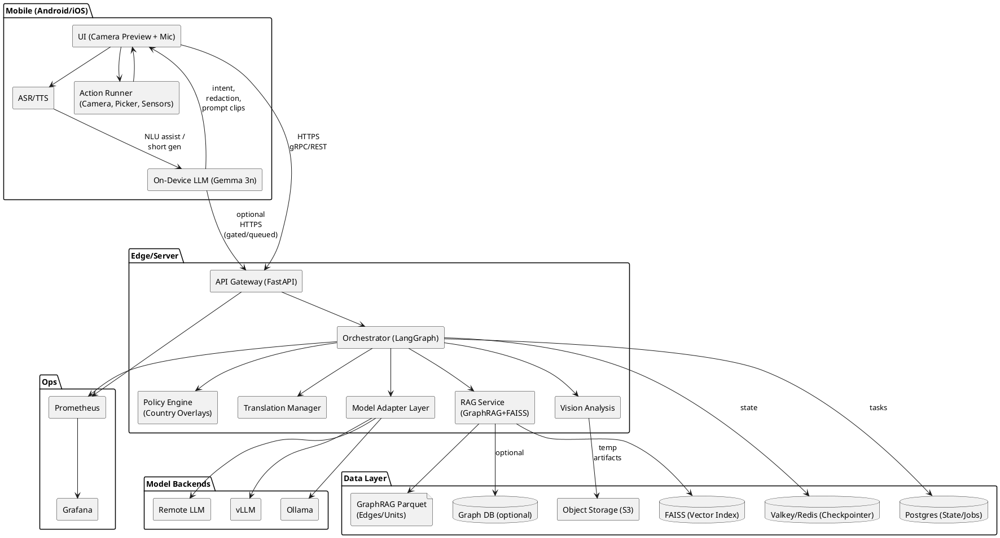
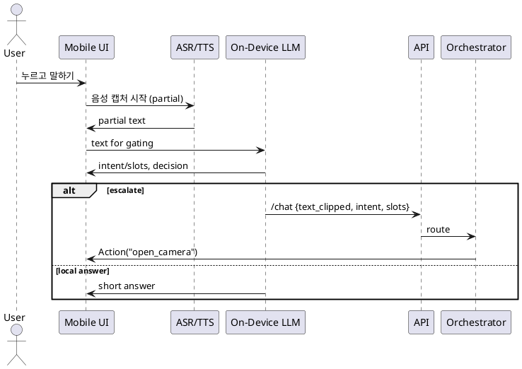
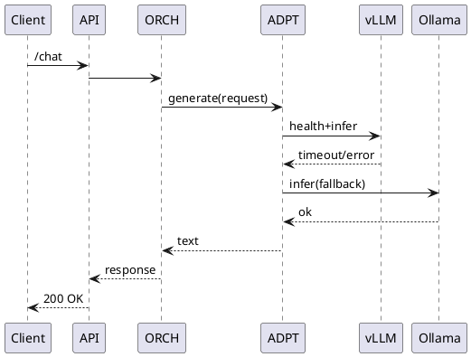
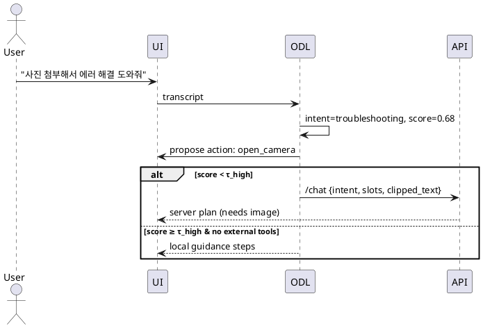

# Onboarding Agent — 요구사항 & 아키텍처 (v2025-08-15)

> 음성 중심 + 카메라 프리뷰 인터랙션을 제공하는 **온디바이스 우선** 하이브리드 AI 에이전트. 디바이스에서 가능한 일은 로컬로 처리하고, 복잡한 계획/검색/지식 조회는 서버의 LangGraph 오케스트레이터로 위임. 모델 교체가 쉬운 **Model Adapter Layer**, 국가별 **정책 오버레이**, **다국어 지원**, **GraphRAG 기반 KB**를 핵심 축으로 설계.

---

## 1) 목표 & 스코프

* **주요 목적**: 카메라 프리뷰 화면에서 자연스러운 음성 대화로 업무/가이드/셋업을 수행하는 온디바이스 우선 에이전트.
* **핵심 가치**: 낮은 지연시간(로컬 처리), 개인정보 보호, 네트워크 불안정 시 **오프라인 모드** 유지, 모델/벤더 **독립성**, 비용 최소화(가능하면 온디바이스와 온프레미스 모델 사용).
* **타깃 플랫폼**: Android, iOS (각각 SpeechRecognizer / Speech framework + TTS), 서버는 FastAPI + LangGraph 기반.
* **주요 도메인 예**: IoT/가전 등록/설정 가이드, 고객 지원(FAQ/RAG), 사진 기반 확인/인증, 여행·예약형 태스크 오케스트레이션 등.

---

## 2) 대표 사용자 시나리오 (요약)

1. 사용자가 **말하기 버튼**을 누르고 기기에 요청 → 디바이스에서 **ASR(STT)** → 로컬 NLU 룰/소형 LLM으로 1차 분류.
2. "사진 첨부" 등 특정 키워드/의도가 감지되면 **카메라 앱 오픈**, 촬영 후 로컬 전처리(리사이즈·압축·익명화) → 서버 분석 필요 시 전송.
3. 서버 **LangGraph 오케스트레이터**가 정책 검사 → 계획 수립 → 도구 호출(vision/RAG/검색/업로드 등) → 응답 작성.
4. 결과는 다국어 번역 → **TTS**로 음성 출력, 필요 시 UI 오버레이(체크리스트/버튼)로 후속 액션 유도.
5. 네트워크 오류 시, 온디바이스 백오프·큐잉 → 회복 시 자동 재전송.

---

## 3) 기능 요구사항 (Functional)

* **온디바이스 처리**

  * Gemma 3n 등 소형 LLM으로 짧은 답변/룰 보강 NLU/후처리.
  * 디바이스 STT/TTS, 카메라 프리뷰, 이미지 전처리(축소/모자이크/텍스트 추출 등).
  * 기기 리소스 연동: 위치, 센서, 파일, 네트워크 상태.
* **서버 처리 (오케스트레이션)**

  * LangGraph 기반 **상태 기계**로 단계적 계획/도구 실행.
  * **Model Adapter Layer**: vLLM ↔ Ollama ↔ Remote LLM 교체/혼합 라우팅.
  * **GraphRAG+FAISS**: 문서/FAQ 인제스트 → 임베딩/그래프 생성 → 하이브리드 검색 + **rerank 적용**.
  * **번역 매니저**: 다국어 입·출력 정규화.
  * **정책/가드레일**: 국가별 규정·금칙어·동의 플로우 오버레이.
* **지식 베이스(KB)**

  * 버전 관리되는 문서 세트, 파이프라인(크롤/ETL → 청크 → 임베딩 → 그래프).
  * 소스 메타데이터(버전, 날짜, 출처)와 신뢰 신호 관리.
* **클라이언트 액션 루프**

  * 서버가 요구한 **행동(Action)**(카메라 열기, 옵션 선택 등)을 앱이 실행 → 결과를 다시 서버로 회신.
* **관측/운영**

  * 트레이스/로그/지표(Prometheus/Grafana), 헬스체크, 자동 페일오버.

---

## 4) 비기능 요구사항 (Non‑Functional)

* **지연시간 목표**: 로컬 반응(버튼→피드백) < 100ms, ASR partial < 300ms, TTS 시작 < 700ms, 서버 왕복 < 1.5s (p95).
* **가용성**: 서버 측 이중화(멀티 모델 백엔드), 네트워크 단절 시 필수 기능 로컬 유지.
* **보안/프라이버시**: 전송/저장 암호화, 최소 수집, PII 마스킹, 리텐션 정책.
* **휴대성**: 모델/DB/클라우드 벤더 종속 최소화, IaC/Helm으로 재현 가능.
* **비용 최소화 원칙**:

  * 온디바이스 우선 처리(ASR/TTS/NLU/간단 응답)로 서버 호출과 토큰 소모 최소화.
  * **캐시 우선**: 의미 캐시(semantic cache)와 임베딩 재사용으로 중복 연산/호출 감소.
  * **토큰 다이어트**: 프롬프트 클리핑/요약, Max Input Tokens, 엄격한 stop 조건, 시스템/도구 메시지 템플릿화.
  * **모델 라우팅**: 품질 임계값을 만족하는 **최저 비용 모델** 우선, 실패 시 상향 페일오버.
  * **배치/오프피크**: 임베딩·인제스트는 배치/야간 처리, 인덱스 증분 업데이트로 피크 비용 억제.
  * **스토리지 등급화**: 원문은 저비용 스토리지, 핫 인덱스는 로컬 디스크/메모리 매핑(FAISS) 사용.
  * **관측 기반 통제**: 요청당 비용, 토큰/초, 캐시 히트율 모니터링 → 자동 한도/스로틀.
* **라이선스 원칙**: **OSI 승인 오픈 라이선스만 사용**(우선: PostgreSQL, BSD‑3‑Clause, Apache‑2.0, MIT; 필요 시 **AGPLv3** 허용). **BSL/SSPL/RSAL 등 소스 공개형/상용 라이선스 금지**.

---

## 5) 전체 아키텍처 개요 (Component)




---

## 6) 컴포넌트 상세 설계

### 6.1 Mobile App

* **UI**: 카메라 프리뷰 상단에 음성 입력 버튼, 결과 오버레이(텍스트/아이콘/체크리스트)
* **ASR/TTS**: iOS Speech / Android SpeechRecognizer + 네이티브 TTS. 스트리밍 partial 결과 제공.
* **On-Device LLM**: gemma-3n(quant)로 NLU 룰 보강, 짧은 응답, 후처리.
* **Action Runner**: 카메라/파일/위치/권한 처리. 서버 지시에 따라 단계별 UX 진행.
* **오프라인 모드**: 요청 큐/재전송, 로컬 캐시.

#### 6.1.1 On-Device LLM 역할(정확한 범위)

* **의도 1차 판별(Gate)**: 규칙(정규식/슬롯) + 소형 LLM을 혼합해 **의도/슬롯 추출** 및 **신뢰도 점수** 산출. 임계치 이상이면 로컬 처리 또는 요약·정규화 후 서버로 **승격(escalate)**.
* **프롬프트 다이어트 & 마스킹**: 불필요 맥락 제거, 개인정보/얼굴/연락처 등 **로컬 마스킹** 후 전송.
* **간단 응답/후처리**: 짧은 Q\&A, 확인/요약, 버튼 라벨 생성, TTS 친화 문장화.
* **캐시/프리페치 보조**: 의미 캐시 조회, 최근 히트 재사용, 서버 호출 전 **쿼리 정제**.
* **오프라인 대체**: 네트워크 불가 시 제한 모드로 **로컬-only 시나리오** 제공.

##### 의도 게이팅 기준(예)

* `intent_score < τ_low` → 로컬 후속 질문 유도(모호성 해소)
* `τ_low ≤ intent_score < τ_high` → **서버 승격**(LangGraph 계획 필요)
* `intent_score ≥ τ_high` & `no_external_tools` → 로컬 처리(짧은 답변/액션)

##### 게이팅 의사코드

```python
def local_gate(nlu, text, ctx):
    intent, score, slots = nlu.infer(text)
    redacted = redact(text)
    if score < 0.45:
        return {"mode":"clarify_local","prompt":clarify(intent)}
    if requires_tools(intent, slots) or score < 0.75:
        return {"mode":"escalate","api_payload":clip(redacted, slots)}
    return {"mode":"answer_local","text":short_answer(intent, slots)}
```

> **메모**: 다이어그램에 `ODL → API` 경로를 **(optional, gated/queued)** 로 추가했습니다. 기본 원칙은 **UI 네트워크 레이어가 소유**하되, ODL 모듈이 게이팅 결과에 따라 호출을 **트리거**하거나 **백그라운드 큐**를 사용할 수 있습니다.

### 6.2 API Gateway (FastAPI)

* 엔드포인트(예시):

  * `POST /chat` : 멀티모달 요청(텍스트, 오디오, 이미지 메타) 수신
  * `POST /actions/result` : 클라이언트 액션 결과 수신
  * `POST /vision/analyze` : 이미지/비디오 프레임 분석
  * `POST /speech/stt` , `POST /speech/tts`
  * `GET /healthz`, `GET /readyz`
* 인증: OAuth2/JWT, 디바이스 바인딩.

### 6.3 Orchestrator (LangGraph)

* **Checkpointer**: Redis/Postgres. 세션/스텝 레벨 상태 공유.
* **노드**(예): Input → PolicyGuard → DetectIntent → Plan → ToolSelect → Execute → Aggregate → Draft → Validate → Translate → Respond
* **에러 처리**: 재시도/보정 프롬프트/대안 경로.

### 6.4 Model Adapter Layer

* **라우팅 규칙**(YAML): 모델 가중치, 토큰 한도, 비용, 지연, 헬스 점수, 국가 규제 태그.
* **백엔드**: vLLM(서빙 성능), Ollama(호환/로컬), Remote LLM(선택적).
* **헬스체크 & 오토 페일오버**: 회로차단기, 지연/오류율 기반 스위칭.

### 6.5 RAG / KB (GraphRAG 하이브리드)

* **스토리지 계층**: 기본은 **GraphRAG Parquet(파일 기반)** 으로 시작 → 필요 시 **Graph DB(옵션: JanusGraph/NebulaGraph)** 로 확장.
* **인덱스**: FAISS(HNSW/IVF‑PQ) + BM25(Sparse) + 그래프 컨텍스트(Parquet/GraphDB).
* **인덱싱 파이프라인**: 원문 → 정제/분할 → **그래프화**(개체/관계/문서‑개체) → **Parquet 출력**(edges, units) → **요약/유닛 생성** → **임베딩** → **FAISS 인덱스 생성/증분 업데이트**.
* **검색/병합**: 질의 시 **GraphRAG 검색**(Parquet 또는 GraphDB) + **FAISS 검색**을 **랭크/병합**.

  * 가중치 재랭크: `score = α·sim_dense + β·bm25 + γ·graph_score (+ δ·recency)`
  * 필요 시 Cross‑Encoder 재랭크는 **top‑M**에만 적용.
* **트러블슈팅 지식**: 트러블슈팅 QA/룰은 Parquet 그래프 유닛과 FAISS 벡터 모두에 인덱싱.

  * 일치 항목이 있으면 해당 근거와 함께 즉시 답변.
  * 일치 항목이 없으면 **HITL 경로**로 전환(§6.9 참조).

### 6.6 Policy Engine

* 국가별 금칙/민감 카테고리, 연령/동의 플로우, 로깅 레벨.
* 정책 위반 시 대안 제시, 감사 로깅, 경보(Webhook) 훅(향후 확장).

### 6.7 Translation Manager

* 다국어 입출력 정규화(ko/en/ja/…); 사용자 선호 언어 유지.
* 시스템/도구 응답의 용어 일관성 보장(용어집/스타일 가이드).

### 6.8 Vision Analysis

* 라이트웨이트 모델(텍스트 검출, QR/바코드, 기기 식별), 서버/온디바이스 선택적.
* 민감 영역 마스킹(얼굴/주소) 옵션.

### 6.9 HITL 트러블슈팅 업데이트(운영 자동화)

* **조건**: 사용자의 질문에 대한 정합 답변이 KB(Parquet/FAISS)에 **부재**일 때.
* **흐름**:

  1. ORCH가 **/kb/propose** 이벤트 생성(질문, 콘텍스트, 추천 초안, 메타 포함).
  2. **Slack 알림**(채널: #ops-kb)으로 카드 전송(Approve/Reject 버튼).
  3. 담당자 검토 후 **승인(Approve)** → 파이프라인 트리거:

     * 메타 YAML 작성(`topic, product, severity, owner, source, locale, status`)
     * 콘텐츠(답변/근거) 저장 → **Parquet 파티션 증분 업데이트**
     * **FAISS add\_with\_ids**(증분 삽입) 또는 소량 리빌드
     * 인덱스 버전 증가 및 감사 로깅
  4. **거절(Reject)** 시 사유 기록, ORCH가 대체 답변/에스컬레이션 안내.
* **상태**: `proposed → approved → published`(배포)
* **지표**: 제안→승인 리드타임, 재질문률, HITL 비율.

### 6.10 데이터 스토어 역할 & 비용(Valkey/Redis vs Postgres)

* **Valkey/Redis (Checkpointer)**

  * **역할**: LangGraph **체크포인터/세션 스냅샷**, 상태 머신 스텝 저장(짧은 TTL), **idempotency 키**, **레이트 리밋 토큰 버킷**, **Pub/Sub**(이벤트 신호), **일시 큐**(경량 작업). 고속 읽기/쓰기와 TTL 관리가 강점.
  * **권장**: **Valkey(BSD‑3)** 우선. Redis는 2025년 **AGPLv3**로 재전환되어 오픈소스이지만 강한 카피레프트 특성 유의.
  * **비용(자가 호스팅)**: 라이선스 비용 없음. 메모리 중심이라 **RAM 용량**과 **복제/고가용성** 수준에 따라 비용 결정. 소규모(HA 1레플리카) 기준 vCPU 2–4, RAM 4–16GB로 시작.
* **Postgres (State/Jobs)**

  * **역할**: **영속 상태**(대화 로그/감사/정책 이력), **잡/워크플로**(예: `pg-boss`/`PGMQ`), **메타데이터**(KB 버전, 파티션 키), **리포팅**과 **트랜잭션 일관성** 요구 영역.
  * **장점**: **PostgreSQL License(OSI 승인)**, 단일 RDB로 큐·스케줄링·리포트까지 커버 가능.
  * **비용(자가 호스팅)**: 라이선스 비용 없음. 주 비용은 **스토리지/IOPS**, **백업/보관 기간**. 중소 규모 vCPU 4–8, RAM 8–32GB, SSD 200–500GB로 시작.
* **선택 가이드**

  * **초저지연·TTL·Pub/Sub** → Valkey/Redis
  * **영속·트랜잭션·조인/리포트** → Postgres
  * 큐잉: **실시간·경량**이면 Valkey, **정확‑한번/감사** 필요하면 Postgres(예: **PGMQ/pg‑boss**)

---

## 7) 상태 & 데이터 설계

* **ConversationState**(요약):

```json
{
  "session_id": "uuid",
  "user_profile": {"locale":"ko-KR","consents":{...}},
  "policy_context": {"country":"KR","age_gate":true},
  "turn": {"input": {"text":...,"audio_ref":...,"image_refs":[...]},
            "intent": {"label":..., "score":...},
            "plan": [...],
            "tools_used": [...],
            "kb_hits": [...],
            "draft": ..., "final": ...},
  "history_head": "vector_cache_key",
  "metrics": {"latency_ms":...,"backend":"vllm"}
}
```

* **Checkpointer**: 그래프 스텝 단위로 직렬화, 재시도/재개 지원.

---

## 8) 배포 토폴로지 & DevOps

* **개발/로컬**: docker-compose (API, ORCH, VDB, PARQ, GDB(opt), REDIS, PG, Grafana, Prometheus, Ollama/vLLM 선택).
* **스테이징/운영**: Kubernetes + Helm 차트 (HPA, PDB, Secret/ConfigMap, Ingress, ServiceMonitor).
* **CI/CD**: GitHub Actions → 포매팅/테스트 → 컨테이너 빌드 → 헬름 패키징/서명 → 환경별 릴리스.
* **관측/알림**: RED/USE, 지연/오류율/용량 대시보드, 경보 룰 + **Slack 앱/웹훅/인터랙션 엔드포인트**.
* **작업자(Worker)**: 인덱스 증분 업데이트 잡(Parquet 파티션/FAISS add\_with\_ids), 재시도/백오프.

---

## 9) API 설계(요약)

* `POST /chat`
  **Req**: `{ text|audio|image_refs, device_ctx, locale }`
  **Res**: `{ messages[], actions[], tts_url?, citations[] }`
* `POST /actions/result`
  **Req**: `{ action_id, payload, attachments[] }` → **Res**: `{ status }`
* `POST /vision/analyze`
  **Req**: `{ image|video_frame, tasks:[ocr,detect,qr] }` → **Res**: `{ results }`

### 9.1 운영/HITL & Slack 연동

* `POST /kb/propose` : ORCH→Ops, 제안 카드 생성(질문, 초안, 근거, 메타 YAML)
* `POST /kb/approve` : Slack 액션 웹훅(승인) → 인덱싱 잡 트리거
* `POST /kb/reject` : Slack 액션 웹훅(거절) → 사유 저장
* `POST /slack/actions` : 인터랙티브 콜백 수신 엔드포인트
* `POST /kb/reindex` : (관리용) 특정 파티션/문서 증분 리빌드

### 9.2 KB 메타 YAML 스키마(예)

```yaml
id: kb-2025-08-15-001
locale: ko-KR
topic: "device-troubleshooting"
product: "SmartAC-9000"
severity: "high"   # low|medium|high|critical
source: "ops"
owner: "@seungho"
status: "proposed"  # proposed|approved|published
created_at: "2025-08-15T07:30:00Z"
updated_at: "2025-08-15T07:30:00Z"
tags: ["wifi", "pairing", "error-code:E12"]
summary: "Wi‑Fi 페어링 중 E12 오류 해결 절차"
answer: |
  1) 공유기 2.4GHz 전용 SSID 사용…
  2) 앱에서 기기 리셋 버튼 5초…
units:
  - id: unit-1
    text: "E12: DHCP 실패 시 라우터 재시작"
  - id: unit-2
    text: "AP 모드 진입: 전원 버튼 10초…"
```

---

## 10) LangGraph 오케스트레이션 (개략)

```python
state = {
  "input": {},
  "intent": None,
  "plan": [],
  "kb_hits": [],
  "response": None,
}

# 노드들: Input -> Guard -> Intent -> Plan -> ToolExec -> Synthesize -> Translate -> Respond
```

* **Intent**: 로컬 규칙(정규식/키워드/슬롯) + 소형 LLM + 서버 분류기(모호할 때).
* **Plan/ToolExec**: Vision / RAG / 서드파티 API / Client Action 지시.
* **Synthesize**: 모델 어댑터로 라우팅, 근거 인용.

---

## 11) GraphRAG 파이프라인 (요약)

1. **수집**: 파일/크롤/웹훅 → S3 임시 보관
2. **정제/분할**: 규칙 기반/문서 유형별 파서
3. **그래프화**: 개체/관계/문서‑개체 추출 → **GraphRAG Parquet**(edges, units) 출력
4. **유닛 요약/임베딩**: 요약 단위(Units) 생성 → 멀티링구얼 임베딩
5. **FAISS 인덱스**: HNSW/IVF‑PQ 생성, **증분 업데이트** 지원
6. **질의**: GraphRAG 검색(Parquet/옵션 GraphDB) + FAISS 검색 동시 실행
7. **랭크/병합**: 가중치 Re‑rank(α,β,γ\[,δ]) → 선택적 Cross‑Encoder(top‑M)
8. **배포**: 인덱스 버전 태깅, 원복 포인트 생성
9. **HITL 반영**: Slack 승인 시 파티션 증분 업데이트(§6.9)

---

## 12) 실패/복구 시나리오

* **모델 서버 장애**: Adapter가 vLLM→Ollama로 페일오버, 회로차단기 열림.
* **네트워크 단절**: 요청 로컬 큐/재시도, 핵심 기능(ASR/TTS/간단 응답) 로컬 유지.
* **비정상 입력**: 정책 엔진이 차단 후 대안 메시지/가이드 제공.

---

## 13) 보안/프라이버시

* 전송(TLS)/저장(디스크 암호화), 최소 수집, PII 마스킹(얼굴/주소/연락처), 옵트인 기반 텔레메트리.
* 감사 로깅 + 관리 콘솔 접근 통제, 키/시크릿 로테이션.

---

## 14) 테스트 전략

* 단위/통합/시나리오 E2E(음성·카메라 포함), 지연/부하 테스트, 안전성/레드팀 시나리오, 다국어 회귀 테스트.

---

## 15) 운영 대시보드(예)

* **모델 라우팅 현황**(vLLM vs Ollama 비중, 오류율), **RAG 히트율**, **p95 지연**, **정책 차단 건수**, **액션 루프 성공률**.
* **비용 지표**: 요청당 비용(₩/req), 입력/출력 토큰, 캐시 히트율, 인덱스 빌드 시간/주기, 재랭커 적용률(top-M 비율).

---

## 16) 시퀀스 다이어그램

### 16.1 음성+카메라 액션 루프



### 16.2 모델 페일오버(vLLM→Ollama)



### 16.3 GraphRAG 조회(Parquet 우선 + 선택적 GraphDB)

```plantuml
@startuml
participant ORCH
participant RAG
database "FAISS Index" as VDB
file "Parquet (Edges/Units)" as PARQ
database "GraphDB (opt)" as GDB

ORCH -> RAG: query(q, k=8)
RAG -> VDB: knn(q)
VDB --> RAG: top_k_dense
RAG -> PARQ: graph_lookup(q)
PARQ --> RAG: subgraph/units
RAG -> GDB: k-hop (optional)
GDB --> RAG: neighbors
note right of RAG
  weighted merge:
  score = α*dense + β*bm25 + γ*graph + δ*recency
  then optional cross-encoder on top-M
end note
RAG --> ORCH: passages + graph_context + citations
@enduml
```

### 16.4 로컬 의도 게이트 & 에스컬레이트



---

## 17) 모델 라우터 설정(YAML 스니펫)

```yaml
models:
  - name: vllm_qwen72b
    provider: vllm
    max_tokens: 4096
    cost_weight: 0.7
    latency_weight: 0.2
    quality_weight: 0.1
    health_endpoint: http://vllm:8000/health
  - name: ollama_llama3_8b
    provider: ollama
    max_tokens: 2048
    cost_weight: 0.4
    latency_weight: 0.4
    quality_weight: 0.2
    health_endpoint: http://ollama:11434/health
routing:
  rules:
    - if: "country == 'KR' and task == 'faq'"
      prefer: [ollama_llama3_8b, vllm_qwen72b]
    - if: "latency_p95 > 1500 or error_rate > 5%"
      action: failover
```

### 17.1 RAG 설정(YAML 스니펫)

```yaml
rag:
  graph_store:
    type: parquet
    path: s3://kb/parquet/  # 또는 로컬 경로
    optional_graphdb:
      enabled: false
      provider: janusgraph   # 또는 nebulagraph
      uri: bolt://graph:7687
  index:
    type: faiss
    factory: hnsw   # 또는 ivf_pq
    params:
      dim: 768
      hnsw:
        M: 32
        efConstruction: 200
      ivf_pq:
        nlist: 4096
        m: 16
        nbits: 8
  ingest:
    unit_summary: true   # 텍스트 요약→유닛 생성
    incremental: true
  retrieval:
    k_dense: 40
    k_sparse: 40    # 선택: BM25 비활성화 시 0
    k_graph: 2
    merge:
      formula: "alpha*dense + beta*bm25 + gamma*graph + delta*recency"
      weights:
        alpha: 0.55
        beta: 0.25
        gamma: 0.15
        delta: 0.05
      cross_encoder:
        enabled: true
        top_m: 10
        model: "bge-reranker-v2-m3"
  cost_controls:
    semantic_cache: true
    dedupe_near_duplicates: true
    max_passages: 12
```

### 17.2 로컬 의도 게이트 설정(YAML)

```yaml
local_gate:
  thresholds:
    low: 0.45
    high: 0.75
  require_tools:
    troubleshooting: true
    device_registration: true
    smalltalk: false
  redact:
    pii: ["phone", "address", "email"]
  clip:
    max_chars: 800
    keep_slots: true
```

---

## 18) 로드맵/To‑Do (요약)

* ReactFlow 기반 **시나리오 GUI** ↔ YAML DSL 상호 변환 안정화
* 온디바이스 STT/TTS 스트리밍 품질 튜닝(바람소리/잔향 억제)
* Vision 경량 모델 온디바이스 이전 옵션 검증(Core ML / NNAPI)
* GraphRAG 품질 평가 파이프라인/대시보드 연동
* 정책/안전 대안응답 템플릿 정교화

---

**참고**: 이 문서는 향후 세부 구현(코드/헬름/CI 파이프라인)과 함께 버전 태그를 증가시키며 관리합니다.

---

# 요구사항/아키텍처 업데이트 (2025-08-16)

아래 항목은 최근 Monorepo 코드(v0.7) 반영 내용에 맞춘 **요구사항 문서 보강**입니다. (기존 서술은 유지, 충돌 없는 범위에서 추가/수정)

## 1) 기능 요구사항 (추가/수정)

* **온디바이스 의도판별 & 게이팅**

  * 단말 내 **Gemma 3n**으로 의도(label), 신뢰도(score), 슬롯(slots), **normalized\_text**, **need\_image**, safety를 생성.
  * 게이트 규칙: `score < low` → **Clarify**, `low ≤ score < high` 또는 툴 필요 → **서버 승격**, 그 외 → **로컬 답변**.
  * 서버 호출 시 `nlu` JSON을 함께 전송하여 서버가 그대로 활용(불가 시 폴백).
* **Retrieval 검색 파이프라인**

  * **GraphRAG 인덱싱 → Parquet 출력 → 요약/유닛 임베딩 → FAISS 인덱스 생성**.
  * **질의 시 GraphRAG + FAISS + BM25** 하이브리드 검색 후 **가중 랭크+병합**, 상위 후보는 **Cross-Encoder rerank**로 재정렬.
* **Troubleshooting HITL 루프**

  * 데이터에 정답이 없으면 **담당자 알림 → 답변 작성/검토 → 승인 후 KB 재인덱싱**.
  * 승인 시 해당 답변이 Parquet/FAISS에 **증분 반영**되어 다음 질의부터 검색 가능.
* **Vision 임시 산출물 보관(S3 호환)**

  * 온디바이스/서버 비전 분석 중 생성되는 **중간 아티팩트**는 S3 호환 스토리지(예: MinIO)에 임시 저장(해시 키, 단기 TTL 정책).

## 2) 비기능 요구사항 (보강)

* **비용 최소화**: 가능한 한 **온디바이스/온프레미스 모델** 사용, 서버 LLM은 폴백일 때만 호출.
* **라이선스**: **오픈 라이선스만 사용**(예: Apache-2.0, MIT). 상용/클라우드 토큰 비용 의존 최소화.
* **성능/지연**: 온디바이스 NLU는 1–2k 토큰 이하 프롬프트 유지, 서버측 CE rerank는 상위 5–10개로 제한.
* **관측성**: 의도/신뢰도/승격율/슬롯 정확도(F1)/응답시간을 메트릭으로 수집.

## 3) 아키텍처 결정(ADR)

* **ADR-D1: Device-first NLU (Gemma 3n)**

  * 장점: 개인정보 단말 내 처리, **토큰 비용 0**, 저지연.
  * 서버는 온디바이스 JSON 유효 시 **그 값을 신뢰**하고, 실패 시 **서버 LLM 폴백 → 룰 스텁**.
* **ADR-D2: GraphRAG(Parquet) + FAISS + CE rerank**

  * 초기엔 **파일 기반(GraphRAG Parquet)** 으로 시작, 필요 시 **JanusGraph/NebulaGraph**로 확장.
  * 스코어 합성식 예: `alpha*dense + beta*bm25 + gamma*graph + delta*recency` → CE로 재정렬.
* **ADR-D3: HITL 승인 워크플로**

  * 슬랙 알림/승인 → YAML 메타(topic, product, severity) 포함 → 승인 시 자동 인덱싱.

## 4) 인터페이스/스키마 (요약)

* **온디바이스 NLU(JSON)**

  ```json
  {
    "label": "faq|troubleshooting|device_registration|smalltalk|other",
    "score": 0.0–1.0,
    "slots": {"error_code":"E12", "product":"X"},
    "normalized_text": "검색 친화 정규화 문장",
    "need_image": false,
    "safety": {"pii":[], "disallowed": false}
  }
  ```
* **/chat 요청 페이로드(발췌)**: `{ text, nlu, device_ctx }`
* **HITL YAML 메타(예)**: `topic, product, severity`

## 5) 컴포넌트 역할 (정리)

* **UI**: 사용자 입력/카메라, 온디바이스 NLU 실행, 게이팅 결정에 따른 로컬 처리 또는 서버 승격.
* **On-Device LLM(Gemma 3n)**: 의도/슬롯/정규화/세이프티 생성.
* **API/Orchestrator**: Intent 검증(온디바이스 → 서버 LLM 폴백), 플랜/툴 실행, 응답 합성/번역.
* **RAG**: GraphRAG Parquet + FAISS + BM25 하이브리드 검색, CE rerank.
* **스토리지**:

  * **Valkey(=Redis 호환)**: 세션/체크포인터/캐시(오픈소스, 무과금).
  * **Postgres**: 영속 메타데이터, 승인 이력 저장(오픈소스, 무과금).
  * **MinIO(S3 호환)**: 비전 임시 아티팩트 저장(오픈소스, 무과금).

## 6) 구성값(예시)

* `local_gate.thresholds: { low: 0.45, high: 0.75 }`
* `rag.merge.weights: { alpha: 0.55, beta: 0.25, gamma: 0.15, delta: 0.05 }`
* `rag.merge.cross_encoder: { enabled: true, top_m: 10, model: "BAAI/bge-reranker-v2-m3" }`
* `stores: { valkey_url, postgres_dsn, s3{endpoint,bucket,...} }`

## 7) 테스트/운영

* **A/B 튜닝**: 게이트 임계값/슬롯 가중치/CE top\_m.
* **알림/승인**: 슬랙 상호작용으로 승인 시 자동 인덱싱 트리거.
* **데이터 거버넌스**: S3 임시 키 TTL, PII 마스킹(PromptClipper, PiiRedactor) 적용.

---

## 🤖 Android LocalLLM (llama.cpp, Gemma 3n) — GGUF 로드 + JNI 스트리밍

> 기존 `LocalLLM` 프로토콜을 **llama.cpp**로 구현합니다. GGUF 모델(예: Gemma 3n)을 앱 내 저장소에 두고 JNI를 통해 호출합니다. `-DHAS_LLAMA` 미설정 시 데모 모드(고정 JSON)로 동작해 앱 배선 확인이 가능합니다.

### 1) Kotlin 구현체 — `mobile/android/localllm/src/main/java/ai/onboarding/LlamaLocalLLM.kt`

```kotlin
package ai.onboarding

/**
 * Android LocalLLM implementation backed by llama.cpp via JNI.
 * Loads a GGUF model (e.g., Gemma 3n) and returns full text from a streaming decode.
 */
class LlamaLocalLLM(
    modelPath: String,
    nCtx: Int = 2048,
    nThreads: Int = Runtime.getRuntime().availableProcessors().coerceAtMost(6)
) : LocalLLM {

    private var handle: Long = 0

    companion object {
        init { System.loadLibrary("llama_bridge") }
    }

    private external fun nativeInit(modelPath: String, nCtx: Int, nThreads: Int): Long
    private external fun nativeGenerate(
        handle: Long,
        prompt: String,
        maxTokens: Int,
        temperature: Float,
        repeatPenalty: Float,
        topK: Int,
        topP: Float,
        typicalP: Float
    ): String
    private external fun nativeFree(handle: Long)

    init {
        handle = nativeInit(modelPath, nCtx, nThreads)
        require(handle != 0L) { "Failed to init llama bridge (model path: $modelPath)" }
    }

    override fun runGemma(prompt: String): String {
        return nativeGenerate(handle, prompt, 256, 0.8f, 1.1f, 40, 0.95f, 1.0f)
    }

    fun close() { if (handle != 0L) { nativeFree(handle); handle = 0L } }
}
```

### 2) JNI C++ 브리지 — `mobile/android/localllm/src/main/cpp/llama_bridge_jni.cpp`

```cpp
#include <jni.h>
#include <string>
#include <vector>
#include <cstring>
#include <android/log.h>

#define LOG_TAG "LlamaBridgeJNI"
#define ALOGE(...) __android_log_print(ANDROID_LOG_ERROR, LOG_TAG, __VA_ARGS__)

#ifndef HAS_LLAMA
struct demo_ctx { int dummy; };
extern "C" JNIEXPORT jlong JNICALL
Java_ai_onboarding_LlamaLocalLLM_nativeInit(JNIEnv* env, jobject, jstring, jint, jint){ return (jlong)new demo_ctx{1}; }
extern "C" JNIEXPORT jstring JNICALL
Java_ai_onboarding_LlamaLocalLLM_nativeGenerate(JNIEnv* env, jobject, jlong, jstring, jint, jfloat, jfloat, jint, jfloat, jfloat){
  const char* demo = "{\"label\":\"faq\",\"score\":0.62,\"slots\":{},\"normalized_text\":\"요청 요약\"}";
  return env->NewStringUTF(demo);
}
extern "C" JNIEXPORT void JNICALL
Java_ai_onboarding_LlamaLocalLLM_nativeFree(JNIEnv*, jobject, jlong h){ delete reinterpret_cast<demo_ctx*>(h); }
#else
#include "llama.h"
struct real_ctx { llama_model* model; llama_context* lctx; int32_t n_ctx; int32_t n_threads; };
static int tok(llama_model* m, const char* s, std::vector<llama_token>& out){ int32_t cap=strlen(s)+8; out.resize(cap); int n=llama_tokenize(m,s,strlen(s),out.data(),cap,true,true); if(n<0)return-1; out.resize(n); return n; }
extern "C" JNIEXPORT jlong JNICALL
Java_ai_onboarding_LlamaLocalLLM_nativeInit(JNIEnv* env, jobject, jstring jpath, jint nCtx, jint nTh){
  const char* cpath = env->GetStringUTFChars(jpath,nullptr);
  llama_backend_init();
  auto mp = llama_model_default_params(); mp.n_gpu_layers = 33; mp.main_gpu = 0;
  auto* model = llama_load_model_from_file(cpath, mp); env->ReleaseStringUTFChars(jpath,cpath);
  if(!model){ ALOGE("load model failed"); return 0; }
  auto cp = llama_context_default_params(); cp.n_ctx = nCtx>0?nCtx:2048; cp.n_threads = nTh>0?nTh:4;
  auto* ctx = llama_new_context_with_model(model, cp); if(!ctx){ ALOGE("ctx failed"); llama_free_model(model); return 0; }
  auto* r = new real_ctx{model,ctx,cp.n_ctx,cp.n_threads}; return (jlong)r;
}
extern "C" JNIEXPORT jstring JNICALL
Java_ai_onboarding_LlamaLocalLLM_nativeGenerate(JNIEnv* env, jobject, jlong h, jstring jprompt, jint maxT, jfloat temp, jfloat rep, jint topK, jfloat topP, jfloat typP){
  auto* r = (real_ctx*)h; if(!r) return env->NewStringUTF("");
  const char* p = env->GetStringUTFChars(jprompt,nullptr);
  std::vector<llama_token> pt; if(tok(r->model,p,pt)<0){ env->ReleaseStringUTFChars(jprompt,p); return env->NewStringUTF(""); }
  env->ReleaseStringUTFChars(jprompt,p);
  int n_past=0; auto batch = llama_batch_init(r->n_ctx,0,1);
  for(size_t i=0;i<pt.size();){ int n_eval = std::min((int)(pt.size()-i), r->n_ctx); llama_batch_clear(&batch);
    for(int j=0;j<n_eval;++j) llama_batch_add(&batch, pt[i+j], n_past+j, NULL, 0);
    if(llama_decode(r->lctx,batch)!=0){ ALOGE("decode(prompt) fail"); llama_batch_free(batch); return env->NewStringUTF(""); }
    n_past += n_eval; i += n_eval; }
  const int32_t vocab = llama_n_vocab(r->model); std::vector<llama_token_data> cand(vocab);
  std::vector<llama_token> hist; hist.reserve(64);
  std::string out; out.reserve(4096);
  int produced=0; while(produced<maxT){ const float* lg = llama_get_logits(r->lctx);
    for(int t=0;t<vocab;++t){ cand[t].id=t; cand[t].logit=lg[t]; cand[t].p=0; }
    llama_token_data_array arr{ cand.data(), (size_t)vocab, false };
    if(!hist.empty()) llama_sample_repetition_penalty(r->lctx,&arr,hist.data(),(int)hist.size(),rep);
    if(topK>0) llama_sample_top_k(r->lctx,&arr,topK,1);
    if(topP<1.0f) llama_sample_top_p(r->lctx,&arr,topP,1);
    if(typP<1.0f) llama_sample_typical(r->lctx,&arr,typP,1);
    if(temp!=1.0f) llama_sample_temperature(r->lctx,&arr,temp);
    llama_token tok = llama_sample_token(r->lctx,&arr);
    char piece[512]; int n = llama_token_to_piece(r->model,tok,piece,(int)sizeof(piece),false,true); if(n>0) out.append(piece,n);
    if(tok==llama_token_eos(r->model)) break;
    if((int)hist.size()<64) hist.push_back(tok); else { memmove(hist.data(),hist.data()+1,sizeof(llama_token)*(63)); hist[63]=tok; }
    llama_batch_clear(&batch); llama_batch_add(&batch,tok,n_past,NULL,0); if(llama_decode(r->lctx,batch)!=0){ ALOGE("decode(step) fail"); break; }
    n_past++; produced++; }
  llama_batch_free(batch);
  return env->NewStringUTF(out.c_str());
}
extern "C" JNIEXPORT void JNICALL
Java_ai_onboarding_LlamaLocalLLM_nativeFree(JNIEnv*, jobject, jlong h){ auto* r=(real_ctx*)h; if(!r) return; if(r->lctx) llama_free(r->lctx); if(r->model) llama_free_model(r->model); llama_backend_free(); delete r; }
#endif
```

### 3) CMake 설정 — `mobile/android/localllm/src/main/cpp/CMakeLists.txt`

```cmake
cmake_minimum_required(VERSION 3.22.1)
project(llama_bridge)

add_library(llama_bridge SHARED
    llama_bridge_jni.cpp
)

# -DLLAMA_DIR=/abs/path/to/llama.cpp 로 지정하여 정적 라이브러리와 헤더 연결
if(DEFINED LLAMA_DIR)
    add_library(llama_static STATIC IMPORTED)
    set_target_properties(llama_static PROPERTIES IMPORTED_LOCATION
        ${LLAMA_DIR}/build/android/${ANDROID_ABI}/libllama.a)
    target_include_directories(llama_bridge PRIVATE ${LLAMA_DIR} ${LLAMA_DIR}/include ${LLAMA_DIR}/ggml/include)
    target_link_libraries(llama_bridge PRIVATE llama_static log)
else()
    message(WARNING "LLAMA_DIR not set - demo mode without llama.cpp")
endif()

# 실제 연결 시 아래 활성화
# target_compile_definitions(llama_bridge PRIVATE HAS_LLAMA=1)
```

### 4) Gradle 모듈 — `mobile/android/localllm/build.gradle`

```gradle
plugins {
    id 'com.android.library'
    id 'org.jetbrains.kotlin.android'
}
android {
    namespace 'ai.onboarding.localllm'
    compileSdk 34
    defaultConfig {
        minSdk 26
        targetSdk 34
        externalNativeBuild { cmake { } } // -DLLAMA_DIR, -DHAS_LLAMA 전달
        ndk { abiFilters 'arm64-v8a' } // 에뮬레이터 필요 시 'x86_64' 추가
    }
    externalNativeBuild { cmake { path file('src/main/cpp/CMakeLists.txt'); version '3.22.1' } }
}
dependencies { implementation 'org.jetbrains.kotlin:kotlin-stdlib:1.9.24' }
```

### 5) 사용 예 — 앱 통합

```kotlin
val modelPath = File(filesDir, "models/gemma-3n-Q4_K_M.gguf").absolutePath
val engine: LocalLLM = LlamaLocalLLM(modelPath = modelPath, nCtx = 2048, nThreads = 4)
val nlu: OnDeviceNLU = GemmaNLU(engine)
val gate = Gating(apiBase = "https://api.example.com", nlu = nlu)
```

> **배포 팁**: GGUF는 APK에 포함하지 말고 최초 실행 시 다운로드(WorkManager) 후 `filesDir/models/`에 저장, **SHA256 검증**을 권장합니다. `nThreads`/`n_ctx`는 기기별 프로파일링으로 튜닝하십시오.
