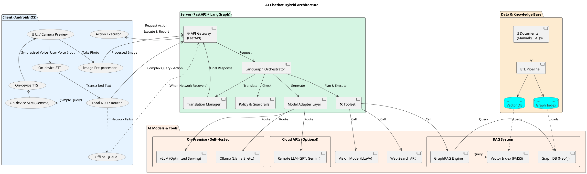

네, 제시해주신 요구사항을 바탕으로 AI 챗봇 프로젝트의 전체적인 **요구사항 명세**와 **시스템 아키텍처 설계**를 정리해 드리겠습니다.

## 1\. 요구사항 명세서 (Requirements Specification)

요청하신 내용을 바탕으로, 목표와 핵심 가치를 달성하기 위한 기능 및 비기능 요구사항을 명확히 정의합니다.

### **핵심 목표 및 가치** 🎯

  * **프로젝트 목표:** 카메라 프리뷰를 활용하여 음성으로 IoT 기기 설정, 가이드, 문제 해결을 수행하는 **온디바이스 우선(On-device First) AI 에이전트** 개발.
  * **핵심 가치 제안:**
      * **즉각적인 반응성:** 온디바이스 처리를 통한 낮은 지연 시간(Low Latency).
      * **강화된 개인정보보호:** 민감 정보를 기기 내부에서 처리하여 프라이버시 보장.
      * **안정적인 사용성:** 네트워크 불안정 시에도 핵심 기능이 동작하는 오프라인 모드.
      * **기술 독립성:** 특정 LLM 모델이나 클라우드 벤더에 종속되지 않는 유연한 구조.
      * **비용 효율성:** 온디바이스 및 자체 호스팅(On-premise) 모델을 우선 활용하여 운영 비용 최소화.

-----

### **주요 기능 (Functions)** 🛠️

1.  **IoT 기기 등록 지원:** 복잡하고 다양한 기기 등록 과정을 음성 대화로 안내.
2.  **선제적 문제 해결 (Troubleshooting):** 오류 발생 가능성을 미리 예측하고, 사용자 환경 정보(Wi-Fi 신호, OS 버전 등)를 대화로 수집하여 사전 요구사항 충족 유도.
3.  **사용자 계정 관리:** 기기 등록 후 사용자 계정 생성 및 연동 지원.
4.  **제품 구매 가이드:** 신규 기기 구매 상담 및 기존 환경과의 호환성 체크.
5.  **인터랙티브 매뉴얼:** 기기 매뉴얼을 음성으로 검색하고 단계별 가이드 제공.
6.  **고객 지원 자동화:** 사용자의 장애 신고(VOC)를 접수하고 1차적인 진단 및 해결 방안 제시.
7.  **오프라인 진단:** 기기가 오프라인일 때 원인을 진단하고 해결 과정을 안내.

-----

### **시스템 요구사항 (System Requirements)** ⚙️

| 구분 | 요구사항 | 세부 내용 |
| :--- | :--- | :--- |
| **클라이언트 (On-device)** | **로컬 AI 처리** | • **소형 LLM (SLM):** Gemma 등 경량 모델로 간단한 질의응답, 의도분류(NLU), 서버 응답 후처리 수행.\<br\>• **음성 처리:** 네이티브 STT/TTS 프레임워크 활용.\<br\>• **이미지 처리:** 카메라 프리뷰, 이미지 리사이즈/압축, PII 마스킹(모자이크 등).\<br\>• **리소스 접근:** 위치, 센서, 파일 시스템, 네트워크 상태 등 디바이스 API 연동. |
| **서버 (Backend)** | **지능형 오케스트레이션** | • **상태 기반 워크플로우:** LangGraph를 활용해 계획-실행-검증의 단계적 작업 처리.\<br\>• **모델 추상화 계층 (MAL):** vLLM, Ollama, 원격 API 등 다양한 모델 백엔드를 유연하게 교체/혼합/라우팅.\<br\>• **지식 검색 (RAG):** GraphRAG 및 FAISS 기반 하이브리드 검색으로 정확도 높은 답변 생성.\<br\>• **다국어 처리:** 사용자 언어에 맞춰 입력 정규화 및 최종 응답 번역.\<br\>• **정책 및 안전장치:** 금칙어, 개인정보보호 규정, 사용자 동의 절차 등 가드레일 적용. |
| **지식 베이스 (KB)** | **신뢰성 및 확장성** | • **데이터 파이프라인:** 문서 크롤링, ETL, 청킹, 임베딩, 그래프 생성을 자동화.\<br\>• **버전 관리:** 모든 지식 소스는 버전, 출처, 최종 수정일 등 메타데이터와 함께 관리. |
| **상호작용** | **클라이언트-서버 액션 루프** | • 서버가 클라이언트의 특정 행동(예: `ACTION_OPEN_CAMERA`)을 요청하면, 클라이언트는 이를 수행하고 결과를 다시 서버에 회신하는 순환 구조. |
| **운영 및 모니터링** | **관측 가능성 (Observability)** | • 분산 추적(Trace), 로그, 메트릭(Prometheus/Grafana)을 통한 시스템 상태 모니터링 및 이상 감지.\<br\>• 헬스체크 및 자동 페일오버(Failover) 기능. |

-----

### **품질 및 제약사항 (Non-functional Requirements)** ✨

  * **성능 (Latency):**
      * 로컬 UI 피드백: \< 100ms
      * ASR 중간 결과(Partial): \< 300ms
      * TTS 첫 소리 출력(TTFB): \< 700ms
      * 서버 왕복(Round-trip): \< 1.5s (p95 기준)
  * **가용성 (Availability):** 서버 이중화, 네트워크 단절 시 온디바이스 폴백(Fallback) 기능.
  * **보안 및 프라이버시 (Security & Privacy):** 전송/저장 데이터 암호화, 개인식별정보(PII) 마스킹, 데이터 최소 수집 원칙 준수.
  * **이식성 (Portability):** 특정 벤더 종속을 최소화하고, IaC(Terraform)/Helm Chart로 인프라 재현성 확보.
  * **비용 최소화 (Cost-Efficiency):** 온디바이스 우선 처리, 시맨틱 캐싱, 토큰 사용량 최적화, 저비용 모델 우선 라우팅, 스토리지 계층화 등 적극적 비용 절감 전략 적용.
  * **라이선스 (License):** **OSI 승인 오픈소스 라이선스** (Apache-2.0, MIT, BSD 등) 사용을 원칙으로 하며, BSL/SSPL 등 상용 제한 라이선스는 사용 금지.

\<br\>

## 2\. 시스템 아키텍처 설계 (System Architecture Design)

위 요구사항을 충족하기 위한 하이브리드(클라이언트-서버) 시스템 아키텍처를 제안합니다.

### **전체 아키텍처 다이어그램**

-----

### **컴포넌트별 상세 설계**

#### **1. 클라이언트 (Client-Side)**

  * **On-device STT/TTS:** Android `SpeechRecognizer` 및 iOS `Speech` 프레임워크를 사용하여 빠르고 자연스러운 음성 입출력을 담당합니다. 네트워크 비용이 없고 지연 시간이 매우 짧습니다.
  * **로컬 NLU / 라우터:** 사용자의 발화를 1차적으로 분석합니다.
      * "볼륨 높여줘" 같은 단순 제어는 즉시 `Action Executor`로 전달합니다.
      * "기기 등록 어떻게 해?" 와 같이 지식베이스가 필요한 복잡한 질문은 서버로 전달합니다.
      * "사진 첨부할게" 같은 키워드가 감지되면 `Image Pre-processor`를 활성화합니다.
  * **On-device SLM (Gemma 3B 등):** 간단한 요약, 감정 분석, 서버 응답의 문체 변경 등 가벼운 LLM 작업을 수행하여 서버 호출을 최소화합니다.
  * **Image Pre-processor:** 사용자가 촬영한 이미지를 서버에 보내기 전, 개인정보(얼굴, 번호판 등)를 모자이크 처리하고, 전송 비용을 줄이기 위해 리사이즈 및 압축을 수행합니다.
  * **Action Executor:** "Wi-Fi 설정 화면 열어줘" 와 같이 서버가 요청한 디바이스 관련 작업을 수행하고 그 결과를 다시 서버에 보고합니다.
  * **Offline Queue:** 네트워크 연결이 끊겼을 때 서버로 보낼 요청을 임시 저장했다가, 연결이 복구되면 자동으로 재전송하여 데이터 유실을 방지합니다.

#### **2. 서버 (Server-Side)**

  * **API Gateway (FastAPI):** 클라이언트와의 모든 통신을 처리하는 진입점입니다. 비동기 처리를 통해 높은 동시성을 지원합니다.
  * **LangGraph Orchestrator:** 전체 작업의 두뇌 역할을 합니다. 사용자 요청을 받으면 상태 기계(State Machine)처럼 작동하여, `계획 수립 → 도구 호출 → 결과 검토 → 최종 응답 생성`의 과정을 체계적으로 관리합니다.
  * **Model Adapter Layer (MAL):** **모델/벤더 독립성**을 보장하는 핵심 레이어입니다.
      * 요청의 복잡도와 비용 정책에 따라 Ollama로 로컬 호스팅된 Llama 3를 호출할지, vLLM으로 최적화된 모델을 호출할지, 혹은 외부 API를 사용할지 동적으로 결정합니다.
      * 이를 통해 가장 저렴하고 효율적인 모델을 우선 사용하고, 필요시 고성능 모델로 전환하는 **비용 최적화 라우팅**이 가능합니다.
  * **Toolset:** 오케스트레이터가 사용하는 도구 모음입니다.
      * **GraphRAG Engine:** 단순 벡터 검색을 넘어, 지식 그래프를 함께 탐색하여 "A와 B의 차이점은?"과 같은 관계형 질문에 더 정확한 답변을 제공합니다.
      * **Vision Model:** 사용자가 첨부한 사진(예: 에러 메시지가 뜬 공유기)을 분석하고 이해합니다.
      * **Web Search:** 매뉴얼에 없는 최신 정보나 드라이버 다운로드 링크 등을 웹에서 검색합니다.
  * **Policy & Guardrails:** 모든 요청과 응답을 검사하여 개인정보, 욕설, 규제 위반 등의 위험 요소를 사전에 차단합니다.

#### **3. 데이터 및 지식 베이스 (Data & KB)**

  * **ETL Pipeline:** 정기적으로 제품 매뉴얼, FAQ, VOC 데이터 등 다양한 소스에서 정보를 수집하여 전처리(ETL)하고, 이를 Vector DB와 Graph DB에 저장하는 자동화된 파이프라인입니다.
  * **하이브리드 저장소:**
      * **Vector DB (FAISS/PostgreSQL+pgvector):** 텍스트의 의미적 유사성을 기반으로 한 빠른 검색을 담당합니다.
      * **Graph DB (Neo4j):** "A 모델과 호환되는 액세서리는?"과 같이 개체 간의 관계를 저장하고 질의하는 데 사용됩니다.

-----

### **주요 동작 흐름 예시: "기기 등록이 안돼. (사진 첨부)"**

1.  **[클라이언트]** 사용자가 "등록이 안돼"라고 말하고 사진 첨부 버튼을 누름.
2.  **[클라이언트]** **On-device STT**가 텍스트로 변환. 사용자가 촬영한 공유기 에러 화면은 **Image Pre-processor**를 통해 익명화/압축됨.
3.  **[클라이언트]** **로컬 NLU**는 "등록 실패" 의도와 "이미지 존재"를 파악하고, 텍스트와 이미지를 함께 서버로 전송. 네트워크 오류 시 **Offline Queue**에 저장.
4.  **[서버]** **FastAPI**가 요청을 수신하여 **LangGraph Orchestrator**에 전달.
5.  **[서버]** **Orchestrator**가 계획 수립: `1. 이미지 분석 → 2. 에러 코드 기반으로 KB 검색 → 3. 해결책 생성`
6.  **[서버]** **Toolset**의 **Vision Model**을 호출하여 이미지에서 "Error Code: C102" 텍스트를 인식.
7.  **[서버]** **Toolset**의 **GraphRAG Engine**을 호출하여 "Error Code C102 해결 방법"을 검색.
8.  **[서버]** **Model Adapter Layer**를 통해 가장 비용 효율적인 LLM(예: Ollama의 Llama 3)을 사용하여 검색된 정보와 이미지 분석 결과를 종합, 친절한 해결책 문장을 생성.
      * > "공유기의 'C102' 에러 코드를 확인했어요. 와이파이 주파수 문제일 수 있습니다. 스마트폰의 Wi-Fi 설정에서 2.4GHz 네트워크에 연결한 후 다시 시도해 보시겠어요? [Wi-Fi 설정 열기] 버튼을 만들어 드릴까요?"
9.  **[클라이언트]** 서버 응답을 수신. **TTS**가 음성으로 안내하고, 동시에 화면에는 **[Wi-Fi 설정 열기]** 버튼(Action)을 UI 오버레이로 표시.
10. **[클라이언트]** 사용자가 버튼을 누르면 **Action Executor**가 Wi-Fi 설정 화면을 열어주고, 이 사실을 서버에 보고하며 상호작용이 완료됨.
