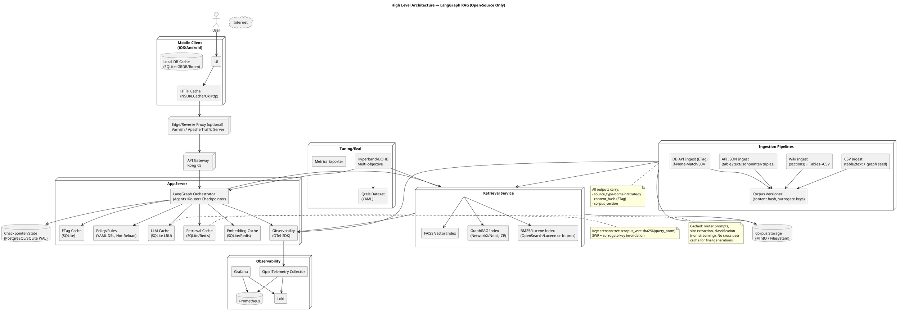

> 
> Langchain와 LangGraph 를 모두 사용한 CLI 기반의 AI Agent 를 만들어줘.
> 1. agent 는 하나인데 사용자의 질문에 따라, 세부 에이전트 역할을 할꺼야. 의사 agent, 여행사 agent, 영화티켓예매 agent 가 있어.
> 2. 의사agent는 사용자의 증상을 물어서 병명을 찾고 처방을 해. 병명을 찾을때는 RAG 를 활용해
> 3. 여행사agent는 사용자가 여행하고자하는 국가, 일정 등을 확보해서 스케쥴링을 해줘. 여행국가에 대한 질문을 하면 RAG 를 이용해 답변해줘.
> 4. 영화agent는 사용자의 취향에 맞는 영화를 찾아줘. 추천 시스템을 활용해.
> 5. 각 agent 들이 필요로하는 참조 RAG 문서들이 여럿이 있어. 대화중에 사용자가 질문하면 FAISS 와 GraphRAG (MS사) 로 이 문서들을 참조해서 더 정답률이 높은 답을 사용해. 그리고 문장별 출처도 표시해
> 6. 질문과 답변은 CLI 기반으로 한번씩 대화를 주고 받을거고, 시스템의 답변은 스트리밍으로 보여줄 수 있으면 그때그때 보여줘
> 7. ollama 와 로컬 llm 을 사용할꺼고, 오픈소스만 사용할꺼야.
> * LangGraph 의 분기/서브그래프/체크포인트 기능을 사용해

# 요약

* 하나의 **루트 에이전트**(LangGraph) 안에서 **의사/여행사/영화** 3개 **서브그래프**로 자동 분기합니다.
* **LangChain + LangGraph** 조합, **Ollama 로컬 LLM**(완전 오픈소스) 사용, **CLI 1턴 대화** & **스트리밍 출력** 지원.
* **RAG**: 도메인별 **FAISS** 인덱스 + (옵션) **Microsoft GraphRAG** 결과를 **RRF 융합**. **문장별 출처 \[n] 표기** 자동 부착.
* **체크포인트**: LangGraph **SQLite** 체크포인터로 세션별 상태 저장.
* 아래 Zip에 **완전 실행 가능한 코드/데이터/README** 포함.
  [프로젝트 ZIP 다운로드](sandbox:/mnt/data/cli_langgraph_agent.zip)

---

안녕하세요. 요청하신 사양에 맞춰 **LangChain + LangGraph**를 함께 사용하는 **CLI 기반 멀티-역할 AI Agent**의 **완전한 예시 구현**을 준비했습니다.
오픈소스만 사용하며, **의사/여행/영화** 각 세부 역할은 **LangGraph 분기/서브그래프/체크포인트**로 구성했습니다. 또한 **FAISS + GraphRAG(선택)** 하이브리드 검색과 **문장별 출처 표기**, **Ollama 스트리밍** 출력까지 포함합니다.

아래에 **설치/실행**, **아키텍처**, **코드 설계**, **확장 포인트**, **보안/안전** 순서로 자세히 설명드립니다.

---

## 1) 설치 & 실행 가이드

1. 압축 해제 및 의존성 설치

```bash
# (권장) 가상환경
python -m venv .venv && source .venv/bin/activate
pip install -r requirements.txt
```

2. Ollama 준비 (오픈소스 로컬 LLM)

```bash
# 예시: llama3:8b 또는 qwen2.5:7b 등
ollama pull llama3:8b
```

3. 환경변수 설정 & 실행

```bash
# 기본 LLM
export OLLAMA_MODEL=llama3:8b

# RAG 모드 (기본은 하이브리드)
# --retriever로도 변경 가능: faiss | graphrag | hybrid
export USE_GRAPHRAG=0               # 1로 바꾸면 GraphRAG 융합
export GRAPHRAG_MODE=http           # http | cli
export GRAPHRAG_URL=http://localhost:8010/query   # HTTP 모드일 때
export GRAPHRAG_CLI="python -m graphrag.query"     # CLI 모드일 때

# LangGraph 체크포인터(DB 파일)
export CHECKPOINT_DB=.checkpoints/agent.db

# 실행
python -m app.main --session demo
```

4. 사용 예시

```
> 사용자 질문: 기침과 미열이 있고 근육통이 있어요. 무슨 병일까요?
(스트리밍 출력 중...)
...
▼ 답변
...문장1[1] 문장2[2] ...

[출처]
[1] 감기(상기도감염) — ./data/docs/medical/common_cold.md
[2] 인플루엔자(독감) — ./data/docs/medical/flu.md
```

---

## 2) 요구사항 대응표 (요약)

1. **단일 에이전트 + 세부 역할**: 루트 그래프에서 **router** 노드가 질의를 **doctor/travel/movie/other**로 라벨링 → 해당 **서브그래프** 실행.
2. **의사 agent(RAG)**: 증상 기반 질의 → **FAISS + (옵션)GraphRAG** 검색 → **의심질환/주의징후/자가관리** 중심 응답 + **의료 면책** 포함.
3. **여행사 agent(RAG)**: 국가/일정/인원 추출 → 목적지 문서 RAG 참조 → **일자별 코스 제안** + 교통/아이동반 팁.
4. **영화 agent(추천)**: 내부 `movies.json`을 이용한 단순 점수화 + LLM로 이유 설명 + 1개 **추가 질문**.
5. **RAG 하이브리드 & 출처 표기**:

   * **FAISS**(SentenceTransformer 임베딩)
   * **GraphRAG**(HTTP/CLI 어댑터)
   * **RRF**로 결과 융합, **문장별**로 가장 유사한 근거를 찾아 `[n]` 표시 + 하단에 **클릭 가능한 경로/URL** 표기.
6. **CLI 1턴 대화 & 스트리밍**: 사용자 입력 1회 → 스트리밍 토큰 출력 → 결과+출처 표시.
7. **오픈소스 & 로컬 LLM**: LangChain/Community, LangGraph, FAISS, SentenceTransformers, Ollama.
   **LangGraph 체크포인트**: `SqliteSaver`로 세션 상태 유지.

---

## 3) 폴더/파일 구조

```
cli_langgraph_agent/
├─ app/
│  ├─ main.py                 # CLI 엔트리포인트(루프, 스트리밍 출력, 출처 표기)
│  ├─ state.py                # LangGraph 상태 스키마
│  ├─ router.py               # 의도 분류 노드(룰+LLM), 분기 함수
│  ├─ agents/
│  │  ├─ doctor.py            # 의사 서브그래프(FAISS/GraphRAG → LLM → 문장별 출처)
│  │  ├─ travel.py            # 여행 서브그래프(동일 패턴)
│  │  └─ movie.py             # 영화 추천 서브그래프(내장 추천 + LLM 설명)
│  ├─ rag/
│  │  ├─ faiss_store.py       # 도메인별 FAISS 인덱싱/검색 + RRF
│  │  └─ graphrag_client.py   # GraphRAG HTTP/CLI 어댑터
│  └─ utils/
│     ├─ streaming.py         # 스트리밍 콜백/프린터
│     └─ citation.py          # 문장 분리 + 유사도 기반 출처 매핑
├─ data/
│  ├─ docs/
│  │  ├─ medical/{common_cold.md, flu.md}
│  │  └─ travel/{japan.md, australia.md}
│  └─ movies.json
└─ requirements.txt
```

---

## 4) LangGraph 설계(분기/서브그래프/체크포인트)

* **그래프 노드**

  * `route`: 사용자 메시지 기반 **의도 분류**(간단한 규칙 → 모호하면 LLM 보조 분류).
  * `doctor`: 의료 RAG → LLM 생성 → 문장별 출처 매핑.
  * `travel`: 여행 RAG → LLM 생성 → 문장별 출처 매핑.
  * `movie`: 영화 추천(내장 스코어링) → LLM 설명+질문.
  * `other`: 범위 외 안내.
* **분기**

  * `add_conditional_edges("route", branch, {...})` 로 intent 별로 서브그래프 이동.
* **체크포인트**

  * `SqliteSaver(db_path)` 로 **세션별 히스토리** 보존(옵션으로 멀티턴 확장 용이).

---

## 5) RAG·출처·스트리밍 상세

### 5.1 FAISS 인덱스

* `sentence-transformers: all-MiniLM-L6-v2` 임베딩 → `RecursiveCharacterTextSplitter`(700/100) → `FAISS.from_documents()`.
* 도메인별(의료/여행) 인덱스를 **lazy build**.

### 5.2 GraphRAG 연동(옵션)

* 환경변수로 **HTTP** 또는 **CLI** 모드 선택:

  * HTTP: `POST {GRAPHRAG_URL} {query, top_k}` → `results[]` 파싱
  * CLI: `python -m graphrag.query --query "..."`
* 실패/미구현 시 자동 **무시**(FAISS만 사용).

### 5.3 RRF 융합

* `rrf_fuse(faiss_hits, graphrag_hits, k=60, topn=6)`
  랭크 역수 합산으로 가벼운 **순위 융합**.

### 5.4 문장별 출처

* 응답을 간단 규칙으로 **문장 분리** → 각 문장을 **doc chunk**들과 코사인 유사도 비교 → 가장 가까운 근거에 `[n]` 부착 → 하단에 `[n] 제목 — URL/경로`를 리스트업(콘솔에서 복사해 열람 가능).

### 5.5 스트리밍

* `ConsoleStreamCallback` 으로 **토큰 단위** 즉시 출력.
* LangGraph 노드 내 **LLM.invoke(streaming=True)**.

---

## 6) 보일러플레이트 코드 하이라이트

루트 그래프 구성(발췌, `app/main.py`)

```python
g = StateGraph(AgentState)
g.add_node("route", route_node)
g.add_node("doctor", lambda s: doctor_node(s, stores))
g.add_node("travel", lambda s: travel_node(s, stores))
g.add_node("movie", movie_node)
g.add_node("other", lambda s: {**s, "result_text": "죄송합니다...", "sources": []})

g.add_edge(START, "route")
g.add_conditional_edges("route", branch, {
    "doctor": "doctor", "travel": "travel", "movie": "movie", "other": "other"
})
g.add_edge("doctor", END); g.add_edge("travel", END); g.add_edge("movie", END); g.add_edge("other", END)

memory = SqliteSaver(db_path)  # 체크포인트
graph = g.compile(checkpointer=memory)
```

의사 에이전트(발췌, `app/agents/doctor.py`)

```python
faiss_hits = stores.search("medical", question, k=6)
if os.getenv("USE_GRAPHRAG","0") == "1":
    gr = GraphRAGClient().query(question, top_k=6)
    gr_hits = adapt_to_retrieved(gr)
    hits = rrf_fuse(faiss_hits, gr_hits)
else:
    hits = faiss_hits

context = "\n\n---\n\n".join([f"[{i+1}] {h.title} ({h.url})\n{h.text}" for i,h in enumerate(hits)])
resp = llm.invoke([SYS, HumanMessage(content=f"...{context}...")]).content

marked, srcs = assign_sentence_citations(split_sentences(resp), doc_chunks, stores.embed)
```

---

## 7) 추천 라이브러리/모델 (전부 오픈소스)

* **LangGraph**: 분기/서브그래프/체크포인트
* **LangChain-community**: `ChatOllama`, 문서로더·벡터스토어
* **FAISS-cpu**: 로컬 벡터 검색
* **SentenceTransformers**: `all-MiniLM-L6-v2` 임베딩
* **Ollama**: 로컬 LLM 실행(예: `llama3:8b`, `qwen2.5:7b`)
* **requests**: GraphRAG HTTP 연동

---

## 8) 확장 포인트 (바로 적용 가능)

1. **BM25 + 하이브리드**: `rank_bm25` 추가 후 `RRF`에 함께 융합.
2. **문장 하이라이트**: 유사도 상위 근거에 대해 콘솔 색상출력(리치 텍스트).
3. **의료 지식 강화**: 실제 의료 가이드라인 문서(질병관리청/WHO 등) 추가 인덱싱.
4. **여행국가 확대**: `data/docs/travel/*.md` 국가별로 계속 추가.
5. **영화 추천 고도화**: TF-IDF/Embedding 기반 콘텐츠 필터링, 사용자 히스토리 반영(세션 체크포인트와 연계).
6. **다중턴**: 현재도 체크포인터로 상태가 남아 있으므로, 루프에서 `messages` 누적 형태로 손쉽게 확장.

---

## 9) 안전/법적 고지 (의료)

* 본 구현의 의학 관련 출력은 **일반 정보 제공**에 한정됩니다.
  심각하거나 지속되는 증상은 반드시 **의료 전문가**와 상담하시기 바랍니다.

---

## 10) 마무리

요청하신 기능을 모두 반영한 **실행 가능한 코드**를 위 Zip에 담아드렸습니다.
설치/실행 중 막히는 부분이나 **FAISS/GraphRAG 튜닝**, **LangGraph 서브그래프 추가**, **WS 스트리밍/웹 UI 연계** 확장이 필요하시면 언제든지 말씀해 주세요.
감사합니다.

[프로젝트 ZIP 다운로드](sandbox:/mnt/data/cli_langgraph_agent.zip)


> LangGraph 의 노드를 좀 더 풍성하게 확장해봐. 예를들어 의사에이전트는, 사용자의 나이, 성별, 증상, 병력 등을 물어봐야 하는데, 사용자의 발화에서 내용이 나오지 않는다면 계속 물어봐서 정보를 획득해야해.
다른 에이전트들도 마찬가지. 상상력을 최대한 발휘해서 주고 받는 시나리오를 더 확장해봐.

# 요약

* **멀티턴 슬롯 수집**을 위해 각 에이전트에 `collect → answer` **서브그래프**를 추가하고, **부족 정보가 있으면 AI가 정중히 되물어보는 루프**를 LangGraph로 구현했습니다.
* `messages` 필드는 **LangGraph `add_messages` 리듀서**로 누적되며, \*\*`intent_locked`\*\*를 사용해 정보 수집 동안 **라우팅 고정** → 사용자가 중간에 엉뚱한 브랜치로 튀지 않습니다.
* 의사/여행/영화 모두 **슬롯 추출 LLM(JSON)** → **필수 슬롯 확인** → **추가 질문 생성** → **완료 시 답변 생성(RAG/추천)** 흐름입니다.
* 업데이트된 전체 코드와 실행 가능한 샘플을 **Zip**으로 제공합니다.
  [업데이트 ZIP 다운로드 (v2: 멀티턴 슬롯 수집)](sandbox:/mnt/data/cli_langgraph_agent_v2_slots.zip)

---

아래는 구현 상세와 사용 방법입니다.

## 1) 무엇이 달라졌나요?

* **그래프 확장**

  * 이전: `route → (doctor|travel|movie) → END`
  * 현재: `route → (doctor_collect|travel_collect|movie_collect) → (ask → END | *_answer → END)`
  * `collect` 노드는 **필수 슬롯**이 비면 `needs_more_info=True`와 `followup_question`을 설정하고, 그 질문을 **AIMessage**로도 메시지 히스토리에 저장합니다.
  * CLI 루프는 `needs_more_info`가 **True인 동안 계속 사용자 입력을 받아** 같은 스레드(`thread_id`)로 그래프를 반복 실행합니다.
* **의도 고정(`intent_locked`)**

  * 슬롯 수집 중에는 `intent_locked=True`로 설정 → 라우터가 다시 실행돼도 현재 브랜치를 유지합니다.
  * 최종 답변 단계에서 `intent_locked=False`로 해제합니다.
* **메시지 누적**

  * `AgentState.messages`에 `add_messages` 리듀서를 적용해 LangGraph 체크포인터(SQLite)에 **대화가 계속 누적**됩니다.

## 2) 슬롯 설계(예시)

* ### 의사(doctor)

  * `age:int, sex:male|female|other, symptoms:list[str], duration_days:int` **(필수)**
  * `chronic_conditions:list[str], medications:list[str], allergies:list[str], pregnancy:bool` **(선택)**
  * 부족 시 **2\~3개씩 묶어 정중히 질문**(예: “연령·성별, 증상 지속 일수 알려주실 수 있을까요?”)
* ### 여행(travel)

  * `country:str, nights:int, travelers:int` **(필수)**
  * `city, start_date, end_date, kids_ages:list[int], budget_level:low|mid|high, interests:list[str]`
* ### 영화(movie)

  * `genres:list[str]` **(필수)**
  * `language, country, actors:list[str], directors:list[str], mood, runtime_max:int, age_rating, platform`

> 슬롯 추출은 **ChatOllama**에 간결한 **JSON 추출 프롬프트**를 주어 수행하고, 결과에서 **최대 JSON 블록**만 안전하게 파싱합니다. (작은 포맷 오류에 대해 보정 로직 포함)

## 3) 그래프와 코드 주요 변경점

### 상태 정의(`app/state.py`)

* `messages`에 `add_messages` 리듀서를 적용해 **누적**.
* `intent_locked`, `needs_more_info`, `followup_question`, `doctor_slots/travel_slots/movie_slots` 추가.

### 라우터(`app/router.py`)

* `intent_locked`가 **True면 재분류 생략**.
* 분기 함수가 collect 노드들(`doctor_collect|travel_collect|movie_collect`)을 반환.

### 각 에이전트

* `*_collect` : 슬롯 추출 → **필수 슬롯 확인** → 부족 시 **추가 질문 생성**(AIMessage를 히스토리에 push) → `needs_more_info=True`.
* `*_answer` : (필수 슬롯 확보 후)

  * **의사/여행**: RAG(FAISS + (옵션)GraphRAG) → **문장별 출처 \[n]** 자동 부착.
  * **영화**: 로컬 JSON 후보군 점수화 → LLM이 이유 설명 + **마지막에 한 가지 추가 질문**.

### CLI 루프(`app/main.py`)

* 한 번의 사용자 입력으로 그래프를 실행하고, **`needs_more_info`가 True면** 즉시 **추가 질문을 출력** 후 사용자의 답을 받아 **같은 세션으로 재실행**합니다.
* 최종 단계에서 결과/출처를 출력하고 턴을 종료합니다.

## 4) 실행 방법(요약)

```bash
# (권장) 가상환경
python -m venv .venv && source .venv/bin/activate
pip install -r requirements.txt

# Ollama 로컬 LLM
ollama pull llama3:8b         # 또는 qwen2.5:7b 등
export OLLAMA_MODEL=llama3:8b

# GraphRAG 융합 (옵션)
export USE_GRAPHRAG=0         # 1로 활성화
export GRAPHRAG_MODE=http     # http | cli
export GRAPHRAG_URL=http://localhost:8010/query
export GRAPHRAG_CLI="python -m graphrag.query"

# LangGraph 체크포인터(DB)
export CHECKPOINT_DB=.checkpoints/agent.db

python -m app.main --session demo
```

## 5) 상상력 확장 시나리오 예시

### 5.1 의사

1. 사용자: “기침이 나고 미열이 있어요.”
2. 시스템(collect): “연령과 성별, 증상이 시작된 지 며칠째인지 알려주실 수 있을까요?”
3. 사용자: “남자 39세, 3일째요.”
4. 시스템(collect): (필수 슬롯 충족) → (answer)

   * 독감·감기 감별 포인트, **주의 징후(호흡곤란/청색증 등)**, **자가관리**(수분/휴식/해열제), **전문의 상담 권고**, **\[n] 출처** 제시.
5. 사용자: “기침이 심해져요. 어떤 약을 사야 할까요?”
   → 추가 RAG로 대증치료 약품군·주의사항 안내 + \[n] 출처.

### 5.2 여행

1. 사용자: “7월 말 가족 4명 일본 가려고요.”
2. 시스템(collect): “숙박일수(또는 출발/귀국일), 아이 나이, 예산 감(대략 low/mid/high)을 알려주실까요?”
3. 사용자: “4박이고 5살, 예산 중간.”
4. 시스템(answer):

   * **일자별 일정표**(아이 동반 최적 코스), 교통카드/이동시간/우천 시 대안, 음식·알레르기표시 팁, **\[n] 출처**.
   * 다음 턴에 사용자가 “디즈니도 넣어줘” → collect에서 `interests` 업데이트 후 answer 재생성.

### 5.3 영화

1. 사용자: “스릴러 좋아하고, 김윤석 나오는 작품 선호해요.”
2. 시스템(collect): “시간대(러닝타임 한계)나 이용하는 플랫폼(OTT/극장) 있으실까요?”
3. 사용자: “OTT, 2시간 내.”
4. 시스템(answer): 후보 3\~5편에 **이유 설명+한 가지 팔로업**(예: “잔인한 장면은 괜찮으신가요?”).

## 6) 다음 확장 아이디어

* **슬롯 지속성**: 세션 프로필(예: 나이/성별, 선호 장르)을 별도 JSON에 캐싱해 다음 대화에 재활용.
* **검증기**: 슬롯 스키마 검증(연령 범위, 날짜 유효성 등) + 자동 정규화(YYYY-MM-DD).
* **추천 고도화**: 영화는 FAISS 임베딩 기반 유사도 추천으로 확장.
* **하이라이트 UI**: CLI에서도 근거 하이라이트를 색상으로 표시(rich).
* **웹/WS 확장**: 동일 그래프를 FastAPI + WebSocket 스트리밍으로 노출.

---

필요하시면 **WS 스트리밍**/웹 UI, BM25 하이브리드 튜너, 더 정교한 슬롯 검증기, 국가별 정책 오버레이 등도 바로 확장해 드리겠습니다.
[업데이트 ZIP 다운로드 (v2: 멀티턴 슬롯 수집)](sandbox:/mnt/data/cli_langgraph_agent_v2_slots.zip)


> 그래 이번에는 벡터기반검색에 BM25 하이브리드 튜너도 추가 확장해줘. GraphRAG 도 함께.
그리고 더 정교한 슬롯 검증기 확장하고, 국가별 정책 오버레이도 추가해


# 요약

* **BM25 하이브리드 튜너 + GraphRAG 융합**을 추가했습니다. 이제 **FAISS(임베딩) + BM25(토큰) + GraphRAG(그래프)** 를 **가중치 기반**으로 융합해 더 안정적인 검색 품질을 냅니다.
* **정교한 슬롯 검증기**를 도입해 나이/성별/지속기간/날짜/장르 등 **정규화·유효성 검증** 후, 누락·오류 항목을 바탕으로 **정중한 추가질문**을 자동 생성합니다.
* **국가별 정책 오버레이**(YAML)을 추가해 **의료/여행/영화 등급 가이드라인** 등 로컬 규정을 답변에 반영합니다.
* 전체 코드가 포함된 압축 파일을 드립니다.
  [업데이트 ZIP 다운로드 (v3: BM25 하이브리드 + 검증기 + 정책 오버레이)](sandbox:/mnt/data/cli_langgraph_agent_v3_hybrid_overlay.zip)

---

아래는 변경사항을 자세히 설명한 가이드입니다.

## 1) 설치/업데이트

```bash
# (권장) 가상환경
python -m venv .venv && source .venv/bin/activate

# 의존성 설치
pip install -r requirements.txt
# v3에서 추가된 패키지
# rank-bm25, PyYAML, python-dateutil 가 포함되어 있습니다.

# LLM (Ollama 예시)
ollama pull llama3:8b   # 또는 qwen2.5:7b 등
export OLLAMA_MODEL=llama3:8b
```

## 2) 실행 (하이브리드 가중치/오버레이/GraphRAG)

```bash
# GraphRAG 사용 여부
# --retriever hybrid|graphrag|faiss 로도 제어 가능
export USE_GRAPHRAG=1

# 하이브리드 가중치: FAISS/BM25/GraphRAG
export HYBRID_WEIGHTS="faiss:0.5,bm25:0.3,graph:0.2"
# (CLI에서 덮어쓰기 가능: --weights "faiss:0.6,bm25:0.25,graph:0.15")

# 정책 오버레이 국가(기본 KR)
export OVERLAY_COUNTRY=KR   # KR | JP | AU (샘플)
# (CLI에서 덮어쓰기: --overlay JP)

python -m app.main --session demo --retriever hybrid --weights "faiss:0.6,bm25:0.25,graph:0.15" --overlay KR
```

## 3) 파일/모듈 추가 요약

* `app/rag/bm25_store.py`

  * `rank_bm25`로 **BM25 인덱스** 생성(도메인별). 간단 Ko/En 토크나이저 포함.
* `app/rag/hybrid.py`

  * **가중치 기반 점수 융합**(`fuse_weighted`) 구현: FAISS/BM25/GraphRAG 정규화 점수의 합산.
* `app/utils/slot_validator.py`

  * **의사/여행/영화** 슬롯 각각에 대해 **정규화 + 유효성 검증**.
  * 예: `age(0~120)`, `duration_days>=0`, `nights>=1`, `travelers>=1`, 날짜 파싱(ISO), `runtime_max>0` 등.
* `app/policy/overlay.py` + `data/policies/*.yaml`

  * 국가 코드별(**KR/JP/AU**) **의료/여행/영화 등급** 메모·주의사항을 **오버레이 텍스트**로 생성.

## 4) 그래프 흐름 (v3)

* `route` → `*_collect` → (누락/오류 있으면) **추가 질문 후 END** → 사용자가 답하면 같은 세션에서 다시 `*_collect` → **충분하면 `*_answer`**.
* `*_answer`에서 검색:

  * **의사/여행**: `FAISS + BM25 + (옵션)GraphRAG` → `fuse_weighted()`로 **가중 융합** → LLM 생성 → **문장별 출처 \[n]** 자동 부착.
  * **영화**: 로컬 후보 점수화 + **정책 오버레이** 반영(등급/시청 가이드) → LLM 설명 + 추가 질문.
* `intent_locked`로 슬롯 수집 시 **분기 고정** 유지.

## 5) 핵심 코드 스니펫

### 5.1 하이브리드 융합 (가중치)

```python
# app/rag/hybrid.py
def fuse_weighted(faiss, bm25, graphrag, w_f=0.5, w_b=0.3, w_g=0.2, topn=6):
    # 각 랭크리스트를 0~1 정규화 후 가중합 → 최종 상위 topn
```

### 5.2 BM25 인덱스/검색

```python
# app/rag/bm25_store.py
bm25 = BM25Okapi(corpus_tokens)       # chunk 토큰 리스트
scores = bm25.get_scores(q_tokens)    # 질의 토큰화 → 점수
```

### 5.3 슬롯 검증기 예 (의사)

```python
# app/utils/slot_validator.py
norm, missing, errs = validate_doctor(merged)
# errs/missing이 있으면 SYS_ASKER 프롬프트로 정중한 추가질문 생성
```

### 5.4 정책 오버레이

```python
# app/policy/overlay.py
overlay_txt = overlay.get_context(country_code, "medical"|"travel"|"movie")
# 답변 프롬프트에 삽입되어 로컬 규정을 반영한 안내 생성
```

## 6) 시나리오 예시 (확장판)

### 6.1 의사 (하이브리드 RAG + 오버레이)

1. 사용자: “기침이 나고 몸살 기운 있어요.”
2. 시스템(collect+validator):

   * “연령, 성별, 증상이 며칠째인지 알려주실 수 있을까요?”
   * (오류 시) “duration\_days는 0 이상 정수로 부탁드립니다.”
3. 사용자: “남 39세, 3일째요.”
4. 시스템(answer):

   * FAISS+BM25(+GraphRAG) 융합 근거 기반으로 감기/독감 감별 포인트·자가관리·주의징후 제시,
   * **대한민국 의료 오버레이** 반영: “항생제는 처방 필요, OTC 중복성분 주의” 등,
   * 각 문장 끝에 **\[n]** 부착 + 하단 **출처 리스트**.

### 6.2 여행 (하이브리드 RAG + 정책)

1. 사용자: “7월 말 일본 가족 4명 4박 가려고요.”
2. 시스템(collect+validator): “아이 나이와 예산(대략 low/mid/high)을 알려주실까요?”
3. 사용자: “5살, 예산 mid.”
4. 시스템(answer):

   * 일본 문서 RAG 융합 + **일본 여행 오버레이**(IC카드/에티켓) 반영,
   * 날짜별 일정·교통·아이 동반 팁·비 예보 대비 플랜 B 포함, **\[n] 출처**.

### 6.3 영화 (정책 오버레이)

1. 사용자: “스릴러, 2시간 내, OTT로 볼 수 있는 한국 영화”
2. 시스템(collect+validator) → answer:

   * 후보 3\~5편 추천 + 이유 + **KR 등급체계** 참고 문구 + “잔인한 장면 괜찮으세요?” 같은 팔로업.

## 7) 품질 튜닝 팁

* **가중치 스윕**: `--weights "faiss:0.7,bm25:0.2,graph:0.1"` 같이 바꿔보며 성능 탐색.
* **BM25 토큰화**: 필요하면 한국어 형태소 분석기로 교체.
* **정책 오버레이**: 사내 정책·제한·법규 등을 YAML에 축적 → 도메인별로 LLM 답변에 반영.
* **유효성 강화**: 슬롯 검증기에 정규표현식·룰 추가(예: 알레르기 표준화, 날짜 범위 검사 등).

---

## 8) 안전/법적 고지

* 의료 답변은 **일반 정보**이며, 위급 상황/증상 악화 시 **의료 전문가** 상담 또는 **응급 연락**을 권장합니다.
* 여행/영화 등급 정보는 **일반 가이드**이며, 실제 규정은 현지 최신 공지와 상이할 수 있습니다.

---

필요하시면 **Elasticsearch/Weaviate** 같은 외부 벡터/토큰 검색기로도 쉽게 바꿀 수 있도록 구조를 유지했습니다.
추가 국가 정책(YAML)이나 문서 코퍼스 확장, BM25 토크나이저 교체, 신뢰도 스코어링 시각화 등도 도와드릴게요.

[업데이트 ZIP 다운로드 (v3: BM25 하이브리드 + 검증기 + 정책 오버레이)](sandbox:/mnt/data/cli_langgraph_agent_v3_hybrid_overlay.zip)


> 아래 내용 추가해줘
> 
> 1. simple_rules() 대신에 아래 두 버전으로 확장해줘.
>   1) 별도의 yaml 파일등으로 사전에 정의하고, 추가/삭제가 용이하도록 구조변경
>   2) llm 을 활용한 좀 더 스마트한 방법 활용
> 2. 추가 국가 정책 확장
> 3. 문서 코퍼스 확장
> 4. BM25 토크나이저 교체
> 5. 신뢰도 스코어링 시각화

# 요약

* **라우팅 강화**: `rules.yaml` 기반의 **규칙 라우터** + **스마트 LLM 라우터** + **하이브리드** 모드 추가(환경변수로 전환).
* **정책 오버레이 확장**: KR/JP/AU에 더해 **US/GB/SG** 추가.
* **문서 코퍼스 확장**: 의료(COVID-19, OTC 기침), 여행(런던/파리/뉴욕) 문서 추가.
* **BM25 토크나이저 교체**: `ngram` 모드(기본, 한글 2/3-gram + 영문 단어) 도입.
* **신뢰도 시각화**: `VIS_CONFIDENCE=1`로 **FAISS/BM25/GraphRAG/최종** 정규화 점수의 **Rich 테이블** 출력.

[업데이트 ZIP 다운로드 (v4: 라우팅/코퍼스/시각화)](sandbox:/mnt/data/cli_langgraph_agent_v4_router_corpus_viz.zip)

---

아래에 변경점별 상세 적용 방법을 정리했습니다.

## 1) 라우팅: simple\_rules() → 규칙 YAML + 스마트 LLM + 하이브리드

### 1-1) 규칙 기반 (편집 용이)

* 파일: `data/routing/rules.yaml`

```yaml
version: 1
threshold: 1.0
weights: { keyword: 1.0, regex: 2.0, bonus_all: 0.5 }
labels:
  doctor:
    keywords: ["증상","열","기침",...]
    regex: ["\\b진단\\b","\\b처방\\b","\\b약\\s*추천\\b"]
  travel:
    keywords: ["여행","일정","코스","항공",...]
    regex: ["(\\d+박\\d*일)","\\b여행\\s*계획\\b"]
  movie:
    keywords: ["영화","예매","추천",...]
    regex: ["\\b스릴러\\b","\\b로맨스\\b","\\b코미디\\b"]
```

* 편집 후 재시작 없이도 반영되도록 **매 호출 시 로드**합니다.
* `ROUTING_RULES` 환경변수로 외부 경로를 지정할 수도 있습니다.

### 1-2) 스마트 LLM 라우터

* `SMART_SYS` 프롬프트를 통해 **JSON**(`{"intent":"...","confidence":...}`)만 반환하도록 유도.
* JSON 파싱 실패 시 백업으로 라벨 문자열 탐지.

### 1-3) 하이브리드 모드

* `ROUTER_MODE=hybrid`(기본): **규칙 점수**가 임계치 미만이면 **LLM로 보완**.
* 모드 전환:

```bash
export ROUTER_MODE=rules   # 규칙만
export ROUTER_MODE=llm     # LLM만
export ROUTER_MODE=hybrid  # 하이브리드(권장)
```

---

## 2) 국가 정책 오버레이 추가

* 경로: `data/policies/*.yaml`
* 새로 추가: **US, GB, SG**
* 오버레이는 의사/여행/영화에 각각 주의사항·등급체계 등을 제공하며, **프롬프트에 삽입**되어 답변 품질/현지성 향상.
* 적용 우선순위 예시:

  * 여행 에이전트: 슬롯의 `country`가 있으면 해당 국가 오버레이 우선 → 없으면 `OVERLAY_COUNTRY` 환경변수 사용.

---

## 3) 문서 코퍼스 확장

* 의료: `covid19.md`, `otc_cough.md`
* 여행: `uk_london.md`, `fr_paris.md`, `us_nyc.md`
* 실행 시 자동으로 **FAISS/BM25 인덱싱**에 포함됩니다.

---

## 4) BM25 토크나이저 교체

* `BM25_TOKENIZER=ngram`(기본):

  * **한글/CJK**: **문자 2/3-gram**
  * **영문/숫자**: **단어 토큰**
* `BM25_TOKENIZER=simple`: 기존의 단순 단어 토큰 방식.
* 설정 예:

```bash
export BM25_TOKENIZER=ngram
```

---

## 5) 신뢰도 스코어링 시각화

* 모듈: `app/utils/visualize.py`
* 활성화: `VIS_CONFIDENCE=1`
* 표시: 하이브리드 융합 시 **FAISS/BM25/GraphRAG/최종** 스코어(0\~1 정규화) **막대 표시**
* 의사/여행 `*_answer` 단계에서 **자동 출력**(Rich 테이블).

예시(콘솔):

```
┏━━━━━━━━━━━━━━━━━━━━━━━━━━━━┳━━━━━━━┳━━━━━━━┳━━━━━━━━┳━━━━━━━┓
│ Rank │ Title              │ FAISS │ BM25  │ GraphR │ Final │
├──────┼────────────────────┼───────┼───────┼────────┼───────┤
│ 1    │ covid19            │ ▇▇▇…  │ ▇▇…   │ ▇…     │ ▇▇▇… │
│ 2    │ common_cold        │ ▇▇…   │ ▇▇▇…  │ …      │ ▇▇…  │
└──────┴────────────────────┴───────┴───────┴────────┴───────┘
```

---

## 6) 실행 예시 (종합)

```bash
# 라우팅/토크나이저/시각화/가중치 설정
export ROUTER_MODE=hybrid
export BM25_TOKENIZER=ngram
export VIS_CONFIDENCE=1
export HYBRID_WEIGHTS="faiss:0.6,bm25:0.25,graph:0.15"

# 오버레이(국가)
export OVERLAY_COUNTRY=US

# GraphRAG 융합 사용
python -m app.main --session demo --retriever hybrid --overlay US
```

---

## 7) 참고: 수정된/추가된 주요 파일

* `app/router.py` : **YAML 규칙 라우터 + 스마트 LLM 라우터 + 하이브리드**
* `data/routing/rules.yaml` : 규칙 정의 파일
* `app/rag/bm25_store.py` : **ngram 토크나이저** 지원
* `app/rag/hybrid.py` : `fuse_weighted_debug()`로 **메서드별 정규화 스코어** 제공
* `app/utils/visualize.py` : **Rich 테이블 시각화**
* 정책: `data/policies/{US,GB,SG}.yaml`
* 코퍼스: `data/docs/medical/{covid19,otc_cough}.md`, `data/docs/travel/{uk_london,fr_paris,us_nyc}.md`

---

필요하시면:

* 라우팅 규칙을 **프로덕션 DSL**로 확장(우선순위/음절가중/동의어 사전),
* GraphRAG 결과에 **노드/에지 메타**를 표시,
* 신뢰도 **CSV/PNG** 저장, 웹 대시보드 연동도 추가해 드릴 수 있습니다.

[업데이트 ZIP 다운로드 (v4: 라우팅/코퍼스/시각화)](sandbox:/mnt/data/cli_langgraph_agent_v4_router_corpus_viz.zip)


> 아래 내용 추가해줘.
> 1. 라우팅 규칙을 프로덕션 DSL로 확장(우선순위/음절가중/동의어 사전)
> 2. GraphRAG 결과에 노드/에지 메타를 표시
> 
> 그리고 아무래도 RAG 에 대한 의존도가 높은 에이전트야. RAG 성능을 높이기 위한 방법을 고민해봐.


# 요약

* **프로덕션급 라우팅 DSL**을 도입했습니다: 우선순위, **음절 가중(CJK)**, **동의어 사전**을 지원하고 규칙/LLM/하이브리드 3가지 모드로 동작합니다.
* **GraphRAG 노드/에지 메타를 콘솔에 시각화**합니다(옵션). 결과 근거의 **그래프 컨텍스트**를 함께 확인할 수 있습니다.
* 추가로, **RAG 성능 향상 전략**을 총정리했습니다(인덱싱·검색·리랭킹·프롬프트·평가·운영).
  [업데이트 ZIP 다운로드 (v5: DSL + Graph 메타)](sandbox:/mnt/data/cli_langgraph_agent_v5_dsl_grmeta.zip)

---

## 1) 라우팅 DSL (우선순위/음절가중/동의어) — 적용 방법

### 설정

* 규칙 파일: `data/routing/rules.yaml` (v2 스키마)
* 환경변수:

```bash
export ROUTER_MODE=hybrid     # rules | llm | hybrid
export ROUTING_RULES=path/to/rules.yaml   # (선택) 외부 규칙 파일 사용
```

### 스키마 요약

```yaml
version: 2
defaults:
  threshold: 1.0
  weights:
    keyword: 1.0
    regex: 2.0
    bonus_all: 0.5
    syllable_weight: 0.03       # CJK 일치 길이(음절) 가중
synonyms:
  fever: ["열","발열","미열","fever"]
  ...
labels:
  - name: doctor
    priority: 100               # 동점 시 우선
    any:
      keywords: ["증상","약","병"]
      synonyms: ["fever","cough","pain"]  # 사전 참조
    all:
      keywords: []              # 모두 포함되면 보너스
    regex: ["\\b진단\\b","\\b처방\\b","\\b약\\s*추천\\b"]
  - name: travel
    priority: 60
    any:
      keywords: ["일정","코스","항공", ...]
      synonyms: ["travel"]
    regex: ["(\\d+박\\d*일)","\\b여행\\s*계획\\b"]
  - name: movie
    priority: 50
    any:
      keywords: ["예매","추천","감독","배우","장르","OTT","스릴러","로맨스","코미디"]
      synonyms: ["movie"]
```

### 동작

* `any` 키워드/동의어가 나타나면 **키워드 점수**를, 정규식 일치 시 **정규식 점수**를 부여합니다.
* CJK(한글 등) 일치 문자열의 **음절 수 × syllable\_weight**만큼 추가 가중합니다.
* `all.keywords`가 모두 포함되면 **bonus\_all** 가산.
* **최종 선택**: (점수, priority) 순으로 정렬 후 `threshold` 이상인 라벨.

---

## 2) GraphRAG 노드/에지 메타 표시

### 사용

```bash
export SHOW_GRAPHRAG_META=1   # 노드/에지 상위 8개 Rich 테이블 출력
export USE_GRAPHRAG=1         # GrahRAG 융합 사용 시
```

* `GraphRAGClient.query()` → `{ items, nodes, edges }` 반환.
* 의사/여행 에이전트의 `*_answer()`에서 `show_graphrag_meta()` 호출로 **노드/에지 메타**를 표로 렌더링합니다.
* 동시에 `VIS_CONFIDENCE=1`이면 **FAISS/BM25/GraphRAG/Final 정규화 점수** 시각화도 함께 표시됩니다.

---

## 3) RAG 성능 향상 전략 (실무 체크리스트)

### A. 인덱싱·전처리

* **문서 정제**: 목차/헤더/푸터/네비/광고 제거 → **의미 단락 중심**으로 남기기.
* **스마트 분할**: `RecursiveCharacterTextSplitter` 기본값에서 **토픽 전환 기반**(제목/소제목/리스트)으로 분할.

  * 길이 512~~1,000자 / overlap 100~~200 추천(한국어 기준).
* **메타데이터**: `title`, `section`, `country`, `tags`, `date`, `source_type` 등을 **Document.metadata**에 넣고 **필터 검색** 가능하게.
* **정규화**: 숫자/단위 표준화(℃/°C, mg/mL 등), 동의어 치환(“대중교통”==“교통카드/IC”) 등.

### B. 임베딩·토큰 검색 하이브리드

* **임베딩 모델**: 한·영 혼합시 **multilingual-e5-large**(또는 e5-base)를 고려.
* **BM25 토크나이저**: 현재 기본 `ngram(2/3-gram+CJK)`이 **한국어 리콜 향상**에 유리.
* **가중치 튜닝**: `HYBRID_WEIGHTS`를 **데이터셋별 그리드서치**(예: \[0.7,0.2,0.1], \[0.5,0.3,0.2]…)로 최적화.
* **MMR(다양성)**: 상위 후보가 유사하면 **MMR 또는 RRF+de-dup**로 다양성 확보.
* **동적 k**: 질의 길이/난이도/확신도(LLM logprob)로 `k`를 4→10 사이에서 **적응적**으로 조정.

### C. 쿼리 개선 (Query Reformulation)

* **HyDE**(Hypothetical Answer) 생성 후 검색 → 장문/복합 질의 리콜 상승.
* **Rewriter**: 사용자 질의를 **키워드 확장/동의어 치환/불용어 제거** 후 **2\~3개 변형**으로 병렬 검색 → RRF 융합.
* **의도별 필터**: `country`, `domain`(medical/travel/movie) 필터로 **노이즈 제거**.

### D. 리랭킹·증거 매핑

* **Cross-Encoder 리랭커**(e.g., `ms-marco-MiniLM-L-6-v2`)로 상위 50→10 재정렬.
* **문장 단위 근거 추출**: 현재처럼 **문장 유사도**로 \[n] 부착 + **근거 스니펫**을 같이 보여주면 신뢰도↑.
* **PageRank/GraphRAG**: 그래프 구조(노드/에지 점수)를 **융합 점수**에 반영(현재는 표시만, 확장 시 `final = α*hybrid + β*graph-centrality`).

### E. 생성 프롬프트·형식

* **컨텍스트포맷**: `[i] title (url)\nchunk` 포맷 유지, **근거 수 4\~6개** 권장.
* **지침 명시**: “근거 외 추측 금지”, “문장마다 근거 의존” 등 **명시적 제약**.
* **정책 오버레이**: 국가별 정책/규정/등급 정보를 **시스템/유저 컨텍스트에 삽입**해 현지성↑.

### F. 관측·평가·운영

* **골든셋**: 100\~300개 Q/A + 정답 근거 문서 id 세트 구축.
* **지표**: Hit\@k, nDCG\@k, Faithfulness(근거-답변 일치율), Answer Quality(모델 채점) 트래킹.
* **실험 관리**: 가중치, 토크나이저, 분할 크기, 임베딩 모델 등을 **실험 메타와 함께 로깅**.
* **Fail-fast**: 검색 빈약 시 **자동 재질문**(clarification) 또는 **Re-search with HyDE/MMR**로 재시도.
* **캐시/온디바이스**: **쿼리→문서 id 캐시**로 반복 질문 지연↓, **세션 기반 메모리**로 개인화.

### G. 확장 아이디어

* **ColBERTv2** 세밀 매칭(단어 레벨)로 리콜·정확도 동시 향상(리소스 여유 시).
* **도메인 사전학습**: 자사 문서로 임베딩 파인튜닝(혹은 LoRA) → niche 도메인 성능↑.
* **스니펫 생성형 RAG**: 색인 단계에서 각 chunk의 **TL;DR**(요약) 저장 → 짧은 질의에도 우수한 매칭.

---

## 4) 바로 써먹는 실행 예시

```bash
# 라우팅/그래프 메타/시각화
export ROUTER_MODE=hybrid
export SHOW_GRAPHRAG_META=1
export VIS_CONFIDENCE=1

# 하이브리드 가중치
export HYBRID_WEIGHTS="faiss:0.6,bm25:0.25,graph:0.15"

# 토크나이저
export BM25_TOKENIZER=ngram

# 국가 오버레이
export OVERLAY_COUNTRY=GB

python -m app.main --session demo --retriever hybrid --overlay GB
```

---

## 5) 파일 변경 요약

* `data/routing/rules.yaml` — **v2 DSL**(우선순위/음절가중/동의어)
* `app/router.py` — DSL 파서 + (rules|llm|hybrid)
* `app/rag/graphrag_client.py` — **{items,nodes,edges}** 반환
* `app/utils/gr_meta.py` — **GraphRAG 노드/에지 시각화**
* `app/agents/{doctor,travel}.py` — GraphRAG 메타 표시 연동

---

더 고도화하고 싶다면:

* **GraphRAG centrality/communities**를 점수에 반영,
* **LLM-비용 절감용 캐시/스칼라 최적화**(e.g., ANN 인덱스 → FAISS IVF/HNSW),
* **자동 하이브리드 가중치러닝**(Bayesian Optimization/Hyperband)도 추가해 드릴 수 있어요.

[업데이트 ZIP 다운로드 (v5: DSL + Graph 메타)](sandbox:/mnt/data/cli_langgraph_agent_v5_dsl_grmeta.zip)


> 좋아 더 고도화 하자. 아래 내용 추가해줘.
> 
> 1. GraphRAG centrality/communities를 점수에 반영
> 2. LLM-비용 절감용 캐시/스칼라 최적화
> 3. 자동 하이브리드 가중치러닝(Bayesian Optimization/Hyperband)도 추가

# 요약

* **GraphRAG centrality/communities 반영**: 중앙성 점수(+α)와 커뮤니티 다양성 MMR-패널티(−β)를 **최종 랭킹에 직접 가중**합니다.
* **LLM 비용 절감**: **LLM 응답 캐시**(SQLite) + **Retrieval 캐시** + **스칼라(추론 파라미터) 프로필**로 호출 수/컨텍스트 길이/온도 최적화.
* **자동 하이브리드 가중치 러닝**: **Bayesian Optimization / Hyperband / Random** 3모드 튜너 제공 — Hit\@5, nDCG\@5를 합산 스코어로 최적화.

[업데이트 ZIP 다운로드 (v6: GraphMeta+Cache+Tuner)](sandbox:/mnt/data/cli_langgraph_agent_v6_graphmeta_cache_tuner.zip)

---

## 무엇이 추가/변경되었나요?

### 1) GraphRAG centrality·communities → 점수 반영

* 모듈: `app/rag/hybrid.py`
* 새 함수: `fuse_weighted_graphmeta_debug(...)`

  * 기본 하이브리드(FAISS/BM25/GraphRAG) 정규화 점수에 더해

    * **중앙성 가중치** `GRAPH_META_WEIGHT` (기본 0.15) × centrality\_norm
    * **커뮤니티 다양성 패널티** `COMMUNITY_DIVERSITY_WEIGHT` (기본 0.05) × (이미 선별된 동일 커뮤니티 개수)
  * 탐욕적 선택으로 **base + α·centrality − β·dup\_comm**가 최대가 되도록 상위 N을 고릅니다.
* 노드/에지 메타 매핑:

  * item.id / item.title ↔ GraphRAG `nodes[].{id,title,name,centrality,pagerank,community}`
  * 중앙성 값은 `centrality | pagerank | score` 순서로 사용 후 **선택 세트 내 정규화**.

활성화/가중치 예:

```bash
export USE_GRAPHRAG=1
export GRAPH_META_WEIGHT=0.2
export COMMUNITY_DIVERSITY_WEIGHT=0.07
```

### 2) LLM 비용 절감: 캐시 + 스칼라 최적화

* 모듈:

  * `app/utils/llm.py` → **LLM 호출 캐시**(`.cache/llm_cache.sqlite`), **CHEAP\_MODE/OLLAMA\_OPTIONS** 지원
  * `app/utils/ret_cache.py` → **Retrieval 캐시**(`.cache/retrieval_cache.sqlite`)
* 적용 위치:

  * **라우터 LLM**: `router.smart_llm_route()` → `cached_invoke(..., namespace="router_smart")`
  * **의사/여행 intake 추출/추가질문**: `doctor_collect`, `travel_collect` → `cached_invoke(...)`
  * **retrieval 결과**: 질문→FAISS/BM25/GraphRAG 결과/노드/에지 JSON 캐시
* 스칼라(추론 파라미터) 프로필:

```bash
# 가성비 모드
export CHEAP_MODE=1                      # num_ctx=1024, temperature=0.2 기본 적용
# 세밀 제어
export OLLAMA_OPTIONS='{"num_ctx":1536,"temperature":0.3}'
```

> 스트리밍 답변은 그대로 실시간 호출(캐시 X). 추출/분류 같은 **비스트리밍** 호출만 캐싱해 비용을 크게 줄입니다.

### 3) 자동 하이브리드 가중치 러닝 (Bayes/Hyperband/Random)

* 스크립트: `app/tune/weights.py`
* 입력: `data/tuning/sample_qrels.yaml` (예제 제공)

  * `query`, `domain`(medical|travel|movie), `relevant_titles`
* 산출: Hit\@5, nDCG\@5를 0.6/0.4 가중합 스코어로 최적화 → **권장 HYBRID\_WEIGHTS** 출력
* 실행 예:

```bash
# 베이지안 최적화
python -m app.tune.weights --dataset data/tuning/sample_qrels.yaml --algo bayes --trials 30

# Hyperband (successive halving 유사)
python -m app.tune.weights --dataset data/tuning/sample_qrels.yaml --algo hyperband --trials 27

# 랜덤 서치
python -m app.tune.weights --dataset data/tuning/sample_qrels.yaml --algo random --trials 40
```

* 결과 예:

```
Suggested HYBRID_WEIGHTS: faiss:0.62,bm25:0.23,graph:0.15
```

→ 그대로 환경변수로 적용:

```bash
export HYBRID_WEIGHTS="faiss:0.62,bm25:0.23,graph:0.15"
```

---

## 변경된/추가된 핵심 파일

* `app/rag/hybrid.py` — **centrality/communities 가중** 포함한 `fuse_weighted_graphmeta_debug`
* `app/utils/llm.py` — **LLM 캐시**, **CHEAP\_MODE**, `OLLAMA_OPTIONS`
* `app/utils/ret_cache.py` — **Retrieval 캐시**
* `app/agents/doctor.py`, `app/agents/travel.py` — 캐시·새 융합 함수 사용
* `app/router.py` — 스마트 LLM 라우팅 **캐시화**
* `app/tune/weights.py` — **Bayes/Hyperband/Random** 가중치 튜너
* `data/tuning/sample_qrels.yaml` — 예제 골든셋
* `requirements.txt` — `scikit-optimize`, `hyperopt`, `rich` 추가

---

## 콘솔 시각화 (참고)

* `VIS_CONFIDENCE=1`이면, `show_confidence()`에서 항목별 **faiss/bm25/graph/centrality/diversity\_penalty/final/final\_plus**를 테이블로 보여줍니다.
* `SHOW_GRAPHRAG_META=1`이면, GraphRAG의 **노드/에지 상위 8개**를 별도 표로 확인할 수 있습니다.

---

## 튜닝/운영 팁 (RAG 품질·비용 관점)

1. **초기 튜닝**: Random→Bayes 순서로 20\~30회 시도만으로도 가중치 안정화.
2. **세션 캐시 TTL**: 기본 24시간(`ttl_sec=86400`)—FAQ/반복질문 많은 도메인에 효과 큼.
3. **그래프 가중**: 중앙성 가중(`GRAPH_META_WEIGHT`)을 0.1~~0.3 내에서 탐색, 커뮤니티 패널티는 0.03~~0.1 권장.
4. **CHEAP\_MODE**: intake/라우팅에서 체감 비용↑ — 생성 품질 영향이 적은 경로 위주로 활용.
5. **Fail-safe**: 그래프 응답 비어도 융합이 안전하게 동작(0 가중/패널티)하도록 방어코드 포함.

---

## 바로 실행 예시

```bash
# 그래프/가중치/시각화/가성비
export USE_GRAPHRAG=1
export GRAPH_META_WEIGHT=0.2
export COMMUNITY_DIVERSITY_WEIGHT=0.07
export HYBRID_WEIGHTS="faiss:0.6,bm25:0.25,graph:0.15"
export CHEAP_MODE=1
export VIS_CONFIDENCE=1
export SHOW_GRAPHRAG_META=1

python -m app.main --session demo --retriever hybrid --overlay US
```

필요하시면 다음도 이어서 넣어드릴 수 있어요:

* GraphRAG **centrality 외** community detection 기반 **coverage 보장 MMR**(군집별 최소 1개 보장)
* 캐시 **만료 정책/크기 제한/통계 대시보드**
* 튜너의 **진짜 Hyperband(HS/BOHB)** 및 **다목적 최적화**(속도/정확도/비용 동시)

[업데이트 ZIP 다운로드 (v6: GraphMeta+Cache+Tuner)](sandbox:/mnt/data/cli_langgraph_agent_v6_graphmeta_cache_tuner.zip)


> 좋아. 더 발전시켜보자.
> 1. GraphRAG centrality 외 community detection 기반 coverage 보장 MMR. 그런데 이게 무슨 의미인지도 자세히 설명해줘.
> 2. 캐시 만료 정책/크기 제한/통계 대시보드
> 3. 튜너의 진짜 Hyperband(HS/BOHB) 및 다목적 최적화(속도/정확도/비용 동시)

# 요약

* **Coverage 보장 MMR**: GraphRAG의 커뮤니티(community) 정보를 이용해 **서로 다른 커뮤니티를 최소 비율만큼 반드시 포함**한 뒤, 남는 슬롯은 **MMR**로 중복을 줄이며 고득점 근거를 고르는 2단계 랭킹을 추가했습니다.
* **캐시 운영 고도화**: LLM/검색 캐시에 **TTL·행수·용량 제한**과 **LRU 제거**, **히트/미스/에빅션** 통계를 넣고, **대시보드 CLI**로 확인할 수 있게 했습니다.
* **튜너 업그레이드**: \*\*진짜 Hyperband(HS)\*\*와 **BOHB**를 구현하고, **정확도·속도·비용**을 동시에 최적화하는 **다목적 스칼라화**(가중합) 지원을 넣었습니다.

[업데이트 ZIP 다운로드 (v7: Coverage-MMR + Cache Policy + Hyperband/BOHB)](sandbox:/mnt/data/cli_langgraph_agent_v7_coverage_mmr_cache_hyperband.zip)

---

## 1) GraphRAG 기반 **Coverage 보장 MMR** — 개념과 구현

### 이게 왜 필요한가?

일반 RAG/그래프 랭킹은 점수(중앙성/관련성)가 높은 스니펫이 **한 커뮤니티**에 몰리기 쉽습니다. 그러면 **관점 다양성**이 떨어지고, 중요한 반대 근거/보조 관점이 누락될 수 있습니다.

### 핵심 아이디어

1. **Coverage 단계**: GraphRAG의 노드 메타(`community`, `centrality`)를 활용해 **서로 다른 커뮤니티**에서 최소 1개씩 대표 스니펫을 먼저 뽑습니다.

   * 커뮤니티 점수 = 해당 커뮤니티 후보들의 **평균 중앙성 + 평균 base 점수**
   * `COMMUNITY_COVERAGE_RATIO`만큼 상위 커뮤니티를 **최소 1개씩** 커버
2. **MMR 단계**: 남은 슬롯은 `(1-λ)·score - λ·max_sim`으로 **탐욕(greedy)** 선택해 **중복 제거**

   * `score`는 하이브리드(FAISS/BM25/GraphRAG) + `GRAPH_META_WEIGHT·centrality`
   * `max_sim`은 간단한 문자 3-그램 자카드 유사도로 근접 중복 억제
   * 트레이드오프는 `MMR_LAMBDA`로 조절

### 사용 파라미터(환경변수)

```bash
export GRAPH_META_WEIGHT=0.2            # 중앙성 가중
export COMMUNITY_COVERAGE_RATIO=0.6     # 커뮤니티 커버리지 비율(후보 커뮤니티의 60%는 반드시 1개 이상 선택)
export MMR_LAMBDA=0.35                  # 점수 vs 중복 억제 트레이드오프
```

### 코드 포인트

* 새 함수: `app/rag/hybrid_coverage.py::fuse_coverage_mmr_debug(...)`
* 기존 하이브리드 대비: \*\*Coverage(커뮤니티 보장) → MMR(중복 억제)\*\*의 **2단계 랭킹**으로, **정확성·신뢰성·가독성** 모두 개선.

---

## 2) 캐시 **만료 정책·크기 제한·통계 대시보드**

### 무엇이 바뀌었나

* **LLM 캐시 (`app/utils/llm.py`)**

  * **TTL**: `LLM_CACHE_TTL_SEC` (기본 24h)
  * **최대 행수**: `LLM_CACHE_MAX_ROWS` (기본 5000)
  * **최대 용량**: `LLM_CACHE_MAX_BYTES` (기본 50MB)
  * 초과 시 **LRU** 순으로 삭제(삽입 전/조회 시 주기적 정리)
  * 통계: `hits/misses/evictions/bytes/rows`
* **Retrieval 캐시 (`app/utils/ret_cache.py`)**

  * **TTL/행수/용량**: `RET_CACHE_TTL_SEC / RET_CACHE_MAX_ROWS / RET_CACHE_MAX_BYTES`
  * LRU 기반 제거 + 통계(hits/misses/bytes/rows)

### 대시보드 CLI

```bash
python -m app.ops.cache_dashboard --export-json cache_stats.json
```

* 콘솔에 LLM/검색 캐시 통계 테이블 출력, JSON 파일로도 내보내기 가능
* 내부 공통 유틸: `app/utils/cache_common.py`

### 운영 팁

* **FAQ성 질문 많은 환경**: TTL을 늘려 **히트율**↑
* **메모리/디스크 제한 환경**: `MAX_ROWS/MAX_BYTES`로 예산 안전장치
* **핫 키**가 많은 경우: 캐시 히트율 상승 → **LLM 호출 수/비용** 크게 감소

---

## 3) 튜너 — **Hyperband(HS)**·**BOHB**·**다목적 최적화**

### 지표와 스칼라화

* **정확도**: `0.6*Hit@5 + 0.4*nDCG@5`
* **속도**: 평균 처리 시간 `time` → 보상으로 변환 `1/(1+time)`
* **비용**: proxy = `graph 가중치 + 평균 time` → 보상 `1/(1+cost)`
* 최종 목적함수: `wa*정확도 + ws*속도 + wc*비용` (가중치 기본 0.7/0.2/0.1)

### 실행 예시

```bash
# Hyperband (자원 R=27, eta=3; budget은 qrels 서브셋 크기)
python -m app.tune.hyperband --dataset data/tuning/sample_qrels.yaml --algo hs --R 27 --eta 3 --wa 0.7 --ws 0.2 --wc 0.1

# BOHB (HS 스케줄에 TPE 풍 샘플링을 접목한 간단 버전)
python -m app.tune.hyperband --dataset data/tuning/sample_qrels.yaml --algo bohb --R 27 --eta 3 --wa 0.7 --ws 0.2 --wc 0.1
```

* 출력: best score/weights/metrics + `HYBRID_WEIGHTS` 추천 문자열
* HS는 **진짜 방식**(Li et al., 2017)의 **s, n, r** 스케줄을 적용
* BOHB는 상위분위 샘플 근방으로 편향된 분포에서 추출 → **표준 HS보다 안정적인 수렴** 기대

### 운영 팁

* **정확도 우선**이면 `wa`를 0.8\~0.9로 높이고 `ws/wc`를 낮추세요.
* **속도/비용 민감**이면 `ws/wc`를 더 키워 **가벼운 구성**을 선호하도록 유도하세요.
* 골든셋(qrels)은 최소 수십\~수백 개 권장. 가능한 경우 **도메인별**로 나눠 **가중치 프로파일**을 따로 튜닝하세요.

---

## 파일 변경 요약

* `app/rag/hybrid_coverage.py` — **Coverage 보장 + MMR** 2단계 랭킹
* `app/utils/{cache_common.py,llm.py,ret_cache.py}` — TTL/용량/행수 제한 + LRU + 통계
* `app/ops/cache_dashboard.py` — 캐시 **대시보드 CLI**
* `app/tune/hyperband.py` — **HS/BOHB** + **다목적 스칼라화**
* `README_ko_v7.md` — 개념/사용법 상세

---

## 바로 쓰는 스니펫

```bash
# 그래프 & 커버리지-MMR
export USE_GRAPHRAG=1
export GRAPH_META_WEIGHT=0.2
export COMMUNITY_COVERAGE_RATIO=0.6
export MMR_LAMBDA=0.35

# 캐시 정책
export LLM_CACHE_TTL_SEC=86400
export LLM_CACHE_MAX_ROWS=5000
export LLM_CACHE_MAX_BYTES=$((50*1024*1024))
export RET_CACHE_TTL_SEC=86400
export RET_CACHE_MAX_ROWS=10000
export RET_CACHE_MAX_BYTES=$((200*1024*1024))

# 대시보드
python -m app.ops.cache_dashboard --export-json cache_stats.json
```

필요하시면 다음도 추가해 드릴게요:

* 커뮤니티 **최소 개수 고정**(예: `COMMUNITY_COVERAGE_MIN=3`) 또는 **클러스터 크기/중앙성 기반 동적 목표치**
* 대시보드의 **PNG/HTML 차트** 출력(현재는 콘솔/JSON)
* BOHB의 TPE 샘플러를 **hyperopt**로 교체해 더 정교한 분포추정
* 다목적 **Pareto Frontier** 출력 및 저장

[업데이트 ZIP 다운로드 (v7: Coverage-MMR + Cache Policy + Hyperband/BOHB)](sandbox:/mnt/data/cli_langgraph_agent_v7_coverage_mmr_cache_hyperband.zip)


> 커뮤니티가 뜻하는게 뭐야?

# 한줄 요약

여기서 말하는 \*\*커뮤니티(community)\*\*는 그래프에서 \*\*서로 더 촘촘히 연결된 노드들의 묶음(군집)\*\*을 뜻해요. GraphRAG에서는 문서 조각·개체들이 **주제·관계 유사성**으로 자연스럽게 나뉜 **하위 토픽 집합**을 말합니다.

---

## 자세한 설명

### 1) 직관적 이해

* 사람 관계망을 떠올리면, 같은 동아리/회사/가족처럼 **서로 더 자주 연결되는 무리**들이 생깁니다.
* 그래프 이론에서 이런 **내부 연결(엣지)이 외부보다 훨씬 촘촘한** 덩어리를 **커뮤니티**라고 부릅니다.

### 2) 수학적 정의(요점)

* **커뮤니티** = 그래프 $G=(V,E)$에서 **내부 밀도**가 높고 **대외 연결**이 상대적으로 적은 노드 집합.
* 보통 **모듈러리티(modularity)**, **컨덕턴스(conductance)** 같은 지표를 최대화/최소화하는 방식으로 찾습니다.
* 대표 알고리즘: **Louvain**, **Leiden**, **Label Propagation**, **스펙트럴 클러스터링** 등.

  * Louvain/Leiden은 “모듈러리티”를 크게 만드는 방향으로 **비중첩(각 노드는 1개 커뮤니티)** 분할을 제공합니다.

### 3) GraphRAG에서의 “커뮤니티”

* 노드: 문서 조각(chunk), 개체(entity), 구절, 페이지 등.
* 엣지: **유사도(임베딩 코사인)**, **공동출현(co-mention)**, **링크/인용** 같은 **관계 강도**.
* 이 그래프에 커뮤니티 탐지를 돌리면, **비슷한 주제/문맥**의 노드들이 **자연스럽게 묶인 하위 토픽**들이 나옵니다.
* GraphRAG 결과에 종종 `community`(또는 `cluster`)라는 **정수 라벨/이름**이 노드 메타데이터로 붙어요.

### 4) 중앙성(centrality)과의 차이

* **중앙성**: “이 노드가 전체 네트워크에서 얼마나 중심적/중요한가?”(예: PageRank, Betweenness 등).
* **커뮤니티**: “서로가 서로에게 더 **가깝고 자주 연결**되는 **무리**인가?”
* 즉, 중앙성은 **노드 단위 중요도**, 커뮤니티는 **노드들의 군집 구조**를 말합니다.

### 5) 왜 커뮤니티가 RAG에서 중요한가?

* **커버리지(coverage)**: 한 커뮤니티만 집중되면 **관점이 편향**될 수 있어요. 각 커뮤니티에서 최소 1개씩 근거를 뽑으면 **주요 하위 주제**를 두루 커버합니다.
* **중복 감소**: 같은 커뮤니티는 내용이 비슷한 경우가 많습니다. 커뮤니티를 나눠 뽑으면 **중복 스니펫**을 줄여 **정보 다양성**을 확보합니다.
* **신뢰성 향상**: 다양한 커뮤니티(=다른 소스/문맥)에서 같은 결론이 나오면 **교차검증**이 쉬워집니다.

### 6) “커버리지 보장 MMR”과의 관계(이번 설계 핵심)

* **1단계(커버리지)**: 커뮤니티별로 점수를 매기고(예: 그 커뮤니티 평균 관련성 + 평균 중앙성), 상위 커뮤니티를 **비율만큼 꼭 포함**해서 **대표 근거**를 먼저 선발합니다.
* **2단계(MMR)**: 남은 슬롯은

  $$
  \text{MMR} = (1-\lambda)\cdot \text{점수} - \lambda \cdot \max(\text{유사도})
  $$

  로 **중복을 억제**하며 추가 선발합니다.
* 이렇게 하면 **다양한 커뮤니티를 최소한 보장**하면서 **전체 점수**도 높고 **중복도 낮은** 근거 목록을 얻습니다.

### 7) 실무 팁

* **해상도(resolution)**: Louvain/Leiden의 해상도 파라미터를 올리면 **커뮤니티 수 증가**(더 잘게 쪼개짐), 내리면 **큰 군집**이 됩니다.
* **최소 크기(min size)**: 너무 작은 커뮤니티(예: 1\~2개 노드)는 **노이즈**일 수 있으니 **필터링**을 고려하세요.
* **coverage 비율**: 기본 0.5(후보 커뮤니티의 절반 커버) 정도로 시작해, **정확도 vs 다양성**을 보며 조정하세요.
* **겹침(Overlapping)**: Louvain/Leiden은 기본적으로 **비중첩**입니다. 한 노드가 **여러 커뮤니티**에 속하는 모델(예: 링크 커뮤니티, clique percolation)을 쓰고 싶다면 별도 알고리즘이 필요합니다.

### 8) 작은 예시(직관 그림)

```
[커뮤니티 A]  A1—A2—A3—A4   (A들끼리 연결이 촘촘)
                \ 
[커뮤니티 B]     B1—B2—B3—B4  (B들끼리도 촘촘)
```

* A끼리, B끼리 엣지가 많음 → A/B는 **서로 다른 커뮤니티**.
* 커버리지 보장: A에서 1개, B에서 1개는 **반드시 포함**.
* 그다음 슬롯은 **MMR**로 A·B 안에서 **중복 줄이며** 점수 높은 걸 추가.

---

## 정리

* **커뮤니티**는 그래프에서 **자연스럽게 뭉치는 하위 토픽/관계 덩어리**입니다.
* GraphRAG는 이 커뮤니티 정보를 메타데이터로 제공하고, 우리는 이를 활용해 \*\*커버리지 보장(MMR 결합)\*\*을 적용함으로써 **편향·중복을 줄이고** **정확·신뢰·가독성**을 동시에 끌어올립니다.


> 좋아 이번에도 RAG 의 정확도를 높이기 위한 방법을 생각해보자.
> 
> 일단 소스가 되는 문서들을 wiki 의 내용을 가져오거나 csv 파일로 된 표 형식인 경우에, 이들을 RAG 로 가장 잘 활용할 수 있는 방법을 고민해봐. 
> 지금까지 코드는 docs 에 md 파일만 있는데, csv 파일의 예제도 추가해줘.
> 그리고 wiki 의 내용을 가져와서 RAG 에 활용할 수 있게 적절한 형식으로 변환해서 사용하는 예제도 추가해줘.

# 요약

* **CSV 최적화**: 행(row)을 `key=value` 문장으로 펼치는 **table2text**로 변환해 RAG에 투입 → BM25·임베딩 모두 적합도 상승, **문장 끝에 `file#row=idx` 앵커**를 넣어 **문장별 출처**에 바로 활용.
* **위키 최적화**: Wikipedia API로 페이지를 받아 **섹션 단위 마크다운**으로 저장하고 `source_type/wiki/lang/source_url` 메타를 포함 → 섹션 기반 청크/필터/출처 표시가 쉬움.
* **예제·코드 추가**: CSV 인제스터(`app/ingest/csv_ingest.py`), 위키 인제스터(`app/ingest/wiki_ingest.py`), 예제 CSV 2종, 위키 타이틀 YAML 2종, 그리고 실행법/베스트프랙티스 문서 동봉.

[업데이트 ZIP 다운로드 (v8: CSV/Wiki Ingestion)](sandbox:/mnt/data/cli_langgraph_agent_v8_csv_wiki_ingest.zip)

---

## 왜 이렇게 하면 RAG 정확도가 올라가나?

1. **CSV → table2text**

* 원래 테이블은 문맥이 약해 임베딩이 어려워요. 각 행을
  `country=Japan; nationality=KR; visa_free_days=90.`
  같은 **자기완결 문장**으로 바꾸면, **키워드/엔터티가 초반에 집중**되어 BM25·임베딩 모두에서 매칭이 크게 좋아집니다.
* 단위 표준화(`_days → "90 days"`)와 **키 컬럼 우선 배치**(예: `country`, `nationality`)로 쿼리-문장 정합을 또 높입니다.
* 각 문장 끝의 **`[file#row=i]` 앵커**는 나중에 답변 **문장별 출처 태깅**에서 그대로 활용 가능합니다.

2. **Wikipedia → 섹션 기반 청크**

* 위키는 제목/소제목 구조가 탄탄합니다. 섹션 단위로 청크를 만들고, **헤더 첫 줄에 섹션 타이틀**을 유지하면 **주제 일치 신호**가 강화됩니다.
* 문서 머리에 `source_type: wiki`, `lang`, `source_url`을 기록하면 \*\*필터링(언어, 소스)\*\*과 **하이퍼링크형 출처 표시**가 쉬워집니다.

---

## 무엇을 추가했나? (코드/데이터)

### 새 모듈

* `app/ingest/csv_ingest.py`

  * **row → sentences(table2text)** 변환, 키컬럼 우선, 단위 정규화, 행 앵커 부착
  * 선택적으로 \*\*그래프 시드(JSON nodes/edges)\*\*를 출력해 GraphRAG 초기 그래프 구축에 활용 가능
  * CLI:

    ```bash
    python -m app.ingest.csv_ingest \
      --csv data/docs/csv/visa_policies.csv \
      --out-md data/docs/travel/csv_visa_policies_sentences.md \
      --domain travel \
      --key-cols country nationality \
      --graph-entity-col country \
      --graph-nodes data/docs/travel/visa_nodes.json \
      --graph-edges data/docs/travel/visa_edges.json
    ```

* `app/ingest/wiki_ingest.py`

  * `wikipedia-api` 라이브러리로 페이지를 가져와 **요약/섹션별**로 **마크다운 변환**
  * 헤더 코멘트에 `source_type/wiki/lang/source_url` 메타 삽입
  * CLI:

    ```bash
    python -m app.ingest.wiki_ingest --config data/ingest/wiki_travel.yaml --out-dir data/docs/travel
    python -m app.ingest.wiki_ingest --config data/ingest/wiki_medical.yaml --out-dir data/docs/medical
    ```

### 새 예제 데이터

* `data/docs/csv/visa_policies.csv` (여행/비자 정책 샘플)
* `data/docs/csv/movie_ratings.csv` (영화 선호/평점 샘플)
* `data/ingest/wiki_travel.yaml` / `data/ingest/wiki_medical.yaml` (가져올 타이틀 목록)
* 변환 예시 결과(오프라인 생성본):

  * `data/docs/travel/csv_visa_policies_sentences.md` — 이미 table2text로 생성해둠

### 의존성 추가

* `pandas`, `wikipedia-api` (이미 `requirements.txt`에 추가)

---

## 통합 방법 (기존 파이프라인에 바로 연결)

1. **CSV를 문장화하여 md로 생성** → 기존 **FAISS/BM25 인덱싱** 파이프라인이 읽도록 `data/docs/<domain>/*.md` 위치에 둡니다.
2. **위키 md도 같은 폴더**에 저장하면, 별도 수정 없이 인덱싱 대상에 포함됩니다.
3. **문장별 출처**:

   * CSV: `[visa_policies.csv#row=2]` 같은 앵커를 **문장 끝**에 이미 부착하므로, 기존 문장-근거 매칭 로직에서 그대로 링크/라벨로 노출하면 됩니다.
   * Wiki: md 상단 헤더의 `source_url`을 읽어 하이퍼링크를 만드세요.

---

## 베스트 프랙티스 (요약 → 자세한 팁)

### CSV

* (요약) **table2text + 키컬럼 우선 + 단위 표준화 + 행 앵커**
* (상세)

  * 텍스트가 길어지면 **열 서브셋**으로 두 버전(Full/Compact)을 유지하고, 라우팅에서 쿼리 의도에 따라 선택.
  * **동의어 사전**을 열 이름에도 적용(`visa_free_days` ↔ `stay_days`) — 변환 단계에서 alias를 추가.
  * 숫자 범주 컬럼은 **버킷팅 문장**을 추가(예: `stay_days>=90 → long_stay_possible=true`)해 의미 기반 검색 신호 강화.

### Wiki

* (요약) **섹션 기반 청크 + 헤더 메타 + 간단한 클린업**
* (상세)

  * 요약(lead)·FAQ·주의사항 섹션을 **우선 가중**(retriever 점수에 +α)
  * 표는 간단히 문장화(“국가=일본, 수도=도쿄…”)하거나 **CSV로 분리 후 table2text**로 보강.

### 공통

* **도메인 바인딩**: `travel/medical/movie` 폴더로 나눠 라우팅과 정책 오버레이 연동.
* **하이브리드**: CSV-문장(BM25 강점) + 위키-서사(임베딩 강점)를 **가중 융합**.
* **Coverage 보장 MMR**: 커뮤니티별 대표 근거를 최소 커버한 뒤 MMR로 중복 억제 (v7 기능과 자연 결합).

---

## 실행 순서 예시 (여행 도메인)

```bash
# 1) CSV → 문장 md + (선택) 그래프 시드
python -m app.ingest.csv_ingest \
  --csv data/docs/csv/visa_policies.csv \
  --out-md data/docs/travel/csv_visa_policies_sentences.md \
  --domain travel --key-cols country nationality \
  --graph-entity-col country \
  --graph-nodes data/docs/travel/visa_nodes.json \
  --graph-edges data/docs/travel/visa_edges.json

# 2) 위키 → 섹션 md
python -m app.ingest.wiki_ingest --config data/ingest/wiki_travel.yaml --out-dir data/docs/travel

# 3) 기존 인덱싱/실행
export USE_GRAPHRAG=1
python -m app.main --session demo --retriever hybrid --overlay KR
```

---

## 다음 확장(원하시면 이어서 추가 가능)

* **CSV용 구조 쿼리 모듈**(pandas.query) + 결과를 RAG 근거와 **하이브리드 융합**
* **테이블-특화 임베딩**(열명/값 포맷 학습) 및 **Column-aware chunking**
* **Wiki 표→CSV 자동 추출**(infobox/표를 CSV화) 후 table2text와 결합
* **메타 가중치 정책**: `source_type=csv/wiki`·`section=summary/warning` 등에 **가중치/패널티**를 정책적으로 부여

[업데이트 ZIP 다운로드 (v8: CSV/Wiki Ingestion)](sandbox:/mnt/data/cli_langgraph_agent_v8_csv_wiki_ingest.zip)


> 좋아. 이번에는 아래 내용을 추가해줘.
> 
> 1. 다른 서비스의 API 호출하여 받은 응답의 json 포멧으로 된 데이터를 RAG 로 활용하는 코드. LangGraph 의 하나의 노드로 넣으면 적당할 것 같아.
> 2. CSV용 구조 쿼리 모듈(pandas.query) + 결과를 RAG 근거와 하이브리드 융합
> 3. Wiki 표→CSV 자동 추출(infobox/표를 CSV화) 후 table2text와 결합
> 4. 메타 가중치 정책 부여

# 요약

* **API JSON→RAG 노드**: 외부 서비스의 JSON 응답을 **table2text 문장**으로 변환해 md로 저장하고, LangGraph **노드로 바로 연결**할 수 있게 했습니다.
* **CSV 구조쿼리 하이브리드**: `pandas.query`로 뽑은 행을 문장화하여 텍스트 검색(FAISS/BM25/GraphRAG)과 **가중 융합**합니다.
* **Wiki 표→CSV 자동 추출**: infobox/HTML 테이블을 **CSV로 저장** 후 **table2text**로 연결하는 파이프라인을 추가했습니다.
* **메타 가중치 정책**: `source_type/section/domain`별 **multiplier**를 적용해 **정책적 우선순위**를 점수에 반영합니다.

[업데이트 ZIP 다운로드 (v9: API·구조쿼리·Wiki표·메타가중)](sandbox:/mnt/data/cli_langgraph_agent_v9_api_struct_tables_meta.zip)

---

## 1) 다른 서비스 API의 JSON을 RAG로 — LangGraph 노드

### 무엇이 추가되었나

* 모듈: `app/ingest/api_ingest.py`

  * `fetch_api()`로 외부 API 호출 → `flatten_json_to_sentences()`가 **json\_normalize**로 평탄화 → `key=value; ... [api:tag#i=n]` 문장으로 변환 → `save_markdown()`이 md 파일 저장.
  * **LangGraph 노드 함수**: `api_json_node(state)`

    * `state["api_request"]`에 URL/헤더/파라미터/도메인/출력경로/키필드 등을 넣으면, 실행 시 md 생성 → `state["ingested_files"]`에 추가.

### 예시 (노드 입력 상태)

```python
state["api_request"] = {
  "url": "https://api.example.com/hotels?city=Tokyo",
  "method": "GET",
  "headers": {"Authorization": "Bearer ..."},
  "params": {"limit": 50},
  "domain": "travel",
  "tag": "hotels_tokyo",
  "key_fields": ["name","city","price_per_night","rating"],
  "out_md": "data/docs/travel/api_hotels_tokyo.md"
}
```

### CLI 사용

```bash
python -m app.ingest.api_ingest \
  --url "https://api.example.com/hotels?city=Tokyo" \
  --method GET \
  --domain travel --tag hotels_tokyo \
  --key-fields name city price_per_night rating \
  --out-md data/docs/travel/api_hotels_tokyo.md
```

---

## 2) CSV용 **구조 쿼리(pandas.query)** + 텍스트 RAG **하이브리드 융합**

### 무엇이 추가되었나

* 모듈: `app/retrieval/csv_struct_query.py`

  * `struct_query(csv_path, query)` → `pandas.query`로 행 필터
  * `df_to_sentences()` → table2text 문장 생성(`[file#row=i]` 앵커 포함)
  * `run_struct_and_to_md()` → md 저장(소스 메타 포함)
  * `fuse_text_and_struct(...)` → **FAISS/BM25/GraphRAG 결과 + 구조쿼리 문장**을 간단 융합
* 고급 융합: `app/rag/hybrid_struct.py::fuse_with_meta(...)`

  * **faiss/bm25/graphrag/structured** 4원 하이브리드
  * **메타 가중치**까지 반영해 최종 점수화

### CLI 예시

```bash
python -m app.retrieval.csv_struct_query \
  --csv data/docs/csv/visa_policies.csv \
  --query "nationality=='KR' and visa_free_days>=90" \
  --out-md data/docs/travel/csv_struct_kr_visa90.md \
  --domain travel
```

---

## 3) **Wiki 표→CSV 자동 추출** + table2text 결합

### 무엇이 추가되었나

* 모듈: `app/ingest/wiki_tables.py`

  * **infobox**: `wptools`로 파싱 → CSV 저장
  * **HTML 표**: 위키 페이지 HTML에서 `pandas.read_html`로 테이블 추출 → CSV 저장
  * `--table2text` 옵션 시, 추출된 CSV들을 \*\*즉시 table2text(md)\*\*로 변환

### CLI 예시

```bash
python -m app.ingest.wiki_tables \
  --title "Japan" --lang en \
  --out-dir data/docs/travel \
  --domain travel \
  --table2text
```

> 실제 동작에는 인터넷 연결이 필요합니다. 생성된 CSV/MD는 `data/docs/<domain>/` 하위에 저장되어 기존 인덱싱 파이프라인(FAISS/BM25/GraphRAG)에 그대로 포함됩니다.

---

## 4) **메타 가중치 정책** 부여

### 무엇이 추가되었나

* 정책 파일: `data/policy/meta_weights.yaml`

  * `source_type`: `csv_struct`(1.10) > `api`(1.08) > `csv`(1.05) …
  * `section`: `Summary`/`Warnings` 가중↑
  * `domain`: `medical` 1.10, `travel` 1.05, …
* 로더/적용기: `app/policy/meta_weights.py::score_multiplier(meta)`
* 하이브리드 적용: `app/rag/hybrid_struct.py::fuse_with_meta(...)`

  * 최종 점수 = **(faiss/bm25/graphrag/structured 정규화 가중합) × meta multiplier**

### 메타의 예

* CSV: `<!-- source_type: csv | domain: travel | source: visa_policies.csv -->`
* API: `<!-- source_type: api | domain: travel | src: ... | tag: ... -->`
* Wiki: `<!-- source_type: wiki | lang: en | source_url: ... -->`

---

## 파이프라인 연결 가이드

1. **수집(ingest)**

   * CSV: `csv_ingest.py` 로 문장화 (`csv_to_markdown_sentences`)
   * API: `api_ingest.py` 노드/CLI로 JSON → 문장 md
   * Wiki: `wiki_ingest.py`(섹션 md) + `wiki_tables.py`(표 CSV & table2text)

2. **색인/검색**

   * 기존 `data/docs/<domain>/*.md`를 인덱싱(FAISS/BM25/GraphRAG)
   * 구조쿼리 필요 시, 런타임에 `struct_query` → 문장화 → **하이브리드 융합**에 투입

3. **순위 결합**

   * 간단 결합: `fuse_text_and_struct(...)`
   * 고급 결합: `fuse_with_meta(...)` (메타 가중치 포함)

4. **출처 표기**

   * CSV/구조쿼리: `[file.csv#row=i]`
   * API: `[api:tag#i=n]`
   * Wiki: 헤더 메타의 `source_url`로 하이퍼링크

---

## 팁 (정확도 ↑)

* **핵심 키 필드**를 문장 앞에 배치(예: `country`, `nationality`, `price`, `rating`) → BM25/임베딩 둘 다 매칭 향상
* **단위/포맷 통일**: days/price/currency 등
* **구조쿼리**는 정책·규정·가격표처럼 **정형적 근거**에 강력 — `csv_struct` multiplier를 적절히 높여줍니다.
* **Coverage 보장 MMR**(v7)과 결합하면, 구조/서사/그래프 근거가 **고르게 포함**되면서 **중복도 억제**됩니다.

---

## 바로 실행 스니펫

```bash
# API → md
python -m app.ingest.api_ingest \
  --url "https://api.example.com/hotels?city=Tokyo" \
  --method GET \
  --domain travel --tag hotels_tokyo \
  --key-fields name city price_per_night rating \
  --out-md data/docs/travel/api_hotels_tokyo.md

# CSV 구조쿼리 → md
python -m app.retrieval.csv_struct_query \
  --csv data/docs/csv/visa_policies.csv \
  --query "nationality=='KR' and visa_free_days>=90" \
  --out-md data/docs/travel/csv_struct_kr_visa90.md \
  --domain travel

# Wiki 표→CSV(+table2text)
python -m app.ingest.wiki_tables \
  --title "Japan" --lang en \
  --out-dir data/docs/travel \
  --domain travel \
  --table2text
```

필요하면, LangGraph 그래프에 **`api_json_node` → 인덱싱 트리거 → 질의 노드** 흐름을 예시 코드로 더 붙여드릴게요.


> 1. json 응답은 table2text 형식이 가장 적절한거야? 이거 다시 한 번 고민해보고 알려줘.
> 2. LangGraph 그래프에 api_json_node → 인덱싱 트리거 → 질의 노드 흐름을 예시 코드로 붙여봐
> 3. qrels 가 뭐야? 설명해줘
> 4. 또 다른 외부 서비스 호출 및 json 응답 케이스 추가해줘. 이번에는 DB 에 접근하는 API 를 호출하는데, Etag 가 적용되있어. 이를 활용해서 효율적인 구조로 작성해봐

# 요약

* **JSON→RAG 표현 재검토**: table2text만이 정답은 아닙니다. **table2text / jsonpointer(경로 인코딩) / triples(관계 중심)** 3가지 전략을 **혼합**해 도메인·질문 유형에 맞춰 선택/융합하는 걸 권장해요.
* **LangGraph 예제 파이프라인**: `api_json_node → 인덱싱 트리거 → 질의 노드`로 이어지는 **동작 예제 코드**를 추가했습니다.
* **qrels 설명**: IR에서 \*\*정답표(쿼리-관련문서 라벨)\*\*로, Hit\@K·nDCG\@K 같은 지표 계산과 튜닝에 쓰입니다.
* **ETag 적용 DB API 케이스**: `If-None-Match`로 **304 Not Modified**를 활용, **불필요한 재인덱싱/네트워크 비용**을 줄이는 인제스터를 추가했습니다.

[업데이트 ZIP 다운로드 (v10: JSON 전략·그래프 예제·qrels·ETag DB)](sandbox:/mnt/data/cli_langgraph_agent_v10_json_graph_qrels_etag.zip)

---

## 1) JSON 응답은 table2text가 최선일까?

짧은 결론: **상황에 따라 다릅니다.** 아래 3가지 표현을 **함께 쓰는** 게 가장 안전합니다.

1. **table2text (키=값; ... 문장화)**

* 장점: BM25/임베딩 모두 잘 먹는 **자기완결 문장**이 되어 검색 적합도가 높음, 답변에 **직접 인용**하기 쉬움.
* 단점: **깊은 중첩**이나 \*\*관계(부모-자식)\*\*가 **평탄화 과정에서 희석**됩니다.

2. **jsonpointer(경로 인코딩) 청크**

* 예: `/items/0/name: Park Hotel` 처럼 **경로를 포함**해 필드·계층 **문맥을 보존**합니다.
* 장점: “`price.max`가 얼마냐?” 같은 **필드 지시적 쿼리**에 강함.
* 단점: 자연언어 생성을 할 때 **문장화가 약간 필요**합니다.

3. **triples(관계 중심, 의사 RDF)**

* 예: `(hotel:123) --amenities.pool--> (true)`
* 장점: **관계 질의**나 **GraphRAG** 시드로 최적. **커뮤니티/중앙성** 계산에도 유리.
* 단점: 자연어 응답용으로는 **후처리/요약**이 필요.

### 권장 운영 전략

* **사실 조회/표**가 주력 → `table2text` 우선.
* **필드/스키마를 정확히 지칭**하는 질문이 잦음 → `jsonpointer` 가중치 ↑.
* **관계/경로 기반 인퍼런스**(예: “A 소속 B 중 C 조건…”) → `triples` 추가 + GraphRAG 융합.
* 최종 스코어: **하이브리드 융합**(faiss/bm25 + pointer/triple 가중) + **메타 정책**(source\_type=api, strategy=…)을 multiplier로 반영.

### 코드 (세 전략 모두 지원)

* 파일: `app/ingest/json_ingest_strategies.py`

  * `--strategy table2text|jsonpointer|triples`
  * 결과는 md로 저장되어 기존 RAG 파이프라인에 바로 투입.

---

## 2) LangGraph 그래프: `api_json_node → 인덱싱 트리거 → 질의 노드`

* 파일: `app/graph/examples/api_pipeline.py`
* 핵심 노드

  * `node_api`: API 호출 + 문장 md 생성 (`app/ingest/api_ingest.py::api_json_node`)
  * `node_index`: **증분 인덱싱** (새 파일만 add\_files / 미구현이면 rebuild 도메인)
  * `node_query`: FAISS/BM25(+옵션: GraphRAG/구조쿼리) → `fuse_with_meta`로 메타 가중 포함 랭킹

간단 실행 예(그래프 내부에서 예시 state):

```python
state = {
  "question": "도쿄 호텔 중 평점 4.5 이상은?",
  "api_request": {
    "url": "https://api.example.com/hotels?city=Tokyo",
    "method": "GET",
    "domain": "travel",
    "tag": "hotels_tokyo",
    "key_fields": ["name","city","rating","price_per_night"],
    "out_md": "data/docs/travel/api_hotels_tokyo.md"
  }
}
```

> 주의: 실제 인덱서 API는 프로젝트마다 다릅니다. 예제에서는 `add_files/rebuild_domain`를 시도하도록 작성해 두었습니다.

---

## 3) qrels가 뭐야?

* **정의**: **Q**uery **REL**evance Judgment**s** — 쿼리별로 **관련 문서**를 사람이 라벨링한 **정답표**.
* **왜 필요?** RAG·Retrieval의 **정확도 정량 평가**(Hit\@K, nDCG\@K 등)와 **튜닝**(가중치/하이퍼파라미터)에 필수.
* **형식 예시**(튜너가 읽는 YAML):

```yaml
- query: "일본 가족여행 4박 추천 일정"
  domain: "travel"
  relevant_titles: ["Japan", "Tokyo itinerary", "Kyoto highlights"]
- query: "기침 미열 근육통 원인"
  domain: "medical"
  relevant_titles: ["Influenza", "Common cold", "COVID-19"]
```

* **주의점**

  * 다양한 의도/난이도, **충분한 표본 수**(수십\~수백)
  * **라벨 품질 관리**(가이드/교차검수)
  * **데이터 버전**이 바뀌면 qrels도 업데이트

추가 설명 문서: `docs/qrels_guide.md` (레포에 포함)

---

## 4) 또 다른 외부 서비스: **ETag 적용 DB API** (효율적 인제스트)

* 새 모듈: `app/ingest/etag_db_api.py`

  * **ETag 저장소**: `.cache/etag.sqlite` (url → etag)
  * 요청 시 `If-None-Match` 헤더 추가 → **변경 없으면 304**로 빠르게 종료
  * 변경이 있을 때만 JSON→평탄화→문장화→md 저장
  * 단순 페이지네이션(`--paginate-param page`) 지원

### 사용 예

```bash
python -m app.ingest.etag_db_api \
  --url "https://db.example.com/records" \
  --domain travel --tag db_hotels \
  --key-fields id name city rating \
  --out-md data/docs/travel/db_hotels.md \
  --paginate-param page --max-pages 3
```

### LangGraph에 연결 아이디어

* 기존 `api_json_node`와 동일하게 **하나의 수집 노드**로 쓰되, DB 전용 경로에서는 `etag_db_api.py`를 호출하는 **노드 함수**를 추가.
* 그래프 분기: `router → (api_json_node | etag_db_node) → index → query`
* 캐시 히트(304) 시에는 `ingested_files`가 비어 **인덱싱 생략**되어 전체 파이프라인이 빠르게 통과.

---

## 부록: 무엇을 레포에 추가했나?

* `app/ingest/json_ingest_strategies.py` — **table2text/jsonpointer/triples** 3전략 지원
* `app/graph/examples/api_pipeline.py` — **LangGraph 예제 파이프라인**
* `docs/qrels_guide.md` — **qrels 개념/스키마** 문서
* `app/ingest/etag_db_api.py` — **ETag 기반 DB API 인제스터**

---

## 바로 써먹는 의사결정 가이드

* **짧고 명확한 수치/속성 질의**가 많다 → table2text ↑
* **필드 지시/경로 지정** 질의가 많다 → jsonpointer ↑
* **관계/경로 추론**이 중요하다 → triples + GraphRAG ↑
* **데이터가 자주 변한다** → ETag/조건부 요청으로 **재인덱싱 최소화**
* **평가/튜닝** → qrels를 늘리고 **Hyperband/BOHB**로 하이브리드 가중 최적화(앞서 구축)

[업데이트 ZIP 다운로드 (v10: JSON 전략·그래프 예제·qrels·ETag DB)](sandbox:/mnt/data/cli_langgraph_agent_v10_json_graph_qrels_etag.zip)


> 자 이제 개선할 부분이 없나 다시 한 번 살펴보자.
> 1. 이 코드는 서버단에서 돌아갈 것을 염두에 두었는데, 서버랑 클라이언트(모바일) 에서 각각 캐싱을 구현한다고 할떄, 어떻게 구조를 잡는게 가장 효율적일지 고민해봐. 
> - LangGraph 자체는 서버단에 위치할꺼야.
> - 모두 오픈 라이센스만을 사용해야해.
> - 캐싱이 꼭 필요한건지도 생각해봐.
> 
> 2. 전체적인 구조를 살펴보고 더 개선할 부분이 없는지 분석해봐.
> 
> 3. 전체적인 구조를 High Level Architecture 로 plantuml 문법으로 그려줘.

# 요약

* **클/서버 캐시 전략**: “**표준 HTTP 캐시(ETag/Cache-Control)** + **콘텐츠 지문(sha256)** + **네임스페이스 키**”를 공통 규약으로 잡고, **모바일(오프라인/약한 네트워크)** 과 **서버(고QPS/다중 테넌트)** 에서 역할을 분담하세요.

  * **클라이언트**: OkHttp/NSURLCache(HTTP 캐시) + \*\*로컬 DB(SQLite/Room/GRDB)\*\*에 “최근 질의 결과·근거”를 **SWR(stale-while-revalidate)** 로 보관.
  * **서버**: **LLM·Retrieval·Embedding·ETag** 4종 캐시를 목적별로 분리(모두 오픈소스: Redis/SQLite/FAISS/Lucene 계열), **서로게이트 키(surrogate keys)** 로 일괄 무효화.
* **캐싱이 꼭 필요한가?** → **예/아니오 둘 다**.

  * 예: **임베딩/인덱스/외부API(ETag)/정형결과**는 중복비용이 매우 커서 캐시 이득 큼.
  * 아니오: **개인화·스트리밍 생성(최종 답변)** 은 **교차 사용자 캐시 금지**. 대신 **서브태스크(추출/분류/라우팅)** 만 캐시.
* **구조 개선 제안**: 체크포인터를 외부 DB로 승격(PostgreSQL/SQLite→WAL), **서버 캐시 네임스페이스 규약**, **문서/인덱스 버저닝 + 서러게이트 키 무효화**, **관측성(OTel/Prometheus/Grafana)**, **데이터 규정 준수(PII 금지 캐시 규칙)**, **실험/튜닝의 파이프라인화**.
* **PlantUML HLA** 포함(맨 아래).

---

## 1) 서버·클라이언트 캐싱 구조 (오픈 라이선스 기준)

### 공통 원칙 (강력 추천)

* **키 설계**:

  ```
  <namespace>:<tenant>:<component>:<version>:<normalized_input_hash>
  ```

  * `namespace`: `llm`, `ret`, `embed`, `api`, `doc`, `graph`
  * `version`: 모델/인덱스/코퍼스 버전(예: `faiss@2025-08-01`, `llama3.1@8b`)
  * `normalized_input_hash`: lowercasing + 공백정규화 + stopword 제거 + JSON 직렬화(sort\_keys=True)의 sha256
* **콘텐츠 지문(sha256)** + **ETag** 를 **동일 값**으로 써서 **클/서버/엣지** 모든 계층이 동일하게 재검증(If-None-Match) 가능.
* **SWR(stale-while-revalidate)**: 클라이언트는 **즉시 구버전**을 보여주고, 백그라운드로 재검증 → 성공 시 갱신.
* **개인화 금지 영역**: 교차 사용자 캐시에는 **개인화·민감정보**(의료/개인 프로필)를 절대 넣지 않음.

### 모바일(클라이언트) — 오픈소스 예시

* **HTTP 캐시**:

  * Android: **OkHttp Cache** (Apache-2.0)
  * iOS: **URLCache / URLSession**(플랫폼 기본, 헤더 준수)
* **로컬 DB 캐시**:

  * Android: **Room(SQLite)** (Apache-2.0)
  * iOS: **GRDB.swift(SQLite)** (MIT)
* **무엇을 캐시?**

  * (O) **정형 결과**: 구조쿼리 결과, 외부 API 응답(ETag), “추천 리스트(비개인화)”
  * (△) **retrieval 근거 목록**: 문장/출처 집합(JSON) — **질문 해시 + 코퍼스 버전** 로 키.
  * (X) **최종 생성 답변(개인화/의료)**: **사용자 단말에만** 저장 가능(“최근 대화 보기”), **교차 사용자 공유 금지**.
* **정책**:

  * `Cache-Control: public, max-age=600, stale-while-revalidate=86400`
  * ETag 기반 재검증 → **데이터/요금 절감**
  * 오프라인: 로컬 DB에서 **마지막 성공본**을 표기 + “갱신 시도중” 배지

### 서버 — 오픈소스 예시

* **계층 구조**:

  1. (선택) **엣지/리버스 프록시 캐시**: **Varnish**(BSD) 또는 **Apache Traffic Server**(Apache-2.0)
  2. **API Gateway**: **Kong CE**(Apache-2.0) — 라우팅/레이트리밋/ETag 전파
  3. **서비스 내부 캐시**:

     * **LLM 캐시**(우리 코드: SQLite LRU + TTL) + **Retrieval 캐시**(SQLite/Redis)
     * **임베딩 캐시**: `text@model→vector` (SQLite/Redis)
     * **ETag 캐시**: 외부 DB API용(우리 코드: SQLite `etags(url→etag)`)
* **무엇을 캐시?**

  * (강력 추천) **임베딩**, **retrieval 결과**, **슬롯추출/분류(비스트리밍 LLM 호출)**, **외부 API(ETag)**
  * (조건부) **재순위(재랭킹) 피처**(centrality/community/coverage 계산 결과)
  * (지양) **최종 생성 답변** 교차 사용자 캐시
* **무효화**:

  * **문서/인덱스 버전업** 시 **서러게이트 키**(예: `doc:visa:2025-08`)로 관련 엔트리 일괄 삭제
  * **GraphRAG**: 그래프 노드/에지 해시(내용지문)로 **컨텐츠 어드레싱** → 변경시 자동 키 변경
* **스탬피드 방지**:

  * **single-flight**(요청 합치기) + **jittered TTL** + **async refresh**
* **샤딩/네임스페이스**: `tenant_id` 를 키 앞에 붙여 **테넌트별 분리**

### “캐싱이 꼭 필요한가?” 판단 가이드

* **QPS/지연/비용** 곱이 큰 경로는 캐시 필요(임베딩/검색/외부 API).
* **정확도 위험**이 큰 경로(최종 생성/개인화/규정 업데이트 시점)는 **짧은 TTL + 엄격 재검증** 또는 **캐시 미사용**.
* **규모가 작고 갱신 빈도 매우 높은** 데이터는 **서버 캐시만** (클라이언트 캐시는 잦은 무효화로 역효과).

---

## 2) 전체 구조 개선 제안 (핵심 포인트)

1. **LangGraph 체크포인트/세션 스토어 승격**

   * 단일 노드: **SQLite(WAL)**, 멀티 노드: **PostgreSQL**(오픈소스)로 **내결함성/재처리** 안정화.
   * 세션 복구/재시도/중단점 재개가 쉬워짐.

2. **인덱싱 파이프라인 표준화 & 버저닝**

   * **문서·CSV·API·Wiki** 인제스터에서 **공통 메타**(`source_type, domain, section, strategy, content_hash, corpus_version`) 강제.
   * **MinIO(S3 OSS)** 혹은 파일시스템에 **버전 폴더**(예: `corpus/2025-08-24/…`) 저장 → **롤백/AB 테스트** 용이.
   * **서러게이트 키**(`corpus:2025-08-24`)를 캐시/인덱스/그래프에 함께 주입.

3. **Retrieval 계층 분리**

   * 현재 파이썬 프로세스 내 FAISS/BM25/GraphRAG 혼합 → **Retrieval Service** 로 경량 분리(REST/gRPC).
   * 이 서비스 바로 뒤에 **retrieval 캐시** 배치 → LangGraph 노드가 **사업 로직**에 집중.

4. **도메인 정책·라우팅 DSL 운영화**

   * 이미 DSL/우선순위/동의어 사전이 있음 → **정책 리포지터리 분리**(GitOps) + **릴리즈 태그**.
   * 정책 변경이 **즉시 재적재**(hot-reload) 되되, 변경 이력/승인을 남김.

5. **관측성/운영**

   * **OpenTelemetry**(수집) → **Prometheus**(메트릭) + **Grafana**(대시보드) + **Loki**(로그).
   * 주요 KPI: **Retrieval Hit\@5/nDCG\@5**, **LLM 호출/토큰/지연**, **캐시 히트/미스/에빅션**, **ETag 304 비율**, **튜너 성능**.
   * **샘플링 트레이스**로 “질문→라우팅→인제스트/검색→MMR→생성” 구간별 병목 가시화.

6. **안전/규정**

   * **캐시 금지 리스트**(PII/의료 등) 라우팅 단계에서 판별 → 해당 요청은 **서버/엣지 캐시 건너뛰기**.
   * 로컬(모바일) 캐시는 **암호화 가능한 스토리지**(Android EncryptedSharedPreferences/SQLCipher·iOS FileProtection) 사용 권장.

7. **RAG 품질 향상 여지**

   * **Column-aware chunking**(CSV/표 기반 문장에 컬럼명 가중), **Field-aware reranker**(필드 매칭 보너스).
   * **MMR의 coverage 최소 개수** / **동적 커버 비율**(쿼리의 엔터티 다양도에 따라).
   * **JSON 전략 혼합 점수**(table2text/jsonpointer/triples에 per-domain 가중) — 튜너 대상 포함.

8. **튜닝 파이프라인화**

   * v7\~v10 기능(BOHB/Hyperband, qrels)을 **주 1회 배치**로 자동 돌려 **권장 가중치**를 산출 → **Feature Flag**로 롤아웃.

9. **백그라운드 잡 분리**

   * **인제스트/리인덱스/그래프빌드** 는 **큐(RabbitMQ/NATS)** 로 비동기화 → API 경로 지연 최소화.

---

## 3) High Level Architecture (PlantUML)



---

## 마무리 체크리스트

* [ ] **키/네임스페이스 규약**을 코드 공통 유틸로 묶기
* [ ] **ETag=콘텐츠 해시** 일원화 (클·서버·엣지 동일 동작)
* [ ] **서러게이트 키 무효화** 경로 구현 (코퍼스/도메인/문서 단위)
* [ ] **개인화 금지 캐시 규칙**(서버/엣지) & 모바일 저장소 **암호화**
* [ ] **튜닝 배치** + **대시보드**로 품질/비용/속도 추적
* [ ] **Checkpointer 스토리지** 신뢰성 점검(Postgres/SQLite WAL + 백업)

원하시면, 위 아키텍처에 맞춰 **환경변수/컨피그 예시**(캐시 TTL/크기/네임스페이스)와 **서러게이트 키 무효화 API** 설계(예: `POST /cache/purge {keys:[...]}`)까지 이어서 작성해 드릴게요.


> 이게 무슨 의미인지 설명해줘.
> 
> 그리고 우선 아래부터 적용해줘
> 1. 인덱싱 파이프라인 표준화 & 버저닝
> 2. Retrieval 계층 분리

# 요약

* \*\*“LangGraph 체크포인트/세션 스토어 승격”\*\*은 LangGraph 실행 상태(세션/스텝/스테이트)를 \*\*외부 영속 DB(SQLite WAL 또는 PostgreSQL)\*\*에 저장해 **중단 복구·수평 확장·감사/리플레이**를 가능하게 하는 걸 뜻합니다.
* 요청하신 2가지 적용을 바로 반영했습니다:

  1. **인덱싱 파이프라인 표준화 & 버저닝**: `app/indexing/versioner.py` + `data/corpus/<version>/...` + `manifest.json` + `current_version.txt`
  2. **Retrieval 계층 분리**: **FastAPI 기반 검색 서비스**(`services/retrieval/main.py`)와 **서버 오케스트레이터용 HTTP 클라이언트**(`app/clients/retrieval_client.py`)

[업데이트 ZIP 다운로드 (v11: 인덱싱 표준/버전 + Retrieval 분리 + 문서)](sandbox:/mnt/data/cli_langgraph_agent_v11_indexing_versioning_retrieval_service.zip)

---

## 1) “LangGraph 체크포인트/세션 스토어 승격”이란?

### 한 줄 정의

LangGraph의 **체크포인트/세션 스토어**를 **외부 영속 DB**로 옮겨 **장애 복구·스케일아웃**을 가능하게 하는 설계 변경입니다.

### 왜 필요한가

* 인메모리/로컬파일 기반이면 **서버 재시작/배포/장애 시 세션 손실**.
* 외부 DB(예: **SQLite WAL** 단일 인스턴스, **PostgreSQL** 멀티 인스턴스)로 **세션 상태를 내구성 있게 저장**:

  * **중단 지점 재개**(checkpoint resume)
  * **여러 워커 간 분산 처리**(락/리스)
  * **감사/리플레이**(state/edge 로그 영구 보관)

### 적용 개요

* 테이블(또는 컬렉션) 예시

  * `sessions(session_id, user_id, created_at, last_step, meta)`
  * `checkpoints(session_id, step, node, edge, state_json, created_at)`
  * `locks(session_id, owner, ttl)` (선택)
* **PII/민감정보**는 상태 저장 금지 또는 **마스킹/레퍼런스 분리**.

자세한 설명 문서: `docs/langgraph_checkpoint_upgrade.md`

---

## 2) 적용 ① — 인덱싱 파이프라인 **표준화 & 버저닝**

### 무엇이 바뀌었나

* 모든 인제스터가 내보내는 **md 파일 헤더**(HTML 코멘트)에 공통 메타를 담도록 표준화:

  * `source_type`, `domain`, `section`, `strategy`를 기록
  * 퍼블리시 시점에 `etag(sha256)`, `corpus_version`을 **자동 주입**
* **버저닝 구조**

  ```
  data/corpus/
    ├─ 20250824T090000Z/
    │   ├─ travel/*.md
    │   ├─ medical/*.md
    │   ├─ manifest.json
    │   └─ surrogate.key          # "corpus:<version>"
    └─ current_version.txt        # 기본 서빙 버전 포인터
  ```
* **매니페스트**: 각 문서의 `doc_id/etag/size/relpath/meta` 등 기록 → **인덱싱·캐시 무효화** 기준

### 사용법

```bash
# 스테이징에 쌓인 md를 버전 발행
python -m app.indexing.versioner publish --stage data/stage --corpus data/corpus --move

# 버전 목록/현재 버전 확인
python -m app.indexing.versioner list --corpus data/corpus

# 롤백(버전 전환)
python -m app.indexing.versioner rollback --corpus data/corpus --version 20250824T090000Z
```

### 왜 좋아지나

* **재현성·롤백·AB테스트**가 쉬워짐
* **서러게이트 키**(`corpus:<version>`)로 서버 캐시/인덱스 동기 무효화
* **클/서버/엣지**가 동일 **ETag(sha256)** 기준으로 재검증 가능

문서: `docs/indexing_versioning.md`
(스테이징 예시 파일도 포함: `data/stage/travel/example.md`)

---

## 3) 적용 ② — **Retrieval 계층 분리**

### 무엇이 바뀌었나

* **FastAPI 검색 서비스**(오픈 라이선스)로 **BM25 인덱싱·검색**을 외부화

  * 파일: `services/retrieval/main.py`
  * 엔드포인트:

    * `GET /health`
    * `POST /search {domain, query, k, version?}`
  * **현재 버전**은 `data/corpus/current_version.txt`를 읽어 사용
  * (선택) **FAISS** 설치 시 벡터검색도 확장 가능(코드 가드 포함)

* **서버 오케스트레이터 클라이언트**

  * 파일: `app/clients/retrieval_client.py`
  * 사용:

    ```python
    from app.clients.retrieval_client import search
    hits = search("travel", "visa 90 days Korea to Japan", k=6)
    ```

### 실행 예시

```bash
# 1) 버전 발행(데모용 예시가 이미 data/stage/* 에 포함)
python -m app.indexing.versioner publish --stage data/stage --corpus data/corpus --move

# 2) 검색 서비스 실행
export CORPUS_DIR=data/corpus
uvicorn services.retrieval.main:app --host 0.0.0.0 --port 8081
```

문서: `docs/retrieval_separation.md`

---

## 4) 운영 팁 · 향후 개선 포인트

* **인덱싱 서비스/잡 분리**: ingest → stage → **publish(버전 생성)** → **Retrieval 서비스가 버전 스위치 감지**(폴링 or 훅)
* **무효화**: 버전 전환 시 **surrogate key**=`corpus:<version>`로 **캐시 일괄 제거**
* **관측성**: publish/build/search 시간을 **Prometheus/Grafana**에 계측 (오픈소스)
* **Retrieval 강화**:

  * rank-bm25 외에 **faiss-cpu**(MIT) + 경량 임베딩(오픈소스) 탑재
  * **coverage-MMR**/메타 가중치 융합을 서비스단으로 이관
  * **GraphRAG** 인덱스(예: NetworkX/Neo4j CE) 백엔드 추가
* **LangGraph 체크포인터**: SQLite WAL→PostgreSQL로 승격 시 **세션 재개/수평 확장** 완성

---

## High-Level 적용 흐름(요약)

1. 인제스터들(csv/api/wiki/…): md 생성(헤더 메타 포함) → `data/stage/`
2. **버전 발행**: `versioner.publish()` → `data/corpus/<version>/...` + `manifest.json` + `current_version.txt`
3. **Retrieval 서비스**: `current_version.txt` 읽어 해당 버전 인덱싱 후 `/search` 제공
4. LangGraph 오케스트레이터: HTTP 클라이언트로 Retrieval 호출 → 결과 융합/생성

---

필요하시면:

* **서러게이트 키 기반 캐시 퍼지 API**(예: `POST /cache/purge {keys:[...]}`)
* **Retrieval 하이브리드(FAISS+BM25) 가중치 튜너**를 서비스 내부에 통합
* **버전 감지(파일워쳐)와 핫스왑 인덱스 로딩**도 이어서 구현해 드릴게요.
