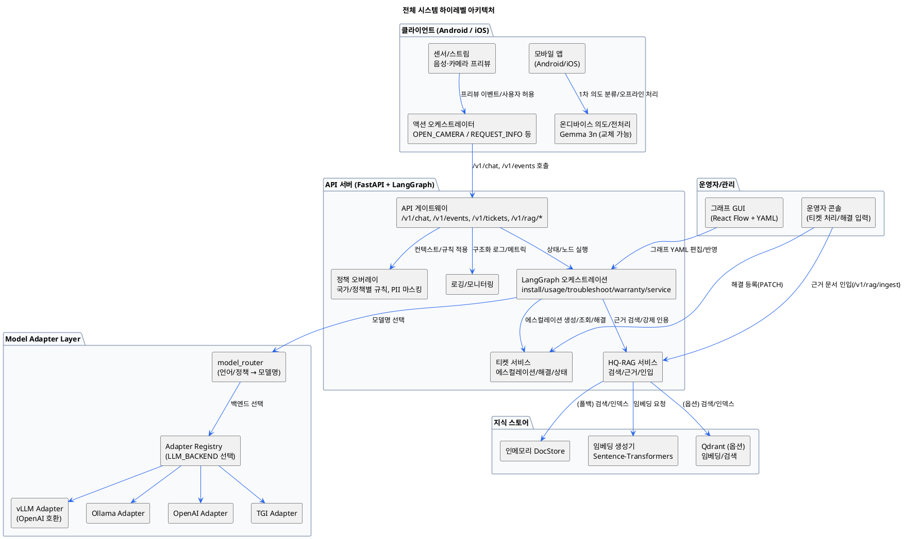
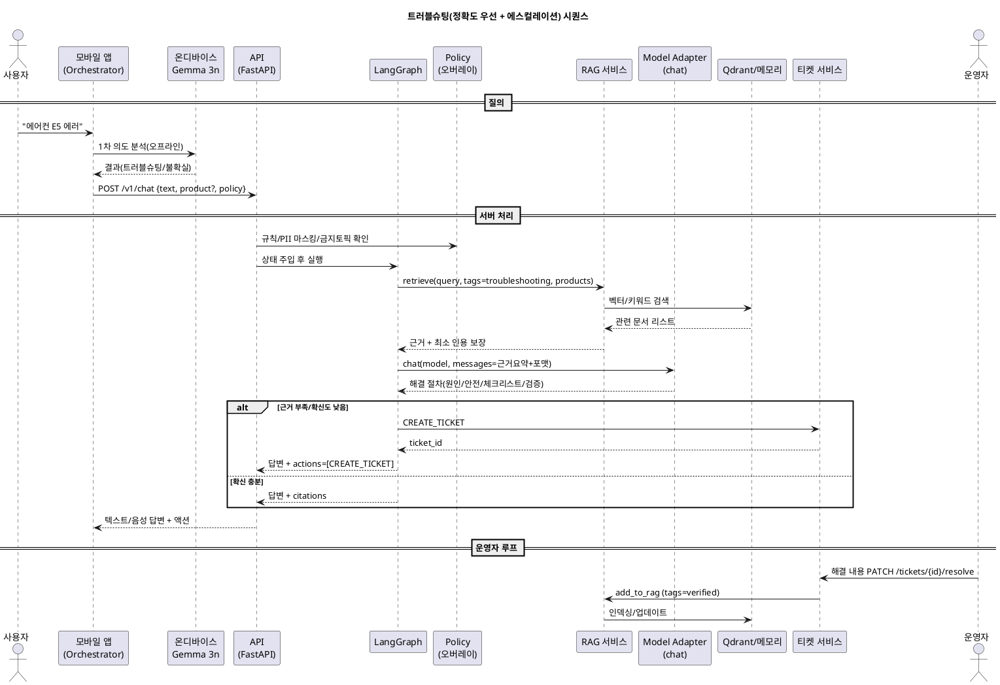
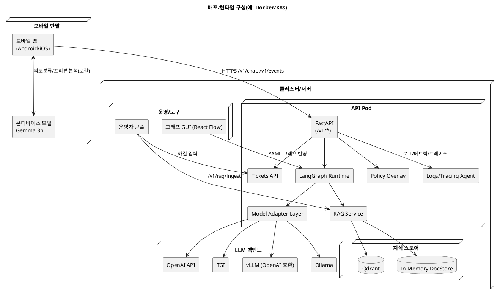

알겠습니다. 아래에 **PlantUML 형식**으로 전체 시스템 구조도를 정리해 드립니다. 복사하여 `*.puml` 파일로 저장하신 뒤 렌더링하시면 됩니다.

# 1) 하이레벨 컴포넌트 다이어그램

# 2) 트러블슈팅 시나리오 시퀀스 다이어그램

# 3) 배포/런타임(Deployment) 다이어그램

원하시면 위 세 다이어그램을 **하나의 파일**로 합치거나, 특정 컴포넌트만 상세화한 **서브 다이어그램**(예: Model Adapter Layer 내부 구조 상세, HQ‑RAG 파이프라인 상세)도 추가로 작성해 드리겠습니다.
