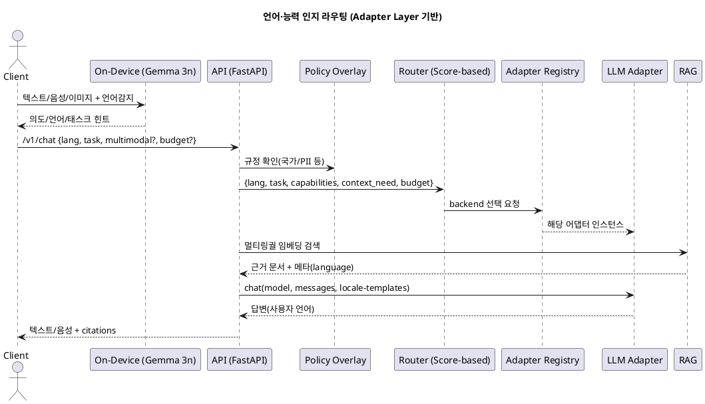

말씀하신 “서버 Ollama(Llama/Qwen/Mistral) + 선택적 GPT-4o/DeepSeek” 방향과, 현재의 **Adapter Layer 중심 구조**를 다국어 지원 관점에서 비교·보강하여 정리드리겠습니다. 결론부터 말씀드리면, **Adapter Layer + 능력(capability)·언어 태그 기반 라우팅**이 가장 유연합니다. 운영 환경에서는 기본 서빙을 **Ollama 또는 vLLM**으로 두고, \*\*특수 과제(고난도 번역/비전/코드 추론)\*\*에만 GPT-4o/DeepSeek 같은 상위 엔진으로 **선택적 폴백**하는 하이브리드가 좋습니다.

---

# 권장 결론(요약)

1. **Adapter Layer 유지**: 그래프/서비스 코드는 `adapter.chat()`만 사용 → 백엔드 교체/추가 시 무수정.
2. **이중 라우터**:

   * L0(온디바이스): 언어/도메인/민감도 1차 판단 (Gemma 3n)
   * L1(서버): **능력·언어 태그 + 정책 + 예산**을 점수화해 모델 선택(아래 예시 코드/설정).
3. **하이브리드 서빙**: 기본은 **Ollama/vLLM**으로 처리, 다음 조건에만 **GPT-4o/DeepSeek** 폴백

   * 비전(이미지 이해/멀티모달), 장문 번역 품질 요구, 특정 언어(저자원) 고품질 필요, 고난도 코드/수학
4. **다국어 RAG**: 멀티링궐 임베딩으로 단일 인덱스 유지 + **언어 정규화(질의/문서 재작성)** + **답변은 사용자 언어**.
5. **프롬프트/템플릿 국제화(I18N)**: 언어별 시스템 템플릿, 안전 경고·절차 표현을 **로케일별 YAML**로 분리.

---

# 구조 비교

## A. “Ollama 중심 + 선택적 GPT-4o/DeepSeek”

* 장점: 내부 호스팅(비용/속도 제어), 외부 엔진은 정말 필요할 때만 호출.
* 단점: 백엔드별 API/응답 스키마 차이가 커지면 라우팅/정규화 코드가 흩어질 위험.
* 해결: **Adapter Layer**로 완화(현재 구조가 이 단점을 상쇄).

## B. “Adapter Layer 중심(권장) + 능력 태그 기반”

* 장점: 그래프/서비스 무수정, 백엔드/모델 추가가 **설정 주도**.
* 단점: 라우팅 규칙이 늘면 복잡해질 수 있음 → **정책 YAML**로 관리하면 안전.

## C. “OpenAI 호환 게이트웨이로 통일”

* 장점: 모든 서빙을 OpenAI Chat API 형태로 통일.
* 단점: Ollama/TGI의 고유 기능(예: 샘플러 세부 옵션) 노출이 어려움. → 고급 옵션은 Adapter의 `kwargs`로 통과시키면 보완 가능.

**종합**: 현재 v0.4의 **Adapter Layer + Registry** 위에 **언어·능력 기반 라우팅**만 보강하면, 제안하신 A안의 이점과 B안의 유연성을 모두 얻습니다.

---

# 구현 제안

## 1) 모델 프로파일과 라우팅 정책(YAML)

다국어·능력 라우팅은 **설정 주도**가 유지보수에 유리합니다.

### `config/model_profiles.yaml`

```yaml
backends:
  - id: vllm_main
    type: vllm
    base_url: http://vllm:8000/v1
    api_key: EMPTY
    models:
      - name: mistralai/Mistral-7B-Instruct-v0.3
        langs: [en, fr, es, de]
        capabilities: [general, rag, function_call]
        max_context: 32768
        cost: 1.0
      - name: meta-llama/Meta-Llama-3-8B-Instruct
        langs: [en, ko, ja]
        capabilities: [general, rag]
        cost: 1.2

  - id: ollama_pool
    type: ollama
    base_url: http://ollama:11434
    models:
      - name: qwen2.5:7b-instruct
        langs: [zh, en, ko, ja]
        capabilities: [general, translate, rag]
        cost: 0.6
      - name: llama3:instruct
        langs: [en, ko]
        capabilities: [general, rag]
        cost: 0.5

  - id: gpt4o_ext
    type: openai
    base_url: https://api.openai.com/v1
    api_key: ${OPENAI_API_KEY}
    models:
      - name: gpt-4o
        langs: [*]                # 거의 모든 언어
        capabilities: [general, vision, translate, code, math]
        cost: 5.0
```

### `config/router_policy.yaml`

```yaml
routing:
  default_backend: vllm_main
  hard_rules:
    - when: { multimodal: image }     # 카메라 이미지 이해 필요
      prefer: gpt4o_ext
    - when: { task: translate, quality: high }
      prefer: gpt4o_ext
  soft_weights:                        # 점수화 기준(가중치)
    lang_match: 3.0
    capability_match: 2.0
    cost_penalty: 1.0     # 비용이 낮을수록 가산
    latency_penalty: 1.0  # 추후 측정값 반영
    max_context_need: 1.5
  fallbacks:
    - ollama_pool
    - vllm_main
    - gpt4o_ext
```

## 2) 라우터 스코어링 코드(간단 예시)

`app/services/model_router.py`를 확장하여 **언어/능력/비용**을 점수화합니다.

```python
# pseudo: 점수 기반 선택 (핵심만 발췌)
from typing import Dict, Any, List
import math

def score_model(req: Dict[str, Any], model: Dict[str, Any], weights: Dict[str, float]) -> float:
    s = 0.0
    # 언어 매칭
    req_lang = (req.get("lang") or "en").split("-")[0]
    langs = model.get("langs", [])
    if "*" in langs or req_lang in langs:
        s += weights.get("lang_match", 0)

    # 능력 매칭
    need_caps = set(req.get("capabilities") or [])
    has_caps = set(model.get("capabilities") or [])
    s += weights.get("capability_match", 0) * len(need_caps & has_caps)

    # 컨텍스트 요구
    need_ctx = req.get("context_need", 4096)
    if model.get("max_context", 8192) >= need_ctx:
        s += weights.get("max_context_need", 0)

    # 비용/지연 페널티 (값이 낮을수록 유리)
    cost = float(model.get("cost", 1.0))
    s -= weights.get("cost_penalty", 0) * math.log1p(max(cost - 1.0, 0))
    # latency는 관측값/SLI 연동 가능
    return s

def choose_backend_and_model(req: Dict[str, Any], profiles: Dict, policy: Dict) -> Dict[str, str]:
    # 1) 하드 룰
    for rule in policy["routing"].get("hard_rules", []):
        cond = rule.get("when", {})
        if all(req.get(k) == v for k, v in cond.items()):
            backend = rule["prefer"]
            m = profiles["backends"][0]["models"][0]  # 실제로는 후보 중 최고점 모델 선택
            return {"backend": backend, "model": m["name"]}

    # 2) 소프트 스코어
    cand = []
    for be in profiles["backends"]:
        for m in be.get("models", []):
            cand.append((be["id"], m, score_model(req, m, policy["routing"]["soft_weights"])))
    cand.sort(key=lambda x: x[2], reverse=True)
    best_be, best_m, _ = cand[0]
    return {"backend": best_be, "model": best_m["name"]}
```

> 서버 레벨에서는 `choose_backend_and_model()` 결과의 `backend`를 **Adapter Registry**로 넘기고, `model`은 **어댑터에 전달**합니다. 그래프/노드 코드는 여전히 `llm_adapter.chat(model, messages)`만 호출하면 됩니다.

## 3) 다국어 RAG 강화 포인트

* **임베딩**: 멀티링궐 임베딩(예: multilingual MiniLM, bge 계열 등)로 **단일 인덱스** 유지
* **질의 정규화**: L0에서 언어 감지 → 필요 시 **의미 보존 번역**(pivot EN) 뒤 RAG 검색 → 최종 생성은 **사용자 언어**
* **문서 메타**: `language`, `source_locale` 필드 추가, 결과 혼합 시 **동일 제품/태그** 우선
* **출처 노출**: 한국어 UI에서도 원문 언어를 함께 표시(예: “\[영문] 설치 가이드…”)
* **LLM 프롬프트 템플릿**: 안전 경고·점검 체크리스트 등은 **로케일별 YAML**로 관리

### RAG 문서 스키마(예시)

```json
{
  "id": "doc_123",
  "title": "에어컨 E5 해결",
  "content": "...",
  "language": "ko",
  "tags": ["troubleshooting", "verified"],
  "products": ["AC-1234"],
  "date": "2025-08-01",
  "url": "https://kb.example.com/..."
}
```

## 4) 음성/카메라 국제화

* ASR/TTS는 \*\*언어 코드(lang)\*\*를 클라이언트가 동기화해서 서버에 전달(예: `ko-KR`, `en-US`)
* 카메라 OCR/문자 인식: 언어 후보를 함께 전달(`ocr_langs:["ko","en"]`) → 서버가 라우팅 힌트로 사용
* 안전 경고/법규 문구는 \*\*국가 오버레이(kr.yaml 등)\*\*에 저장

---

# 하이레벨 라우팅 PlantUML(추가)



---

# 어떤 구조가 더 좋은가(결정 기준)

* **모델 추가/교체 빈도**가 높음 → Adapter Layer 중심 + 설정 주도 라우팅이 우세
* **비용/성능을 내부에서 강하게 통제**해야 함 → 기본은 Ollama/vLLM, 외부 엔진은 폴백
* **비전/번역 품질 최우선** 업무 비중이 큼 → GPT-4o/DeepSeek에 하드 룰 부여(특정 태스크 강제 라우팅)

---

# 다음 단계(실행 체크리스트)

1. `model_profiles.yaml`, `router_policy.yaml` 추가 및 `model_router.py` 점수 기반 라우팅 구현
2. RAG 문서/임베딩에 `language` 필드 도입, 질의 정규화(번역) 노드 추가
3. 언어별 프롬프트 템플릿/안전 문구 YAML 분리(ko/en/ja/zh 등)
4. 라우팅 로그/지표 수집: 선택 사유(언어/능력/비용/지연)를 구조화 로그로 남겨 회귀 분석
5. 품질 벤치마크: 언어별 BLEU/COMET-kiwi, RAG 정확도(EM/F1), 에스컬 레이트율 모니터링

원하시면 위 설정(YAML)과 점수 기반 라우터 코드를 현재 v0.4 어댑터 레이어에 바로 반영한 **패치 버전**을 만들어 드리겠습니다.
